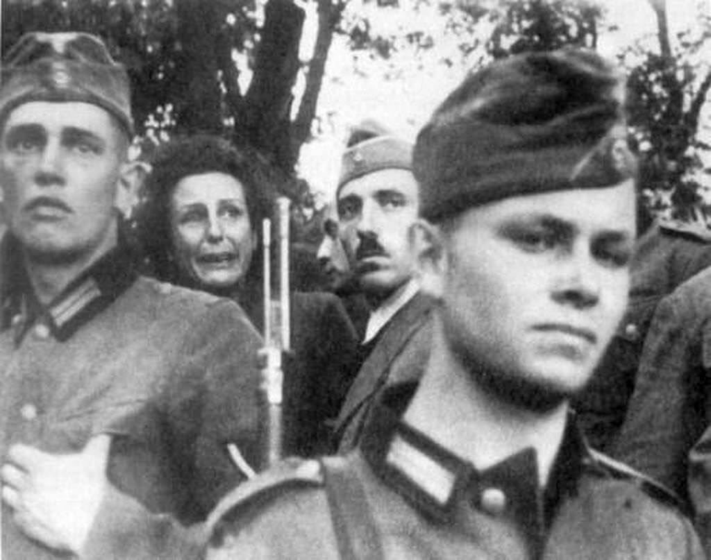

import FBBoxImageWrapper from '../../components/FBBoxImageWrapper.astro'
import SeeAlso from '../../components/FBSeeAlso.astro'

### Warszawa

To krytyczna faza boju o Warszawę. Oddziały 1 Armii WP zbliżają się do stolicy. Aż do dziś nie wiadomo, czy Niemcy będą bronić miasta, czy się z niego wycofają. Po godzinie 15.00 pierwsze meldunki o wycofujących się oddziałach. Dziś oddziały polskie wychodzą na przedpola Warszawy.

Jutro nastąpi rozstrzygnięcie.

### Ryszard Moszkowski i Róża Etkin

Tego dnia w Warszawie, w bliżej nieznanych okolicznościach (są różne wersje) zamordowani zostali Ryszard Moszkowski i jego żona Róża Etkin.

Moszkowski był znanym polskim rzeźbiarzem pochodzenia żydowskiego. Urodził się we Francji i tam też uczył się rzeźbiarstwa m.in. pod kierunkiem znanego wszystkim polskim turystom odwiedzającym Paryż wielkiego rzeźbiarza francuskiego o nie dającym się zapomnieć nazwisku Bourdelle (najważniejsza dla nas jego realizacja to pomnik Adama Mickiewicza znajdujący się prawie na drodze z Trocadéro do wieży Eiffla).

Podczas okupacji wraz z żoną ukrywali się po aryjskiej stronie. Ostatnich ich schronieniem była piwnica na Żoliborzu.

Tylko jeden dzień dzielił ich od przetrwania.

### Grupa Armii A

Dowództwo Grupy Armii A wobec perspektywy okrążenia podjęło decyzję o przeniesieniu się na kolejną rubież.

Tymczasem na zapleczu Warszawy wojska 1 Frontu Białoruskiego zdobywają Żyrardów.

Idąca na Łódź 69 Armia zdobywa Iłżę, Radom i Szydłowiec. Jest już 70 km od Łodzi.

W nocy sztab Grupy Armii A wobec zagrożenia Krakowa i walk w mieście ewakuuje się z Częstochowy do Opola. Pozostanie tam tylko tydzień.

Dla wojsk niemieckich sytuacja przedstawia się dramatycznie i nawet po latach tak to wspomina von Ahlfen, pisząc o sobie:

>Dowódca jednostki zaporowej von Ahlfen po opuszczeniu pozycji na Wiśle znalazł się świtem 16 stycznia na pozycji straży tylnej, gdy pospiesznie przekazany droga radiową rozkaz XLII Korpusu wezwał go na stanowisko dowodzenia w miasteczku Iłża. Tam otrzymał ostatni osobisty radiowy rozkaz otaczanego szacunkiem generała dowodzącego Recknagela, który dwa dni później wraz ze swoim szefem sztabu korpusu pułkownikiem von Drabichem-Waechterem zginął w walce wręcz. "Jednostka zaporowa broniąc skrzyżowania dróg w Iłży, kontynuuje pospieszny marsz na pozycję Hubertus, którą trzeba obronić. Chodzi przy tym o ochronę północnego skrzydła Korpusu wycofującego się na zachód". Tak brzmiał rozkaz zakończony zawołaniem z głębi serca "Niech Bóg ma Pana w opiece!".

Jeżeli chodzi o losy generała Recknagela, panuje tu pewne zamieszanie. Ahlfen bowiem pisze, że zginął 2 dni później, czyli 18 stycznia. Majewski podaje, że 17 stycznia w pobliżu Końskich polscy partyzanci (nie podaje przynależności organizacyjnej) rozbili cały sztab Korpusu, a Recknagel został wzięty do niewoli. Zaś [Lexikon der Wehrmacht - Recknagel, Hermann](http://www.lexikon-der-wehrmacht.de/Personenregister/R/RecknagelH.htm) i za nim niemiecka Wikipedia informują, że został zastrzelony przez partyzantów 23 stycznia, gdzieś między Piotrkowem Trybunalskim a Tomaszowem Mazowieckim. Cóż, najwidoczniej von Ahlfen myli dzień, a Majewski przemilcza fakt egzekucji.

### 1. Front Ukraiński

Majewski:

>Na głównym kierunku uderzenia wojska 1 Frontu Ukraińskiego po dwudniowych walkach przełamały hitlerowską pozycję obronną "B", przekroczyły 19 stycznia granicę polsko-niemiecką z 1939 r. i wdarły się na Śląsk. Brak poważniejszego oporu był w znacznym stopniu wynikiem słabości sił niemieckich w tym rejonie. Mimo alarmujących meldunków Guderiana i Gehlena, a następnie również przedstawiciela Sztabu Dowodzenia Wehrmachtu generała-leutnanta A. Wintera, Hitler z dużym opóźnieniem podjął decyzje odbudowy centralnego odcinka frontu wschodniego, wzmocnienia Grupy Armii "A" i odtworzenia zniszczonej 4 Armii Pancernej. Do 16 stycznia zarządzono (poza spóźnionym przegrupowaniem Korpusu Pancernego "Grossdeutschland") jedynie przesunięcie z frontu zachodniego na Śląsk 269 i 712 Dywizji Piechoty, dwóch korpusów artylerii (o rzeczywistej sile brygad) i 18 Brygady Wyrzutni Rakietowych, ponadto zaś przekazano z zasobów armii zapasowej 655 Brygadę Saperów.

1 Front Ukraiński zdobywa dzisiaj Końskie, Radomsko i dociera do Częstochowy.

I tu trzeba na chwilę zrobić przerwę i opowiedzieć o 2 rzeczach:

### Masakra w Końskich 12 września 1939

Końskie znane jest z masakry urządzonej przez wojska niemieckiej, której świadkiem była najbardziej znana reżyserka niemiecka Leni Riefenstahl. Jest to jedna z tych osób, o których można powiedzieć, że stworzyły kino współczesne. Do dziś jej filmy szczególnie: "Triumph des Willens" (zapis Parteitagu w Norymberdze) i "Olimpia" (Olimpiada Berlin 1936) są dokładnie analizowane przez adeptów sztuki filmowej. Do realizacji tych filmów została wybrana przez Hitlera. Ze względu na to uwikłanie w propagandę hitlerowską po wojnie została dotknięta ostracyzmem i nigdy już nie wróciła do głównego nurtu.

W Polsce była jako, jak to się dzisiaj mówi, embedowany filmowiec, bezpośrednio obserwując triumfalny pochód Wehrmachtu w pierwszej prawdziwej wojnie. Miał to być jej kolejny film.

12 września 1939 w Końskich miał się odbyć pogrzeb 4 żołnierzy niemieckich poległych w walkach z regularnym wojskiem polskim. Spędzono na rynek około 50 Żydów, którzy traktowani z niezwykłym okrucieństwem mieli wykopać groby. W zamieszaniu, po tym, jak otrzymywali sprzeczne polecenia, obawiając się linczu, w panice rzucili się do ucieczki. Niestety akurat w tym momencie nadjechał oficer niemiecki, który nie znając sytuacji i tylko widząc uciekających mężczyzn, otworzył do nich ogień. Zginęło 22 ludzi. Był to początek wojny i taka masakra była jeszcze czymś niezwykłym. Oficer ten został postawiony przed sądem i skazany na rok więzienia.

Leni Riefenstahl po tym wydarzeniku zerwała i realizację tego filmu i współpracę z NSDAP. Nie zrobiła dla nich już żadnego filmu.

<FBBoxImageWrapper>

Leni Riefenstahl podczas masakry w Końskich, 12 września 1939. 
Żródło: reddit (to zdjęcie jest wszędzie w internecie, licencja?)
</FBBoxImageWrapper>

### Ostrowiec Świętokrzyski "Popiół i diament"

Drugie ważne wydarzenie ma miejsce dzisiaj w Ostrowcu Świętokrzyskim. Jan Foremniak, komunistyczny partyzant, oficer Armii Ludowej, świeżo mianowany wojewodą kieleckim (świętując ten niezwykły awans?), wraz z kolegami dokonał napadu rabunkowego na mieszkanie. Został tam zastrzelony przez Stanisława Kosickiego, dowódcę patrolu porządkowego AK.

Wydarzenie to po propagandowych zmianach stało się podstawą akcji powieści Jerzego Andrzejewskiego "Popiół i diament", wydanej pierwotnie w 1947 pod tytułem "Zaraz po wojnie". Dopiero rok później po pewnych zmianach ukazała się pod obecnym tytułem. Wszyscy znamy film Andrzeja Wajdy z 1958 na podstawie tej powieści, ze znakomitą rolą Zbigniewa Cybulskiego.

Kosicki zbiegł do Krakowa i tam się ukrył w klasztorze kapucynów. Zdradzony i przewieziony do wiezienia UB w Kielcach, dostał wyrok śmierci. Nie znając daty wykonania wyroku, oczekiwał na egzekucję. W nocy z 4 na 5 sierpnia 1945 kieleckie więzienie, w którym siedział, zostało rozbite przez 250-osobowy oddział Antoniego Hedy ps. "Szary". Kilkuset (źródła się różnią - od 300 do 700) więźniów uwolniono. 

Nie po raz pierwszy Kosicki miał nieziemskie szczęście. Dwa lata wcześniej, latem 1944 udało mu się uciec z transportu do Oświęcimia.

Po ucieczce z Kielc ukrywał się na Wybrzeżu, aż do amnestii w 1947. Wtedy się ujawnił i zaczął normalne życie. Jednak w 1954 został zdemaskowany, ale ponieważ posiadał dokument amnestyjny, został zwolniony.

SB z powodu tej historii z Foremniakiem przez wiele lat go szykanowało. Nie mógł znaleźć pracy, rozbili mu rodzinę. Całą historię opisał Jerzy Kąkolewski w książce "Diament znaleziony w popiele".

### Ewakuacja Kraju Warty

Niemcy zaczynają wycofywać nie tylko wojsko. W Kraju Warty (niem. Wartheland aka Warthegau) - większość Wielkopolski wcielona do Rzeszy i przeznaczona do całkowitej germanizacji - ogłoszona zostaje ewakuacja. Tysiące niemieckich rodzin chłopskich w panice i pośpiechu pakuje się na wozy i ucieka.

Spora część z nich dotrze jutro do Wrocławia, wywołując tam poważny niepokój.

Większość z nich to niemieccy osadnicy, których władze hitlerowskie skusiły do szukania nowego życia na odebranych Polakom gospodarstwach. Dziś każą im uciekać, zwierzęta gospodarskie, których nie można zabrać, zabić. Wszystko, czego się nie da zabrać, zniszczyć. Cena wojny.

### Częstochowa

Śmiały atak sowieckich czołgów z 7 Korpusu Pancernego Gwardii 1 Frontu Ukraińskiego, wywołuje panikę w niemieckim garnizonie. Następuje dezorganizacja. Plany wysadzenia klasztoru niezrealizowane. Miasto padnie już jutro.

### Górny Śląsk

Majewski o sytuacji na Górnym Śląsku:

>Stosunkowo największe siły niemieckie znajdowały się na terenie Górnośląskiego Okręgu Przemysłowego. Zadanie obrony tego rejonu otrzymał XXXVIII Korpus Pancerny, w którego składzie pozostały w tym czasie 68 i 75 Dywizja Piechoty. Równocześnie jednak dowódcy tego korpusu, generałowi wojsk pancernych Edelsheimowi podporządkowano wszystkie miejscowe jednostki zapasowe, szkolne i Volkssturmu, ponadto zaś pośpiesznie skierowano pod jego rozkazy posiłki z innych odcinków frontu. Z zachodu przybyła 712 Dywizja Piechoty, z Grupy Armijnej "Heinrici" 97 Dywizja Strzelców. W drodze na Górny Śląsk znajdowała się (przegrupowana z Węgier) 8 Dywizja Pancerna. Dla obrony Górnego Śląska od południa utworzona została grupa "Arndt" w składzie 359 Dywizji Piechoty i resztek 304 Dywizji Piechoty. Równocześnie w ramach zarządzonej 14 stycznia mobilizacji „Gneisenau" dowództwo VIII Okręgu Wojskowego wystawiło jako załogi bezpieczeństwa pozycji "B-1" i "B-2" na terenie Górnego Śląska 4 dowództwa pułków i 18 grup bojowych (w zasadzie w sile wzmocnionego batalionu każda). Do działania gotowych było 16 stycznia również 15 batalionów Volkssturmu, zaś w ciągu najbliższych dni liczba ich znacznie wzrosła. 
>Siłami tymi hitlerowcy zamierzali uporczywie bronić Górnego Śląska, którego utrzymanie stanowiło dla nich sprawę życia i śmierci. Były niemiecki minister uzbrojenia A. Speer pisał na ten temat w swoich Wspomnieniach: "Już 16 stycznia zwróciłem w trybie pilnym uwagę Hit- lera na to, że po odcięciu Zagłębia Ruhry od pozostałej części Rzeszy utrata Górnego Śląska musi pociągnąć za sobą szybkie załamanie się gospodarki. Przy pomocy dalekopisu jeszcze raz przekonywałem go o znaczeniu Górnego Śląska i prosiłem, ażeby grupie wojsk Schörnera przydzielić przynajmniej 30 do 50 procent produkcji zbrojeniowej ze stycznia".

### Volkssturm

Majewski:

>16 stycznia 1945 r. na terenie VIII Okręgu Wojskowego było 28 batalionów Volkssturmu gotowych do działań bojowych. Do 3 lutego 1945 r. ich liczba wzrosła do 30.

<SeeAlso txt="Volkssturm" url="/festung-breslau/article/volkssturm" />

### Bombardowanie Magdeburga

Dziś okrutnie został zbombardowany Magdeburg.

Najpierw Amerykanie wysłali 127 bombowców B-24 Liberator, które w samo południe dokonały ataku na obszar przemysłowy i węzeł kolejowy. Nie spodziewano się kolejnego bombardowania tego samego dnia.

Po 19.00 ze wschodniej Anglii wystartował zespół 371 brytyjskich bombowców, które pomiędzy wieczorem pomiędzy 21.30 a 22.00 przeprowadziły bombardowanie dywanowe na centrum miasta. Pierwotny kierunek lotu tej flotylli wskazywał na Berlin, ale podczas lotu Brytyjczycy zakłócili działanie niemieckich radarów i zmienili kierunek na Magdeburg. Dlatego bombardowanie było całkowitym zaskoczeniem dla mieszkańców, nie ogłoszono alarmu, nie mieli czasu dobiec do schronów. Zginęło około 16 tys. ludzi.

### Hitler w Berlinie

Było już jasne, że operacja Nordwind mająca uratować z okrążenia niemieckie wojska biorące udział w ofensywie w Ardenach zakończyła się niepowodzeniem.

Dziś Hitler opuścił Adlerhost. Powrócił do Berlina i już w nim go aż do śmierci  - za wyjątkiem krótkiej wycieczki nad Odrę - pozostał. Za 104 dni popełni samobójstwo.

### Nacjonalizacja Renaulta

Jednym z najbardziej znanych produktów Renault jest FT-17 - rewolucyjny lekki czołg, który nie tylko zmienił sposób prowadzenia wojny, ale i był początkiem obecnie podstawowej formuły budowy czołgu: moduł silnika z przodu, gąsienice w profilu kadłuba, załoga w przedniej części a u góry obrotowa wieża z armatą. Łatwy w produkcji, szybki i jak na tamte czasy niezawodny.

Podczas okupacji Louis Renault założyciel i właściciel zakładów Renault odmówił produkcji czołgów, ale robił ciężarówki dla Wehrmachtu.

Po wyzwoleniu Francji zakłady Renault stały się bastionem stronnictwa komunistycznego. Domagano się rekwizycji i ukarania Renaulta, który już wtedy nie miał żadnych politycznych sojuszników, pamiętano mu bowiem bezwzględne traktowanie strajków w latach 1936-38.

Rząd tymczasowy oskarżył go o kolaborację. Tego typu oskarżenia były powszechne. Tak jak wielu innych przedsiębiorców wtrącono go do więzienia i tam 23 października 1944 zmarł. 1 stycznia 1945 de Gaulle wydał dekret o pośmiertnym wywłaszczeniu Renaulta. Dzisiaj znacjonalizowano masę własnościową zakładów Renault.

Praca dla Niemców była jedynym sposobem na zapewnienie utrzymania pracowników. Na wiele sposobów Francuzi sabotowali ten obowiązek. Szczególne rozmiary przybrało to w fabrykach Peugeot. W listopadzie 1941 Peugeot otrzymał zamówienie na 100 tys. głowic cylindrów, w ciągu kolejnych trzech lat dostarczył ich słownie tysiąc. Podczas czterech lat okupacji od czerwca 1940 do września 1944 (w sumie 28 miesięcy) Peugeot wyprodukował 27 tys. pojazdów. Przed wojną na wyprodukowanie takiej liczby wystarczyło 10 miesięcy. "Pracuj powoli" to było motto francuskiego robotnika. W Citroenie często zdarzało się umieszczanie próbnika oleju w niewłaściwym miejscu, pokazywał niewłaściwy stan oleju co powodowało zatarcie silnika i to bardzo daleko od fabryki.

W końcu poddano zakłady Peugeot pod władzę Ferdynanda Porsche, który był ambitnym hitlerowcem. Zaczęli produkować kadłuby samolotów, tak w każdym razie powiedziano Francuzom. W rzeczywistości były to kadłuby latających bomb V1. Z tego powodu Brytyjczycy dokonali nalotu na fabrykę, zrzucono 700 bomb. W sąsiadujących z fabryką domach mieszkali jej pracownicy. Zginęło 200 cywilów. Nikt, ani Brytyjczycy, ani Francuzi, ani nawet Niemcy nie był z tego powodu szczęśliwy. Trzeba było opracować inny sposób. Właściciel Rodolphe Peugeot antynazista przebywał na emigracji w Londynie. Zwrócono się do niego z prośbą o pomoc w zniszczeniu kluczowych elementów produkcji. Po chwili wzburzenia zgodził się. Operację na miejscu przeprowadził agent SOE Harry Ree, który miał wyraźny motyw osobisty, był częściowo pochodzenia żydowskiego. Zniszczono trudne do zastąpienia maszyny. Niemcom zajęło cale tygodnie przywrócenie produkcji. Którą przerwał kolejny akt sabotażu.

### Maria Langner

Pierwszą opublikowaną po wojnie książką opowiadającą o bitwie o Wrocław jest wydana w 1948 relacja Marii Langner "Die letzte Bastion" już w 1951 wydaną po polsku jako "Ostatni bastion". 15 stycznia już wszyscy we Wrocławiu wiedzą, że front na Wiśle się zawalił, ale nie chcą jeszcze wierzyć, że znajdą się na linii frontu:

> \- Chciałem państwu zakomunikować - ciągnie doktor Helsig dalej i patrzy przy tym na mnie - że w drodze znajdują się tysiące uchodźców. Już jutro mogą zalać Wrocław i w tej samej chwili skończy się w mieście normalny porządek. Miasto stanie się fortercą. 
>Przez chwilę panuje milczenie. Coś, co dotąd było niepojęte w całej swej grozie, zawisło nieubłaganie nad nami, wypowiedziane jednym zdaniem, czterema słowami. 
>Wrocław stanie się fortecą. 
>Może siedzimy dziś po raz ostatni razem, w tym małym ciepłym pokoiku jednego z wielu tysięcy nie zbombardowanych domów, w mieście, które dotąd pozostało prawie nie tknięte wypadkami wojennymi. W ciągu dwudziestu czterech lub czterdziestu ośmiu godzin rozkaz Hitlera zmieni w teren walk jedną z nieliczncyh ocalałych wysepek Niemiec, która dotąd dawała schronienie uchodźcom z Rzeszy. 
>Miasto liczy milion mieszkańców, w tej liczbie dziesiątki tysięcy bezdomnych uchodźców ze zniszczonych miast Rzeszy. 
>Front się zbliża. 
>Żaden fakt nie mógłby tak przekonywająco podkopać wiary w niepokonaną potęgę wojskową Trzeciej Rzeszy. Wrocław będzie twierdzą, bastionem dla cofających się wojsk hitlerowskich. 
>Żaden fakt nie mógłby w sposób tak nieodparty ukazać, jak bardzo mylili się hitlerowcy nie doceniając siły Związku Radzieckiego, z którym należy się liczyć jako poważną potęgą wojskową: Wrocław będzie twierdzą, wróg naciera. 
>Dotąd naloty oszczędzały miasto.Ten gest sowieckiego dowództwa nie został zrozumiany, a nawet naigrywano się z niego. Hitlerowiec bowiem ma zrozumienie tylko dla siły, która stoi ponad prawem i himanitarnością, a niestosowanie gwałtu jest w jego pojęciu oznaką słabości i obawy przed gwałtem. Tylko pod takim kątem widzenia rozpatrywano wszystko i ludzie czuli się dotąd bezpieczni i pewni w niezniszczonym mieście Wrocławiu. 
>Teraz w tym mieście nastąpi starcie dywizji, zderzenie dwóch armii, groźner naloty zmiotą bombami domy i ludzi, zagrzmią działa, nastanie dzień sądu. 
>To jednak niepojęte, jak beztroscy są mieszkańcy tego miasta, ciągle jeszcze nie przeczuwając grozy, która nadchodzi.
>Laurenz pierwszy wypowiada to słowami. 
> \- Nie mogę sobie tego wyobrazić - mówi - Forteca? Przecież nie mogą aż tu... 
> \- Mogą - mówi doktor Helsig. 
> \- A więc tu się to odbędzie - mamrocze członek partii i antymilitarysta Laurenz. - Możliwe, że przedtem miałem rację. W ciągu czterech tygodnii może tutaj być rumowisko. Ale wreszcie nastąpi rozstrzygnięcie. 
> \- Rozstrzygnięcie j u ż nastąpiło - mówi doktor Helsig. 
> \- Pan ma rację, doktorze - przyznaje z niezwykłą powagą Charlie Schulz - Już w trzydziestym dziewiątym roku nastąpiło. Dla człowieka myślącego i przewidujacego rok czterdziesty pierwszy tylko to potwierdził, a w roku czterdziestym piątym ci bankruci w ostatecznym wysiłku plują resztkami nabojów, rzucając na barykady ostatnie rezerwy: ludność cywilną. 
> \- Jeżeli sytuacja stanie się poważna, ludność cywilna będzie ewakuowana - informuje Laurenz, który ciągle jeszcze szuka jakiegoś wytłumaczenia. 
>Doktor spogląda na niego ironicznie.

Później już w rozmowie z Marią Langner doktor mówi:

>Fakty potoczą się z szaloną szybkością. Armia Radziecka posuwa się w niebywałym tempie. Rozporządzenia dotyczące obrony i niesłychanie prymitywne okopy wskazują, że ich rozumowanie znowu było mylne: Rosja leży na wschodzie, stamtąd więc musi przyjść uderzenie. Typowe rozumowanie ograniczonego biurokratycznego umysłu. Przy tym wiatr, który wieje z Sudetów, zalatuje zapachem ognia. A na północnym wschodzie też nie ogień ze ścierniska gna zapachem spalenizny tysiące uchodźców przed siebie. Ale, jak wiadomo, nasze naczelne dowództwo ma chroniczny katar, celem jest Berlin, a nie Wrocław. 
>Nasz wojskowy punkt opatrunkowy leży na południowym krańcu miasta. 
Wojska radzieckie wpierw nas odetną, a potem okrążą. Tam szybko nawiążemy z nimi kontakt. Stacja nadawcza znajduje się w naszym najbliższym sąsiedztwie. Widzę wprost olbrzymie możliwości. Mam dobrych, pewnych ludzi. Skoro tylko okaże się to konieczne, przyjadę samochodem po obydwie staruszki. Ukryjemy je w kuchni. Byłoby mi miło, gdyby pani znalazła kogoś, kto by ułożył plakat: muszą to być rosyjskie drukowane litery: "Tu znajduje się wojskowy punkt opatrunkowy". Tylko proszę, bez wielkiego szumu. Krótko i zwięźle.
> \- Wreszcie nadszedł koniec tej zmory - mówię. - Jeszcze ciągle nie mogę tego pojąć - tyle lat. Będziemy wolni, podczas gdy w Rzeszy Hitler drżąc ze strachu będzie uciekał z miasta do miasta aż do żałosnego końca. 
Doktor podaje mi rękę: - Pani wie - w głosie jego brzmi lekkie wzruszenie - nie jestem czułostkowy, jestem człowiekiem, który kocha i używa życia. A dzisiaj jestem w prawdziwie uroczystym nastroju. Nie wiemy, co nas spotka lub może spotkać. Czy w ogóle doczekamy się tych "innych czasów", dla których nie mamy jeszcze nazwy. Ale jednego doczekaliśmy się, pewności, że Trzecia Rzesza się skończyła, skończyła się raz na zawsze. Ta twierdza to ostatni ogień - ostatnia próba ogniowa, przez którą nas pędzą. Ale dlatego, że jest ostatnia, wszystko już jest jasne i wszystkie nadzieje spełnione. 
> \- Niech pan nie kokietuje bohaterską śmiercią, doktorze. Nie jest z tym panu do twarzy. Zresztą mnie jest tak samo na sercu jak panu. Człowiekowi wydaje się, że u jego łoża stoi śmierć, i ma takie uczucie: wszystko zapłaciłem i idę do nieba. Ale jeśli śmiertelna kosa ominie go, tym lepiej; wprawdzie przyjemnie jest umrzeć w przeświadczeniu, że wszystkie rachunki zostały wyrównane, ale jeszcze przyjemniej byłoby żyć. A zresztą zapraszam pana już dzisiaj na moje setne urodziny, gdyż wiem, że będę żyła bardzo, bardzo długo. 
> \- Dziękuję - mówi doktor wesoło. - Czy mogę zanotować datę? Przyjdę na pewno. 
> \- 10 stycznia 2001 r. 
> \- Do diabła! Właśnie na ten dzień jestem już umówiony. Ale dla dobrego placka sprzedam diabłu duszę... jeśli pani przyrzeknie, że będzie kruchy placek - śmieje się - Już muszę pójść. W najbliższych dniach zajrzę znowu. 
>Doktor odszedl, obie staruszki poszły spać. Stoję oparta plecami o zielony piec kaflowy. Przede mną w szybkiej kolejności przesuwają się obrazy: rok trzydziesty trzeci do tysiąc dziewięćset czterdziestego czwartego, od "przemarszów brunatnych batalionów" trzydziestego stycznia, od pierwszego powiewu czerwonych idiotycznych szmat ze swastyką, aż do coraz bardziej milknącego wrzasku fanfar obwieszczających nadzwyczajne komunikaty z przegranej wojny. Bezprawie, cierpienie, morderstwo, zniszczenie i rabunek. Ileż wycierpieliśmy przez wszystkie te lata lata - długie, okropne lata - my, którzy nie chcieliśmy się sprzedać. I jak nieskończenie ciężkie i straszne było to wszystko. Wielu padlo na tej drodze i zawsze najlepsi, bo byli najodważniejsi. Teraz jest już po wszystkim. 
>Pozostaje jeszcze do przeżycia twierdza, a czołgi oswobodzicieli już się zbliżają. 
>Szum motorów i miażdżących łańcuchów żelaznych groźnie i obiecująco zdaje się przedzierać przez noc. 
>Gaszę światło i kładę się na tapczanie. Ale nie mogę usnąć.

### Odnośniki

- [Wyzwolenie Końskich 16 stycznia 1945](https://www.konskie.org.pl/2012/01/wyzwolenie-konskich-16-stycznia-1945.html)
- [Ocalenie Jasnej Góry](https://www.tygodnikprzeglad.pl/ocalenie-jasnej-gory/)
