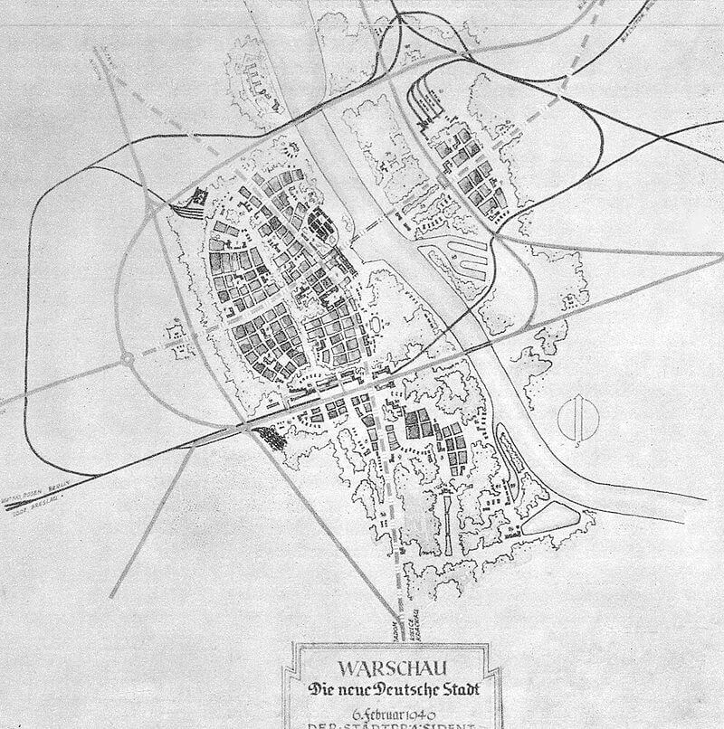

import FBBoxImageWrapper from '../../components/FBBoxImageWrapper.astro'
import SeeAlso from '../../components/FBSeeAlso.astro'

### Warszawa!

Warszawa! Po 1939 dniach niemieckiej okupacji wreszcie wolna od wojsk niemieckich.

Bez wątpienia najważniejszym wydarzeniem dzisiaj na całym polskim froncie jest zdobycie Warszawy.

Poprzedniego dnia oddziały 1 Armii WP dotarły do Legionowa. W nocy z Pragi przeprawiła się 6 DP i zaczęła walki w centrum.

Dziś główne siły przeprawiły się na wysokości Grójca i nacierały od południa. Natarcie prowadziła 2 DP. O godzinie 10.00 wkroczyła do miasta. Połączenie polskich dywizji nastąpiło w rejonie Ogrodu Saskiego.

W obawie przed okrążeniem jeszcze wczoraj Niemcy zaczęli się wycofywać. W mieście były już tylko 4 bataliony niemieckie. Wciąż toczyły się walki o Modlin, ale przewaga sowiecka była widoczna na każdym odcinku frontu. Okrążenie było nieuchronne. Zaledwie po kilku godzinach walk, obawiając się okrążenia, Niemcy opuścili miasto.

Do godziny 16.00 17 stycznia Warszawa, a właściwie ruiny Warszawy były wolne od wojsk niemieckich.

Ta Warszawa nazywana "Paryżem północy", miasto sejmowe i od XVI wieku faktyczna stolica Polski, w której w XIX wieku wybuchły dwa powstania narodowe, wielka Warszawa wizji Prezydenta Starzyńskiego zamordowanego przez Niemców w grudniu 1939. Zdegradowana w Generalnej Guberni do roli miasta powiatowego, Warszawa z planu Pabsta ograniczona do niemieckiego osiedla i węzła kolejowego. Warszawa największego getta w Polsce, heroiczne miasto dwóch powstań, zniszczone wojną, powstaniami i potem po upadku Powstania Warszawskiego celowo i systematycznie obracane w ruiny było wreszcie wolne od hitlerowskiego okupanta. Symbolicznie i realnie zaczynał się nowy etap w historii Polski. Były wprawdzie koncepcje utworzenia wielkiego pomnika wojny i przeniesienia stolicy gdzieś indziej (najczęściej wymieniano niezniszczoną Łódź), ale formułowane przez pojedynczych ludzi nie miały żadnego wpływu na rzeczywistość.

Jeszcze zanim zostaną podjęte oficjalne decyzje, było wiadomo i było to rzeczą oczywistą, choć zdawałoby się, że niemożliwą do wykonania - Warszawa zostanie odbudowana. Polacy odzyskają stolicę. Już 3 stycznia 1945 KRN podjęła decyzje o konieczności odbudowy Warszawy i ustanowienia jej stolicą Polski. 19 września 1944 wyznaczyła na Prezydenta Warszawy Mariana Spychalskiego.

Prawobrzeżna Warszawa została zdobyta do 5.30 15 września 1944, ale to na lewym brzegu było centrum miasta. To wielki moment dla Polski. Zniszczenia lewobrzeżnej części miasta szacowano na 85%, całkowicie zniszczona infrastruktura, 20 mln m3 gruzów. Warszawa była rozległą po horyzont kupą gruzów, w której w nieprawdopodobnie prymitywnych warunkach, gnieździło się kilka tysięcy ludzi. Już jutro zaczną przybywać nowi. Ruiny zaczną odżywać.

### Hitler

Hitler, który dopiero co, bo wczoraj wrócił z frontu w Ardenach, z Adlerhost, na wieść o poddaniu wpadł w furię. Warszawa była jedna z tzw. twierdz, czyli miejsc przeznaczonych do obrony za wszelką cenę.

Po tym, jak padły rachuby najpierw na zniszczenie anglosaskiej inwazji z morza, potem niepewna stała się Linia Zygfryda i w końcu po fiasku ofensywy ostatniej szansy w Ardenach jedyne co Hitlerowi zostało to liczyć na rozłam w koalicji antyhitlerowskiej i połączenie się Anglosasów i Niemców (w końcu ludy germańskie, nie?) w wojnie z sowietami, czyli “żydobolszewizmem”. W tej sytuacji te izolowane, położone daleko na wschodzie, wciąż broniące się miasta miały być jego wkładem w tę nową koalicję równie cennym co cała wciąż istniejąca armia.

Ponadto zdawał sobie sprawę z ogromnego znaczenia symbolicznego i propagandowego stolicy Polski. Czy Stalin zajął, czy wyzwolił Warszawę to było bez znaczenia. Liczyło się to, że Hitler ją stracił. I cały świat to widzi. Nie udało się zrobić z Warszawy drugiego Stalingradu. W tej sytuacji ostatnią nadzieją pozostał Poznań.

Wszyscy odpowiedzialni za podjęcie tej ze wszech miar racjonalnej pod względem wojskowym decyzji zostali przykładnie ukarani, tzn. rozstrzelani.

### Plan Pabsta

Hitlerowskie plany dotyczące Warszawy - 12 lipca 1940 Hans Frank:

>jeżeli chodzi o Warszawę, Führer postanowił, że odbudowa miasta Warszawy jako stolicy polskiej żadną miarą nie wchodzi w rachubę. Führer życzy sobie, aby w związku z rozwojem ogólnej sytuacji Warszawa zeszła do poziomu miasta prowincjonalnego.

Plany hitlerowców zawierał tzw. Plan Pabsta przedstawiony gubernatorowi Hansowi Frankowi 6 lutego 1940 (niem. Die neue Deutsche Stadt Warschau, część General Plan Ost). Opracowany przez architektów: Huberta Grossa i Ottona Nurnberga pod kierownictwem naczelnego architekta Warszawy Friedricha Pabsta.

Znany jest w kilku wersjach, ale zasadniczo polegał na przekształceniu głównego ośrodka państwowego, zamieszkanego przez ponad milion ludzi w prowincjonalny, duży węzeł komunikacyjny, którego główną częścią miało być niemieckie osiedle, a liczba ludności nie przekracza 200 tys. Na lewym brzegu wzorcowe osiedla dla niemieckich urzędników administrującymi podbitymi terenami wschodnimi. Na Pradze 1 km2 osiedle dla polskich niewolników. W miejscu Zamku Królewskiego miała powstać hala widowiskowa, a na Placu Zamkowym gigantyczna figura Germanii. Pozostać miało tylko Krakowskie Przedmieście i Belweder (jako siedziba niemieckich władz).

W tym celu należało całą Warszawę zniszczyć. Miano do tego przystąpić po tzw. ostatecznym zwycięstwie, ale w dużej części udało się ten plan zniszczeń zrealizować podczas Powstania Warszawskiego i potem. Od października aż do stycznia 1945 oddziały Technische Nothilfe (TN aka TeNo, Techniczna Pomoc Ratownicza) zniszczyły 30% lewobrzeżnej Warszawy.

Były to paramilitarne jednostki, techniczna obrona cywilna powołana w 1919, której pierwotnym zadaniem była ochrona obiektów przemysłowych przed aktami sabotażu w gorącej sytuacji politycznej Niemiec powojennych. Odbyły długą, orwellowską drogę, by stać się oddziałami niszczycieli miast.

<FBBoxImageWrapper>

Warszawa wg planu Pabsta. 
Źródło: Wikipedia [By Hubert Gross († 1992), Otto Nurnberger and others. - The book of Stanisław Jankowski, Adolf Ciborowski "Warszawa 1945 i dziś" Publisher: Wydawnictwo Interpress, Warszawa, 1971 strona 22](https://commons.wikimedia.org/w/index.php?curid=2264913), Domena publiczna
</FBBoxImageWrapper>

{/* ### Herrlisheim

SS-Obersturmführer Bachmann

FBTODO

- Mark Felton Productions ["2 SS Panthers vs. 21 US Shermans" [YT 10:19]](https://www.youtube.com/watch?v=86K0ncTkAkA)
- ["Battle of Herrlisheim – 2 Panthers vs. 21 Shermans"](https://opposingfronts.com/2-panthers-vs-21-shermans/) */}

### Operacja wschodniopruska

3 Front Białoruski naciera na Królewiec. Zaciekły opór niemiecki, Armia Czerwona nie uzyskuje przełamania.

Do ataku na kierunku mławskim zostaje wysłana 5 Armia Pancerna 2 Frontu Białoruskiego.

### 1 Front Białoruski

Główne siły sowieckie 1 Frontu Białoruskiego zajęły dziś Gorlice, Przedbórz i Zgierz. Łódź była na wyciągnięcie ręki.

### Masakra w Radogoszczu

W Łodzi załoga policyjnego więzienia niemieckiego na Radogoszczu rozpoczęła likwidację więźniów.

Najpierw rozstrzelano więźniów funkcyjnych. Kiedy w nocy hitlerowcy przystąpili do egzekucji pozostałych więźniów, ci stawili opór. W tej sytuacji podpalono oddział i systematycznie likwidowano ocalałych. Do rana zamordowano około 1,5 tys ludzi, ocalało około 30 więźniów, którzy zdołali się ukryć.

Był to wstrząs dla całej Łodzi, wielu jej mieszkańców przyszło na miejsce masakry, szukając swoich bliskich. Odpowiedzialny za tę zbrodnię komendant więzienia, porucznik policji Walter Pelzhausen, we wrześniu 1947 stanął przed sądem w Łodzi i został skazany na karę śmierci. Wyrok wykonano 1 marca 1948 roku.

Obecnie na miejscu więzienia znajduje się muzeum.

### "Wędrujący kocioł" Nehringa

Majewski:

>Ciosy zadawane przez wojska 1 Frontu Ukraińskiego doprowadziły w ciągu 4-5 pierwszych dni operacji wiślańsko-odrzańskiej do zupełnego rozbicia znajdującej się na kierunku głównego uderzenia hitlerowskiej 4 Armii Pancernej. Prawie całkowicie został zniszczony XXXXII Korpus tej armii. Jego sztab, który wycofał się do rejonu Końskich, został tam 17 stycznia rozbity przez polskich partyzantów, którzy m.in. wzięli do niewoli dowódcę korpusu, generała piechoty H. Recknagla. Ogromne straty poniosła również odwodowa grupa "Hohn". Z wojsk podległych dowódcy 4 Armii Pancernej siłę bojową zachował jedynie XXIV Korpus Pancerny, przebijający się jako "wędrujący kocioł" na zachód. 17 stycznia dowódcy tego korpusu podporządkowano resztki XXXXII Korpusu (w postaci niedobitków 88, 72, 291 i 342 Dywizji Piechoty) oraz grupy "Hohn". Powstałe w ten sposób zgrupowanie otrzymało nazwę grupy "Nehring". 
>Los 4 Armii Pancernej podzieliła również, usytuowana na lewym skrzydle Grupy Armii "A", 9 Armia, rozbita przez wojska 1 Frontu Białoruskiego. Niektóre dowództwa, m.in. VIII Korpusu i LVII Korpusu Pancernego i część jednostek tej armii (resztki 17 i 214 Dywizji Piechoty, a także 45 Dywizji Grenadierów Ludowych), zostały przez natarcie radzieckie zepchnięte na południe i znalazły się w pasie działania 1 Frontu Ukraińskiego. Na południe wycofywał się także Korpus Pancerny "Grossdeutschland", który transportowany z Prus Wschodnich do rejonu Kutna i Łodzi, został tam zaskoczony przez radzieckie czołówki pancerne i w znacznym stopniu uległ rozproszeniu. Dowódca Korpusu generał D. von Saucken zebrał część podległych jednostek i na ich czele przebił się do rejonu Sieradza, gdzie połączył się z grupą "Nehring". 
>Rozgromienie 4 Armii Pancernej i 9 Armii spowodowało, że na kierunkach działania głównych zgrupowań uderzeniowych 1 Frontu Białoruskiego i 1 Frontu Ukraińskiego powstał wyłom, którego dowództwo hitlerowskie nie mogło zamknąć z braku odwodów. Jak pisze generał T. Busse, którego Hitler mianował w tym czasie na miejsce gen. von Lüttwitza dowódcą 9 Armii, "przez tę lukę płynęły na zachód w nieopisanym chaosie i pośpiechu resztki oddziałów wojsk walczących, tyły, oddziały pomocnicze, ewakuujące się urzędy i władze administracji wojskowej i cywilnej, przeważnie bez dowództw i bez broni, przemieszane z długimi kolumnami uciekinierów". 
>Dodać należy, że zdolne jeszcze do walki jednostki, przede wszystkim pancerne i zmotoryzowane, w "wędrujących kotłach", do których dołączały resztki rozbitych dywizji piechoty, skupiały główny wysiłek na wymykaniu się z zarysowującego okrążenia oraz pośpiesznym wycofywaniu na zachód. Wykorzystując to, wojska radzieckie przeszły do pościgu.

### 1 Front Ukraiński

Wojska 1 Frontu Ukraińskiego zdobyły dziś Jasło.

To dzisiaj wg Majewskiego sztab XXXXII Korpusu (taką dziwną notację podaje, Ahlfen poprawnie XLII) 4 Armii Pancernej podczas wycofywania się został rozbity w rejonie Końskich przez polskich partyzantów, którzy wzięli do niewoli jego dowódcę, generała H. Recknagla. To że generał został zastrzelony przez partyzantów sześć dni później, przemilcza.
 
Sd.Kfz.251/1 Ausf. D, zatonął w Pilicy. Został wydobyty w dniach 29-31 marca 1989. Należy do Muzeum Polskiej Techniki Wojskowej, nie jest eksponowany.

### Częstochowa

Drugiego dnia walk 1 Front Ukraiński zdobył Częstochowę. jak pisze Majewski:

>16 stycznia w godzinach popołudniowych oddział wydzielony 3 Armii Pancernej Gwardii, dowodzony przez majora S. Chochriakowa (składający się z batalionu czołgów 54 Brygady Pancernej Gwardii i batalionu 32 Brygady Zmotoryzowanej) wdarł się niespodziewanie dla Niemców do Częstochowy, skąd wypłoszył sztaby Grupy Armii "A" i 4 Armii Pancernej. Walkę o miasto, odważnie podjętą przez czołgistów i zmotoryzowaną piechotę, wsparł 17 stycznia rano oddział wydzielony (42 pp 13 Dywizji Piechoty Gwardii) 5 Armii Gwardii pod dowództwem pułkownika G. Dudnika. Gdy pod wieczór nadeszły siły główne 32 Korpusu Gwardii, Częstochowa została ostatecznie uwolniona od hitlerowców. W tym samym dniu wyzwolone zostało Radomsko, zaś 18 stycznia Piotrków.

- [Siemion Chochriakow](https://pl.wikipedia.org/wiki/Siemion_Chochriakow)

### Stawka, Moskwa

Majewski tak pisze o bieżacej ocenie głównego dowództwa sowieckiego:

>Główna Kwatera Naczelnego Dowództwa Armii Radzieckiej, oceniając 17 stycznia dotychczasowy przebieg działań, uznała, że wojska 1 Frontu Ukraińskiego w pełni zrealizowały zadania pierwszego etapu operacji "Wisła - Odra", i w wydanej w tym samym dniu dyrektywie sprecyzowała dalsze cele nacierających wojsk. Zgodnie z nią 1 Front Ukraiński winien był głównymi siłami kontynuować natarcie na Wieluń i Wrocław, nie później niż 30 stycznia wyjść nad Odrę na południe od Leszna i uchwycić przyczółki na lewym brzegu. Wojska lewego skrzydła Frontu wyzwolić miały w dniach 20-22 Kraków, następnie zaś Zagłębie Śląsko-Dąbrowskie. Na podstawie otrzymanych wytycznych marszałek Koniew wydał 18 stycznia 1945 r. dyrektywę operacyjną, określającą zadania podległych armii. Wyzwolenie Krakowa powierzono 59 Armii, wzmocnionej 4 Korpusem Pancernym Gwardii, oraz 60 Armii. Dowódca Frontu postanowił ponadto wprowadzić do walki znajdującą się dotąd w drugim rzucie 21 Armię i przez skierowanie jej wraz z 1 Korpusem Kawalerii Gwardii na Tarnowskie Góry i Koźle obejść Górny Śląsk od północy.

### KL Auschwitz-Birkenau

Zaczyna się ostatnia faza likwidacji obozu koncentracyjnego Auschwitz-Birkenau.

Dziś do Wodzisławia Śląskiego wyruszył najsłynniejszy i najbardziej makabryczny marsz śmierci. Zarządzono ewakuację 56 tys. więźniów, droga do Wodzisławia to 63 km, pogoda była mordercza. Dopiero w Wodzisławiu załadowano więźniów na wagon kolejowe i przewieziono ich dalej. Liczbę ofiar brutalności, warunków i egzekucji szacuje się na 15 tys. ludzi.

Zaczyna się trwająca do 25 stycznia ewakuacja KL Auschwitz.

### Śląsk

Majewski pisząc o decyzjach podjętych 19 stycznia:

>W tej sytuacji organizacja obrony Dolnego Śląska przypadła dowództwu VIII Okręgu Wojskowego, które 17 stycznia 1945 r. zostało podporządkowane dowództwu Grupy Armii "A" i przekształcone w dowództwo Korpuśnej Grupy "Breslau". Obok 408 rezerwowej Dywizji Piechoty miało ono do dyspozycji doraźnie zebrane jednostki alarmowe, zapasowe i szkolne, 4-5 batalionów policji i 8 zdolnych do walki batalionów Volkssturmu (oraz 1 batalion Volkssturmu w toku organizacji). Pośpiesznie formowane we Wrocławiu 4 pułki forteczne i pułk SS, a także jednostki, które następnie weszły w skład 609 Dywizji do zadań specjalnych, nie były jeszcze wówczas zdolne do walki. Natomiast pierwsze transporty przerzucanej z frontu zachodniego 269 Dywizji Piechoty dotarły do Wrocławia dopiero 20 stycznia. W dniu następnym przybyły tu pododdziały 405 Korpusu Artylerii Ludowej, zaś 25 stycznia 1945 r. 311 Brygada Dział Szturmowych (z Grupy Armijnej "Heinrici"). 
>Bardziej na południe, do wschodniej części Śląska Opolskiego, wycofał się VIII Korpus 9 Armii (dowódca - generał artylerii W. Hartmann). Dowództwo tego korpusu, które 17 stycznia 1945 r. przybyło do Opola, dysponowało z własnych związków taktycznych jedynie grupą bojową 45 Dywizji Grenadierów Ludowych. Podporządkowało ono sobie jednak dowództwo "twierdzy Opole", resztki rozbitej nad Wisłą 168 Dywizji Piechoty oraz miejscowe jednostki zapasowe, szkolne i Volkssturm. Z odwodów dowództwa wojsk lądowych przerzucono do rejonu Kluczborka 561 batalion czołgów ciężkich, 663 batalion dział szturmowych i 655 brygadę saperów. Od 21 stycznia pod rozkazy generała Hartmanna zaczęły przybywać jednostki 20 Dywizji Pancernej (z Prus Wschodnich), 100 Dywizji Strzelców (z Grupy Armijnej "Heinrici") oraz z odwodów grupa bojowa 20 Dywizji Grenadierów SS. Siłami tymi dowództwo VIII Korpusu zorganizowało obronę na linii Kluczbork - Olesno - Lubliniec.

### Aresztowanie Wallenberga

Od października 1944 trwała prowadzona przez 2 Front Ukraiński ofensywa na Budapeszt. Dowodzący Frontem marszałek Rodion Malinowski wezwał do swojej kwatery w Debreczynie dyplomatę, sekretarza ambasady szwedzkiej, Raoula Wallenberga. Ostatnie znane nam słowa Wallenberga zapisane w notatniku brzmią:

>Wybieram się do Malinowskiego, ale czy jako gość, czy więzień, tego jeszcze nie wiem.

Jest to jedna z bardziej ponurych historii tej wojny. Wallenberg był bohaterem. Do Budapesztu przybył dopiero 9 lipca 1944 już po głównej fali wywózek Żydów węgierskich do Auschwitz. Zamordowano ponad 400 tys. ludzi. Wciąż na Węgrzech istniała 250 tysięczna gmina żydowska, desperacko szukając ratunku, m in przez uzyskanie dokumentów obywateli państw trzecich. Wallenberg natychmiast przystąpił do działania. W samej ambasadzie zatrudnił kilkuset Żydów, tysiącom dał ratunek, lokując ich w domach mających immunitet. Była to ogromna akcja mająca wsparcie USA, Watykanu i Czerwonego Krzyża. Stworzył sieć pomocy humanitarnej, medycznej, ośrodki opieki dla chorych, domy dziecka. Wystawił około 10 tys. paszportów. Ocenia się, że organizacja stworzona przez niego uratowała 100 tys. ludzi. Ma honorowe obywatelstwo USA, Izraela i Kanady tytuł Sprawiedliwego Wśród Narodów Świata i pomnik w Budapeszcie.

17 stycznia został aresztowany przez NKWD i zniknął. Szwecja i wiele organizacji międzynarodowych starały się ustalić dalsze losy Wallenberga, bez żadnego skutku. Pojawiały się nieoficjalne informacje, wiele relacji więźniów, którzy mówili, że widzieli go, nawet z nim siedzieli w jednej celi. Ale nie było to nic pewnego. Takie informacje pojawiały się aż do lat 80. Tajemnicą jest nie tylko, co dokładnie stało się z Wallenbergiem, ale nawet to dlaczego sowieci go uwięzili. Dwie najbardziej prawdopodobne hipotezy mówią, że albo przypadkiem go zabili, albo został uwięziony i zamordowany, bo znał szczegóły zbrodni katyńskiej. Co warto podkreślić, jego rodzina była związana z Wrocławiem, mamy we Wrocławiu pałac Wallenberg-Pachalych.

### Szare Szeregi

Dziś rozwiązano Szare Szeregi, organizację konspiracyjną ZHP.

### 605 Dywizja Piechoty rosyjska

- [Gliederung 650 Dywizji Piechoty (rosyskiej), 17 stycznia 1945, jest moc! Panzerschrecki w każdym pułku (kilkadziesiąt), mocny, organiczny oddział niszczycieli czołgów, przy nich 23 Dywizja SS, o której pisałem niedawno, to nędza, ci maja tu wszystko, Holendrzy nie mieli nic](https://twitter.com/dwojkarz/status/1543301691721801731)

### Luftwaffe

Brak dostaw ropy powoduje uziemienie Luftwaffe. Dzisiejszy rozkaz ogranicza zadania niemieckich sił powietrznych do transportu (z braku eskorty nocnego), zwiadu i niszczenia czołgów. Czyli w działaniu pozostają wyłącznie Ju 52, He 111, Fi 156 Stork i Ju 87 Stuka.

W całym lotnictwie wstrzymano prace rozwojowe nad wszystkimi nowymi konstrukcjami już (już?) 17 stycznia 1945, polecając skoncentrować wszystkie wysiłki i dostępne jeszcze środki na dwóch samolotach:

- Me 262
- Heinkel He 162 (Volksjäger).

<SeeAlso txt="Wunderwaffe" url="/festung-breslau/article/wunderwaffe" />

{/* FBTODO
https://www.youtube.com/shorts/UPqICvKHgIc
1944
marzec 180 t ton
czerwiec 54 t ton
wrzesień 10 t ton */}

### Wrocław

W tym czasie we Wrocławiu panował spokój. Podobnie jak Drezno miał opinię schronu Rzeszy, miasta, do którego nie dotrą bombowce, któremu wojna zostanie oszczędzona. Prawie nikt jeszcze nie wiedział, że miasto zostało ogłoszone twierdzą, rozkaz ten był trzymany w tajemnicy. Wydaje się to nieprawdopodobne, ale aż do dziś nikt we Wrocławiu nie wiedział o sowieckiej ofensywie, ani o jej gwałtownych postępach. Panowała blokada informacyjna. Nikt by nie dał wiary wiadomości, że Armia Czerwona jest w Częstochowie, że jest na przedpolach Łodzi i Krakowa. Niepowstrzymanie zbliżała się do Śląska. Krążyły plotki, które niebezpiecznie było powtarzać. Do dziś.

Bo dzisiaj wszystkie wrocławskie oddziały zapasowe postawione w stan gotowości. Ogłoszono alarm mobilizacyjny Gneisenau. Na ulicach wylotowych i dworcach kolejowych wystawiono 7 posterunków, żołnierze garnizonu zatrzymywali wszystkich mundurowych niezależnie od stopnia i posiadanych rozkazów i kierowali ich do punktu zbornego w Koszarach Kirasjerów Wielki Elektor (obecnie ulica Hallera).

Dowództwo VIII Okręgu Wojskowego podporządkowane dowództwu Grupy Armii A i przekształcone w Grupę Korpuśną "Breslau", jej zadaniem była organizacja obrony Dolnego Śląska.

Do Wrocławia docierają uciekinierzy z Kraju Warty. To znak, że sowieci są blisko.

Wieczorem pojawiły się informacje o poddaniu Warszawy.

Dzisiaj front po raz pierwszy dotknął Wrocławia. Już po zmroku, krótko przed 19.00 sowieckie samoloty zaczęły bombardować miasto. Nieskoordynowany, nietrwający dłużej niż godzinę nalot nie przyniósł wielkich strat. Nie był to też pierwszy nalot tej wojny, ten miał miejsce 7 października 1944.

Jednak w styczniu nawet ci, którzy nie wiedzieli o ofensywie, oczekiwali jej. Teraz już wiedzieli, że czasy bezpieczeństwa minęły. Od dawna nie było we wrocławskich domach ważniejszego tematu, ale teraz stało się jasne, że szybka decyzja pozostać czy uciec może rozstrzygnąć o życiu lub śmierci. Spoglądano na wschód, nasłuchując. Fizycznie niemożliwością było usłyszeć artylerię z tej odległości, zresztą o tej porze wojsko przygotowywało się do następnego dnia wojny. Ale w tej mroźnej, nocnej ciszy 17 stycznia każdy odgłos ze wschodu rozbrzmiewał eksplozją.

Warszawa padła, Wrocław jest bombardowany. Zbliżała się zagłada.

### Maria Langner

>UCHODŹCY 
> 
>Z wsi i miast płyną szosą masy ludzi z pogranicza. Za nimi pada jedno miasto za drugim pod natarciem czołgów radzieckich. W odległości pięćdziesięciu, czterdziestu pięciu, czterdziestu kilometrów znajduje się front. 
>Od wielu dni ulicami przeciąga nie kończąca się fala uchodźców. Zgnębieni i otumanieni, wystraszeni i bezradni, do ostatniej chwili pozostawieni w nieświadomości sytuacji, wyruszyli nagle i bezplanowo w drogę. 
>Wolno, jakby skazana na milczenie jakimś rozkazem, skulona od zimna, gnana strachem, bez określonego celu, przesuwa się przez miasto fala obcych opatulonych postaci: suną sanie zaprzężone w konie, wozy chłopskie kryte szarym od starości brezentem, pieszo wędrują mężczyźni z małymi ręcznymi saneczkami lub plecakami, kobiety z dziecinnymi wózkami, na których wysoko piętrzy się bagaż, brną z trudem przez śnieg rodziny ciągnąc male, naładowane, ręczne wózki, dzieci uginają się pod ciężkimi bagażami - jak w kalejdoskopie zmieniają się i ustawicznie powtarzają te same obrazy. Mane Tekel zbliżającego się frontu przeciąga przez miasto jak groźny straszny pochód upiorów i toruje sobie drogę jak rzeka, która wystąpiła z brzegów. W ponure zamglone dni styczniowe tysiące ludzi w zimowych okryciach wloką się przez ulice, pojazdy zaprzężone w zmęczone krowy i konie zmieniają codzienny wygląd miasta. Regulujące ruch posterunki policyjne zatrzymują na skrzyżowaniach ulic pochód bezdomnych, gdy przejeżdżają samochody sztabu generalnego lub przeciągają długie kolumny maszerujących żołnierzy. Mieszkańcy tych samych wsi lub dzielnic miasta usiłują trzymać się razem, ale w bocznych ulicach tłum rozdziela ich i odrywa od siebie. Konduktorzy tramwajowi nieustannie naciskają dzwonki nagle zablokowanych wozów; coraz bardziej zatrważający, coraz szerszy staje się pochód uchodźców. Przechodnie zatrzymują się na ulicach i patrzą z lękiem i ciekawością na zjawisko, którego nie mogą pojąć. 
>Uspokajająco i obiecująco brzmią komunikaty naczelnego dowództwa Wehrmachtu. Pierwszą zapowiedzią zbliżającej się burzy jest fala uciekinierów, przewalająca się w panicznym pośpiechu przez miasto. Porywa za sobą tych wszystkich, co poddają się trwodze przed nieznanym jutrem, które nadchodzi. 
>Rozpoczyna się wymarsz mieszkańców twierdzy. 
>Radio zapewnia jeszcze o starannie przygotowanych środkach do obrony granicy, ostrzega przed pośpiechem, grozi pod osłoną kwiecistych, ale wykrętnych słów. Trzydzieści pięć kilometrów na wschód od miasta grzmią już działa. 
>Kierownictwo okręgu i komendantura twierdzy niezależnie od Gestapo roztaczają wzmożoną czujność nad miastem. Wielokrotnie zwiększone patrole Wehrmachtu wyłaniają się na tle miasta, które przybrało wygląd wojenny, a aktywni członkowie partii, od dawna wystraszeni nerwową atmosferą, przeżywają katusze w trosce o życie. Stoją na straży dyscypliny i pilnują, czy nikt nie usiłuje z niej się wyłamać. 
>Plotki biegną z ust do ust. 
>Gauleiter podaje do wiadomości, że nieprzyjaciel przedarł się chwilowo przez granicę, nie ma jednak powodu do obaw i gdy zajdzie konieczność, z całą pewnością nie omieszka przestrzec ludności. Gwarantuje porządek przy ewakuacji, gdyby okazała się niezbędna dla ochrony ludności. Ze względu na zbliżanie się wroga wszyscy zdolni do służby wojskowej, kierownicy warsztatów, pracownicy instytucji wojskowych i zbrojeniowych będą karani za dezercję, tak samo jak karani będą za sabotaż pracownicy ważnych przedsiębiorstw przemysłu zaopatrzeniowego i punktów rozdziału żywności, jeśli opuszczą swoje posterunki. 
>Dowódca dywizji pancernej, generał Guderian, kładzie swoje nazwisko na pierwszych wielkich obwieszczeniach, które oznajmiają, że nieprzyjacielskie czołówki pancerne podjęły ryzykowne przedsięwzięcie przedzierając się aż do okręgu górnośląskiego. W ciągu czternastu dni teren ten zostanie oczyszczony. Każdy winien spełniać obowiązek na swoim miejscu, wówczas zwycięstwo jest pewne. 
>Jako pierwsi znikają kierownicy urzędów partyjnych i kierownicy miejscowych komórek partyjnych. 
>Alarmy lotnicze i odwołania powtarzają się w coraz krótszych odstępach czasu, przy czym nalotów dotąd nie było. Niepokój w mieście poczyna przeradzać się w panikę. 
>Setki tysięcy ludzi uciekają przeważnie pieszo, nie zważając na lodowaty gryzący mróz. 
>Drogę uciekających znaczą na każdym kroku śniegiem przyprószone doły, w których naprędce grzebie się zamarzniętych.

### Filipiny

6 DP nacierała na miasto Urdaneta. Piechota została przygwożdżona ogniem japońskich moździerzy. Jako wsparcie wysłano pluton czołgów pod dowództwem porucznika Roberta Courtwrighta. Były to trzy czołgi M4A3 Sherman.

W pobliskim lasku mangowca ukryte były trzy japońskie czołgi Typ 97 Chi-Ha. Były to wprowadzone do użytku w 1936 czołgi z 25 mm pancerzem przednim, nitowanym korpusem i armatą 57 mm. Ważył 15 t. W kategoriach japońskich był to czołg średni. Całkiem dobry na początku wojny i sprawował się dobrze na froncie chińskim, gdzie przeciwnik praktycznie nie miał broni pancernej. W 1945 był jednak już dramatycznie przestarzały. Nie miał żadnych szans w walce z amerykańskimi Shermanami. Chyba, że z zaskoczenia i z boku.

Na tym polegał pan japońskiego dowódcy, chorążego Kojura Wady. Ukryte japońskie czołgi miał czekać aż Amerykanie zbliżą się na 30 metrów.

Wszystkie otworzyły ogień w tym samym momencie, zasypując przeciwnika pociskami. Wyłączyły z walki dwa z nich, trzeci dowodzony przez sierżanta Schrifta miał rozwaloną gąsienicę, jednak wciąż walczył. Amerykanom udało się obrócić czołg frontem do przeciwnika, używając ocalałej gąsienicy. Pierwszym zniszczonym przez nich czołgiem była maszyna, którą dowodził chorąży Wada. Została trafiona w korpus. Drugi czołg pod dowództwem sierżanta Kokai został trafiony przez osłonę armaty. Widząc, że nie ma szansy z pancerzem przednim Shermana, Wada rozkazał załodze trzeciego czołgu skrócić dystans. Sierżant Suzuki ruszył naprzód, ale jego czołg również został zniszczony.

Ogółem Japończycy wystrzelili 60 pocisków, stracili w potyczce wszystkie trzy czołgi. Straty amerykańskie to jeden czołg zniszczony i dwa uszkodzone, dwóch czołgistów zabitych i dwóch rannych. Załoga sierżanta Schrifta została odznaczona Srebrną Gwiazdą.

W walkach o Urdanetę Japończycy stracili 60 zabitych i dziewięć czołgów. Amerykanie natomiast 5 zabitych i 15 rannych.

- Steven J. Zaloga "Osprey Duel 43 - M4 Sherman vs Type 97 Chi-Ha. The Pacific 1945"
- Mark Felton Productions ["Sherman vs. Type 97 - Luzon 1945" [YT 5:01]](https://www.youtube.com/watch?v=OiB7t1HvLs8)

### Odnośniki

- [Czy Łódź po II wojnie światowej mogła zostać polską stolicą?](https://wielkahistoria.pl/czy-lodz-po-ii-wojnie-swiatowej-mogla-zostac-polska-stolica/)
- [Rosja odtajniła raport marszałka Żukowa z 1945 o Warszawie. "Miasto jest martwe""](https://wiadomosci.dziennik.pl/historia/aktualnosci/artykuly/589405,rosja-raport-marszalka-zukowa-ii-ww-wojna-1945-warszawa.html)
