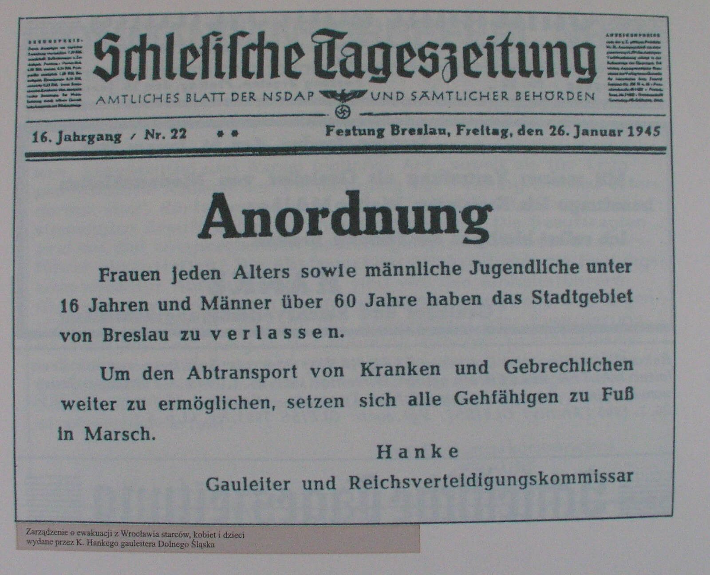

import FBBoxImageWrapper from '../../components/FBBoxImageWrapper.astro'

### 1. Front Białoruski

1 Front Białoruski zajął dziś Konin, Brześć Kujawski, Koło, Radziejów, Nidzicę i Włocławek.

Awangarda Frontu dotarła do Poznania i podjęła próbę ataku z marszu. Niestety jak się okazało, miasto było już przygotowane do obrony. Stanowiło pierwszą poważną przeszkodę na drodze żołnierzy Żukowa do Berlina.

W lesie pod Grajewem Niemcy rozstrzelali ponad 120 osób, głównie członków miejscowej inteligencji wraz z rodzinami.

Oddziały 1 Gwardyjskiej Armii Pancernej i 5 Armii Uderzeniowej zdobyły Koło, zginęło 132 żołnierzy sowieckich.

### 1 Front Ukraiński

1 Front Ukraiński: Koziegłowy, Olkusz i Nowy Sącz.

Podczas walk o Kluczbork sowieccy jeńcy wojenni, będący robotnikami przymusowymi w zakładzie produkującym drut kolczasty, zorganizowali bunt, 18 z nich zginęło.

W Sieradzu opuszczonym przez Wehrmacht doszło do tragicznej pomyłki. Całkowicie cywilne już miasto zostało zbombardowane przez sowieckich lotników, około 100 osób zginęło, 200 zostało rannych.

{/* ### Brygada Świętokrzyska NSZ

FBTODO

- ["nie tylko "most na Pilicy", kpt NSZ Telesfor Piechocki („Gustaw”) przeszedł przez linię niemieckich posterunków w innym miejscu, chłopcy z WH/SS podwieźli oddział uzbrojonych Polaków ciężarówkami wprost do BŚ NSZ, 20 stycznia 1945, tego dnia dymiły jeszcze kominy w KL Auschwitz"](https://twitter.com/dwojkarz/status/1613555576256040960) */}

### Masakra w Ostrzeszowie

Od rana w Ostrzeszowie żandarmi wywlekali Polaków z ich z domów. Organizowano łapanki na ulicach. Zebrano ich na rynku pod Ratuszem i trzymano pod silną strażą. Chwytanych brutalnie bito i czasem do nich strzelano. W ten sposób na ulicach zmordowano 14 ludzi w tym jednego Niemca, przesiedleńca znad Morza Czarnego.

Na Rynku dla postrachu zorganizowano pokazową egzekucję - rozstrzelany został uczeń krawiecki Walenty Płaczek. Pozostałych 80 aresztowanych zamknięto i byli przeznaczeni do egzekucji następnego dnia. Jutro uratuje ich wkroczenie sowietów.

Wydarzenia te przeszły do historii pod nazwą Krwawa Sobota.

### Górny Śląsk

Atak na Górny Śląsk.

Marsz śmierci z Auschwitz dotarł do Żor. Rozstrzelano tam 47 ludzi.

### Egzekucja Wacława Krzeptowskiego

Oddział AK "Kurniawa" (burza śnieżna) pod dowództwem porucznika Tadeusza Studzińskiego "Kurzawy" aresztował w okolicy Zakopanego Wacława Krzeptowskiego i dzisiaj dokonał jego egzekucji przez powieszenie. Przy ciele zabitego znaleziono testament:

>Ja niżej podpisany Wacław Krzeptowski urodzony 1897 roku dnia 24 czerwca w Kościeliskach przekazuję cały swój nieruchomy i ruchomy majątek uwidoczniony w księgach hipotecznych w Zakopanem na rzecz oddziału partyzanckiego Kurniawa grupy Chełm AK z własnej nieprzymuszonej woli, jako jedyne zadośćuczynienie dla narodu polskiego za błędy i winy popełnione przeze mnie wobec polskiej ludności Podhala w okresie okupacji niemieckiej od roku 1939 do 1945 Kościelisko, 20 stycznia 1945, 22.30

Krzeptowski był przewodniczącym Goralenverein, organizacji założonej 29 listopada 1939 przez część działaczy Związku Górali, którzy byli zwolennikami kolaboracji. Według hitlerowskiej teorii rasowej byli przedstawicielami tzw. Goralenvolk, czyli germańskich górali. Jakkolwiek by to nie wyglądało dziwnie, Niemcy wierzyli w istnienie germańskich górali w Tatrach, miało to być dowodem na odwieczną germańskość tych ziem.

Idea ta nie cieszyła się popularnością wśród górali, np. próba utworzenia oddziału wojskowego spaliła na panewce, ale były regiony, gdzie wiele osób poszło na kolaborację z okupantem. Jest to temat do dziś wstydliwy i powodujący wiele podziałów. Krzeptowski był głównym działaczem i organizatorem tego ruchu. Od 1942 był na czele Goralisches Komitee samorządu będącego namiastką autonomii góralskiej. Spotkał się z gauleiterem Hansem Frankiem i starał się namówić go do idei założenia suwerennego państwa góralskiego. Prześmiewczo był nazywany "goralenführerem"

Wziął udział w powstaniu słowackim, a kiedy wrócił w swoje strony, zabiło go AK. Został pochowany na cmentarzu parafialnym w Kościelisku.

- Okupowana Polska ["Wacław Krzeptowski - przywódca Goralenvolk" [YT 19:26]](https://www.youtube.com/watch?v=nKeGXjU59Q8)
- [Biała odwaga](https://pl.wikipedia.org/wiki/Bia%C5%82a_odwaga)

### Wrocław

Przenieśmy się do Wrocławia, na Dolny Śląsk, ziemie rdzennie niemieckie.

Jest 20 stycznia, sobota. Najbardziej tragiczny weekend w historii Wrocławia. Decyzję o ewakuacji Wrocławia gauleiter Hanke podjął 19 stycznia, jeszcze wczoraj funkcjonariusze NSDAP obchodzili domy, wydając polecenie natychmiastowego skierowania się na dworzec i wyjazdu. Dotarli do nielicznych.

Dziś ogłoszono to wszystkim: wszystkie kobiety i dzieci mają opuścić miasto. Z megafonów słychać:
>Uwaga! Uwaga! Mieszkańcy Wrocławia! Komisarz Obrony Rzeszy i Gauleiter Śląska ogłaszają: Wrocław będzie stopniowo ewakuowany. Nie ma żadnych powodów do niepokoju i paniki. Najpierw miasto opuszczą kobiety i dzieci. Należy zabrać bagaż podręczny. Kobiety z małymi dziećmi mają zabrać ze sobą kochery: NSV [nazistowska opieka społeczna] przygotuje kuchnie polowe i dystrybucje mleka. Bliższe informacje udzielają dzielnicowe punkty ewakuacyjne...

A potem po prostu:
>Kobiety i dzieci mają natychmiast opuścić miasto.

Polecenie, które wówczas otrzymali wrocławianie, podsumowuje obwieszczenie z 26 stycznia 1945 opublikowane w formie afisza i w "Schlesische Tageszeitung":
>Zarządzenie! 
>Wszystkie kobiety, młodociani poniżej 16 roku życia i mężczyźni mający więcej niż 60 lat muszą natychmiast opuścić miasto. 
>Aby umożliwić ewakuację osób chorych i niedołężnych, są zobowiązani udać się w drogę pieszo. 
>Hanke 
>Gauleiter i Komisarz Obrony Rzeszy 

Obwieszczenie to było ponawiane wielokrotnie i w różnych formach aż do zamknięcia oblężenia wokół Wrocławia. Wiele osób opuściło miasto, ale powróciło jeszcze tego samego dnia, albo po kilku dniach widząc, co się dzieje, jakie warunki panują na drodze.

<FBBoxImageWrapper>

Obwieszczenie gauleitera Karla Hanke datowane na 26 stycznia 1945 nakazujące opuścić miasto wszystkim kobietom, dzieciom do 16 roku życia i mężczyznom po 60. 
Tekst oryginału: "Anordnung! 
Frauen jeden Alters sowie männliche Jugendliche unter 16 Jahren und Männer über 60 Jahre haben das Stadtgebiet von Breslau zu verlassen! 
Um den abtransport von Kranken und Gebrechlichen weiter zu ermöglichen, setzen sich alle Gefälligen zu fuß in marsch" 
Źródło: Wikipedia, domena publiczna
</FBBoxImageWrapper>

Jak to relacjonuje ówczesny wojskowy komendant Twierdzy, generał Krause, jeszcze w grudniu na naradzie w Berlinie przedstawił konieczność ewakuacji ludności Wrocławia, mówiąc, że z zachodu przeniesiono na ten teren traktowany jako bezpieczny schron Rzeszy obiekty przemysłowe i podjęto działania mobilizacyjne w sektorze cywilnym. Ze wschodu napływały masy uchodźców. Pod koniec 1944 Wrocław liczył około miliona mieszkańców, co stanowiło dramatyczny wzrost wobec niewiele ponad 600 tys. w czasach pokoju, a i tak przedwojenny Wrocław był jednym z najbardziej zagęszczonych miast Rzeszy. Trzeba też wziąć pod uwagę, że miał wówczas znacznie mniejszą powierzchnię, ok 60% obecnego stanu: 175 km2 wobec obecnych 292 km2.

Obrona tak zagęszczonego miasta była niemożliwa i była zbrodnią. Kolej była gotowa podstawić 100 pociągów na kilka dni, Krause proponował ewakuować ok. 200 tys. starszych i słabszych mieszkańców, kobiet w ciąży i matek z dziećmi. Jednak wówczas Karl Hanke odrzekł:

>Gdzie ja mam podziać tych ludzi, a poza tym Führer każe mnie rozstrzelać, jeżeli teraz w czasie najgłębszego pokoju, przyjdę do niego z czymś takim.

Na początku wydawało się, że instytucje miejskie jeszcze działają. Tysiące ludzi zmierzało w kierunku dworców kolejowych tylko po to, żeby dowiedzieć się, że nawet jeżeli jeszcze pociągi jeżdżą, to oni się do nich nie dostaną, natomiast ci, którzy zdołali tam dotrzeć, nie mogli się z nich wydostać. Ludzie ginęli w ścisku, tratowali się nawzajem. Najpierw to były pojedyncze ofiary, później setki. Z powodu tłoku nie było jak usuwać zwłok.

Fala uciekinierów ruszyła na południe, by pieszo wydostać się z miasta. Nie przygotowano im żadnych środków transportu, żadnej aprowizacji i pomocy na drodze. Nie zorganizowano noclegów ani choćby elementarnej opieki medycznej. Średnia temperatura stycznia wynosiła wtedy ok -6°C, w nocy spadała do -20°C co oznaczało, skutą mrozem ziemię i brak bezpiecznego noclegu w nieogrzewanych pomieszczeniach. Najsłabsi ginęli.

Świadkowie wspominają, jak wyglądała droga ewakuacji. Ponieważ ziemia była zbyt twarda, by pochować umarłych, pozostawiano ich na poboczu. Najbardziej rzucały się w oczy trupy dzieci, często niemowląt w becikach leżących na ziemi, wózki były wciąż potrzebne żywym.

W krótkim czasie miasto opuściło ponad pół miliona ludzi, do 700 tys. Większość z nich to były kobiety, ludzie starsi i dzieci. Przez Oporów szli na Kąty Wrocławskie i dalej w kierunku na Legnicę. Ocenia się, że około 90 tysięcy z nich zmarło.

Była to tzw. Wielka Ucieczka (niem. die große Flucht). Część znalazła schronienie w Wałbrzychu w opuszczonych zakładach przemysłowych. Ci którzy dotarli do Drezna padli ofiarą bombardowania, które w połowie lutego obróciło miasto w ruiny.

Ksiądz Paul Peikert:

>Śląsk jest kwitnącą krainą chłopów, serce się kraje na widok rodzin chłopskich wypędzonych przemocą. Właściciele są niemal bez wyjątku na froncie, podobnie ich synowie, być może nawet ich córki. Głównie są to ludzie starsi i dzieci, które siedzą na wozach, lub młodsze kobiety, które tylko przy pomocy jeńców wojennych musiały uprawiać swoją rolę. Ta masowa ucieczka przypada w dodatku w ostre dni zimy, gdy temperatura spada do 13-15 stopni. Dzieci zamarzają i ich krewni układają je na skraju ulicy. Donoszą, że zwozi się do tutejszych kostnic pełne ciężarówki takich zmarzniętych dzieci. Moja służąca opowiadała mi dziś, że sama widziała 8 zwłok dzieci na swej drodze przy szosie strzelińskiej za koleją obwodową i trupa starego mężczyzny w przydrożnym rowie. [...] Także Wrocław doczekał się ewakuacji. Prawdziwa panika i zamęt ogarnęły masy. Dworce kolejowe są całymi dniami tak przepełnione, że przebrnięcie przez tłumy jest niemożliwością. Wszystko tłoczy się do pociągów, które mogą przyjąć tylko ograniczoną ilość uciekinierów, największa część musi pozostać i próbować następnym razem. Większość ludzi zabiera wózki dziecięce i niezbędny bagaż, pieszo udając się szosą w niepewne. Obok chłopskich wozów ciągną nieprzerwane kolumny mieszczan, którzy na wózkach dziecięcych i kolaskach wiozą swą chudobę ku nieznanej jeszcze i wątpliwej przyszłości. Od tych kobiet i dzieci wymaga się, aby ogromną drogę przebyły pieszo. Obiecuje się im, że w Jaworzynie będą miały połączenie kolejowe, ale drogę z Wrocławia do Jaworzyny muszą przebyć pieszo. Skoro zaś dotrą do Jaworzyny - tam taki sam widok przepełnionego dworca.

Taki był koszt tchórzliwego zaniedbania i odłożenia ewakuacji na później, co w połączeniu z decyzją o obronie miasta bez względu na koszty spowodowało masakrę. Kiedy usłyszymy o "Wypędzonych", przypomnijmy sobie kto, ich wypędził i w jakich warunkach. W Prusach Wschodnich sytuacja przedstawiała się jeszcze gorzej. Stamtąd nie było nie tylko jak, ale i dokąd uciec.

Pamiętnik księdza Paula Peikerta przez kilkadziesiąt lat była w jedyną w Polsce popularną relacją z oblężenia Wrocławia. Owszem była też książka Marii Langner "Ostatni bastion", ale ta wydana wydana raz w 1951 w nakładzie 13 tys. egzemplarzy szybko popadła w zapomnienie. Relacje obu tych osób będą stałym wątkiem opowieści o bitwie o Wrocław.

### Twierdza

Do oblężenia miasta jest jeszcze kilka tygodni, ale już kształtowały się warunki zdecydowanej, brutalnej i nie liczącej się z kosztami, ani ludzkimi, ani materiałowymi obrony za wszelką cenę. Jak złudne były nadzieje, na szybki upadek reżimu hitlerowskiego, na szybkie wzięcie miasta przez sowietów wyrażane przez Marię Langner - to można było już wtedy ocenić. Jak pisze Dolata:

>Jak widać, siły i środki Niemców były dostatecznie duże, aby prowadzić długotrwałą walkę w okrążeniu z siłami znacznie większymi niż te, które posiadała 6 Armia Radziecka. Ponadto zaś, inaczej niż to było w przypadku innych dużych miast opuszczonych bez walki wobec groźby okrążenia, Niemcy zdecydowani byli bronić "Festung Breslau" do upadłego. Na taką postawę wpłynęły w dużym stopniu stosunki panujące wewnątrz "twierdzy", zwłaszcza zaś osobista w niej pozycja i wpływ gauleitera NSDAP i zarazem komisarza Rzeszy do spraw obrony przy VIII Okręgu Wojskowym. 
>Urodzony w 1903 r. w Lubaniu Karl Hanke, od stycznia 1941 r. sprawujący funkcję gauleitera i zarazem nadprezydenta prowincji dolnośląskiej, był zatwardziałym hitlerowcem, do końca ślepo wierzącym w Führera. Hanke całkowicie zdecydowany był raczej skazać miasto i jego mieszkańców na zagładę niż dopuścić do zajęcia go przez Armię Radziecką. Gdy w styczniu 1945 r. w drodze powrotnej z Górnego Śląska zjawił się we Wrocławiu niemiecki minister zbrojeń A. Speer, Hanke oprowadzając go po starym Ratuszu mówił z patosem: "Rosjanie nie zdobędą go nigdy. Raczej go spalę". Wysuwałem zastrzeżenia - pisze Speer - ale Hanke upierał się przy swoim. Było mu wszystko co stanie się z Wrocławiem, gdyby dostał się w ręce wroga. Swoje plany realizował Hanke konsekwentnie. Na nim to i na obu kolejnych dowódcach wojskowych spoczywa odpowiedzialność za palenie i burzenie całych dzielnic w celu lepszego ich przystosowania do działań obronnych. 
>W stosunku do dowódcy "twierdzy" Hanke spełniał rolę czynnika nadzorującego lojalność polityczną i ścisłe wykonywanie nadsyłanych z wyższych instancji rozkazów. 
>Dzięki radiostacji dużego zasięgu, zainstalowanej w schronie urządzonym pod budynkiem Nadprezydium (w pałacu Hatzfeldów przy ul. Wita Stwosza), gauleiter utrzymywał stały kontakt z Kancelarią Rzeszy i osobiście z M. Bormanem, wywierał istotny wpływ na podstawowe decyzje dotyczące "Festung Breslau". Między innymi doprowadził zmian na stanowisku dowódcy "twierdzy", przyczyniając się do odwołania generała Krausego, a następnie również (o czym później będzie mowa) generała von Ahlfena. 
>Wewnątrz "twierdzy" wykonawcą decyzji Hankego były podległa mu policja i administracja cywilna, przede wszystkim jednak terenowe organizacje NSDAP. W tragicznych dniach oblężenia funkcjonariusze partii hitlerowskiej zyskali sobie najgorszą sławę jako naganiacze i dozorcy ludności w niewolniczych i pochłaniających tysięczne ofiary robotach fortyfikacyjnych oraz jako donosiciele policyjnego aparatu terroru. 
>Ten ostatni rozbudowany został w "twierdzy" do monstrualnych rozmiarów. Wprawdzie część jednostek policji porządkowej oraz hitlerowskiej służby bezpieczeństwa w dniu 20 stycznia 1945 r. ewakuowała się do Saksonii, część zaś z szefem Gestapo W. Scharpfinklem powołano do Waffen SS i wcielono do pułku "Besslein", ubytek ten jednak został uzupełniony przez żandarmerię i Gestapo wycofane z terenów Polski (m.in. z Krakowa i Radomia), które teraz swoim rodakom zademonstrowały w praktyce "metody pracy", jakie stosowali poprzednio wobec Polaków. Brutalny terror, atmosfera donosicielstwa i wzajemnej podejrzliwości utrzymywały prawie do końca oblężenia w karbach całkowitego posłuszeństwa zarówno oddziały wojskowe, jak i pozostałą w mieście ludność cywilną.

Proszę zwrócić uwagę na tę podmianę części aparatu bezpieczeństwa. Miejscową bezpiekę operującą w środowisku prawie całkowicie niemieckim uzupełnili ludzie, których nastawienie i metody wykształciły się we wrogim otoczeniu terenów okupowanych i dokładnie to z czym musieli mierzyć się Polacy, spadnie teraz na niemieckich mieszkańców Wrocławia. Tym bardziej, że ich strach, paranoję i okrucieństwo znakomicie powiększy świadomość zbliżającej się i już wkrótce całkowicie ich otaczającej sowieckiej machiny zagłady.

### Maria Langner

>SYGNAŁY ŚWIETLNE 
> 
>Nadciąga niepowstrzymana, groźna, nieznana, drogę jej znaczy przemoc. Zapowiadają ją jaskrawe błyski, które jak drżące sygnały świetlne w bezszelestnej ciemności nieustannie przecinają chmury, piętrzące się coraz bliżej i coraz wyżej. 
>Zbliża się wojna. 
>Ma tysiąc twarzy, a jedną tylko nazwę. 
>Mieszkańcy tego miasta niezliczone razy wymawiali słowo "wojna", jednak prawie nigdy nie widzieli żadnego z jej obliczy. Każdy błysk światła na niebie wprawia nas w paniczne drżenie przed nieznanym, strasznym obliczem wojny. 
>Zbliża się wojna. 
>Złowroga nawałnica przywiała do mego domu małe obce dziecko uchodźców, maleństwo w powijakach, z paluszkami jak zapałki, niewinne i nic nie przeczuwające, jak małe zwierzątko wydarte z gniazda spod opieki matki. Moja młodsza córka, która uciekła z miasta powiatowego, leżącego na południowym wschodzie, przywiozła je z sobą tymczasem musiałam umieścić małego obcego przybysza i moją osiemnastoletnią córkę w niezbyt bezpiecznym miejscu. Barbara, moja najstarsza córka, zatrudniona jako pielęgniarka w Domu Niemowląt w Zgorzelcu, zajmie się nimi. To jest spokojny, zrównoważony człowiek i gdyby Zgorzelec został ewakuowany, zabierze do Domu Niemowląt obce dziecko i młodszą siostrę, która z trwożnym uporem opiera się wszelkim moim namowom. 
>Moja podróż, trzydziestosześciogodzinna jazda do Zgorzelca, miasta odległego o dwieście kilometrów, i pożegnanie z córkami jest już poza mną. Pozostało mi wrażenie nieskończonej rozpaczy i udręki, wciąż jeszcze prześladuje mnie obraz pociągów przepełnionych uchodźcami, dworców kolejowych pełnych ludzi, zdawałoby się na pól obłąkanych, schodów uginających się pod tłumami, a zamkniętych kordonem policji, matek, które zgubiły swoje dzieci, starców, którzy padali i o których nikt nie pytał. 
>Na Dworcu Głównym we Wrocławiu huczy bez przerwy, jak dnia poprzedniego, gdy odjeżdżałam, głośnik, który dźwięczy mi w uszach nawet teraz, gdy matka uszczęśliwiona moim powrotem owija mnie w ciepłym pokoju kocami i stara się, aby w domu panował spokój. Do mego zmęczonego mózgu docierają słowa: "Wszyscy noszący mundur, którzy przybywają lub są przejazdem w mieście, winni natychmiast zameldować się u oficera dyżurnego". 
>Mój syn, który od roku zaciągnął się do wojska do pomocniczej służby marynarskiej i obecnie liczy szesnaście lat, powinien w najbliższych dniach przyjechać do Wrocławia. Zgłosił się wraz z kilkoma swoimi młodymi kolegami do lotnictwa jako ochotnik, aby uniknąć grożącego mu przymusowego wcielenia do SS. Pisał, że dwudziestego stycznia przyjeżdża na egzamin psychotechniczny do Wrocławia.
>Dziś jest 20 stycznia. Zapadł już zmrok i zbliża się noc. "Wszyscy noszący mundur, którzy przybywają lub są przejazdem w mieście, winni zameldować się u oficera dyżurnego..." Wreszcie gdy już prawie usypiam, głos z megafonu przeobraża się w krzyk starej chłopki-uciekinierki, którą w nocy, przed dwudziestu czterema godzinami, wyprowadzili siłą dwaj policjanci i sanitariusz z hali dworca legnickiego. Uległa ona atakowi szału, który wyładował się w przeraźliwym krzyku, przechodzącym w niepohamowany zwierzęcy skowyt, żałosne biadanie nad niedolą, która nie da się wyrazić ludzkim słowem. 
>Możliwe, że dziś na dworcu spełniło się przeznaczenie mego syna. Może nawet nigdy się o tym nie dowiem.
>Zameldowanie się u oficera dyżurnego jest równoznaczne z wcieleniem do narodowej dywizji grenadierów, czyli oznacza natychmiastowe odkomenderowanie do oddziałów frontowych.

### Opole

Inaczej niż we Wrocławiu, w Opolu - również ogłoszonym Twierdzą - ewakuacja przebiegła planowo i w zorganizowany sposób. Rozpoczęto ją jeszcze 18 stycznia, a dziś kiedy padł rozkaz ewakuacji, mieszkańców Opola wywożono autobusami, a potem pociągami w stronę Kłodzka.

W ciągu czterech dni miasto opuściło 60 tysięcy ludzi. Zostało mniej niż tysiąc. Więźniów i robotników przymusowych ewakuowano w konwojach pieszych. Tyle się dało zrobić.

Komendantem miasta był pułkownik hrabia Friedrich Albrecht von Pfeil pochodzący ze starego śląskiego rodu, którego historia w tym regionie sięgają średniowiecza. Opole wiele mu zawdzięcza. Jutro popełni samobójstwo.

### Odnośniki

- [Ostrzeszów uczcił rocznicę Krwawej Soboty](http://wlkp24.info/ostrzeszow-uczcil-rocznice-krwawej-soboty/)
- [Beata Maciejewska "Z Festung Breslau pierwsza wyszła śmierć"](https://wroclaw.wyborcza.pl/wroclaw/1,35771,17262745,Z_Festung_Breslau_pierwsza_wyszla_smierc.html)
- [Ostatnia twierdza Rzeszy](https://wroclife.pl/czas-wolny/ostatnia-twierdza-rzeszy/)