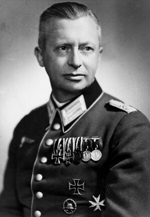

import FBBoxImageWrapper from '../../components/FBBoxImageWrapper.astro'
import SeeAlso from '../../components/FBSeeAlso.astro'

### Jan Borysewicz

Żołnierze 105 pułku piechoty NKWD w zasadzce pod Kowalkami koło Naczy (grodzieńszczyzna) zastrzelili kapitana Armii Krajowej Jana Borysewicza ps. "Mściciel", zdolnego dowódcę lokalnej partyzantki.

Był zawodowym żołnierzem, we wrześniu 1939 dowodził plutonem. Potem był więziony przez NKWD. W 1941 zaczynał z kilkuosobowym oddziałem, wkrótce miał oddział 650 dobrze uzbrojonych ludzi. Brał udział a operacji "Ostra Brama".

Sowieci obwozili ciało kapitana AK jak trofeum, wystawiając je na widok publiczny na rynkach miasteczek.

- [Jan Borysewicz (żołnierz)](https://pl.wikipedia.org/wiki/Jan_Borysewicz_(%C5%BCo%C5%82nierz))

### 2 Front Białoruski

Po kilku dniach powolnych postępów udało się dokonać wyłomu w linii przeciwnika. Drugim etapem operacji wschodniopruskiej jest operacja mławsko-elbląska. Dziś Stawka wydaje rozkaz: przez atak w kierunku Zalewu Wiślanego należy odciąć wycofujące się wojska Grupy Armii Środek: 2 i 4 Armię.

Lewe skrzydło Frontu ma nacierać na Bydgoszcz, a grupa szybka składająca się z 5 Gwardyjskiej Armii Pancernej i 3 Gwardyjskiego Korpusu Kawalerii z rejonu Działdowa na północ. Centrum natomiast ma opanować dolną Wisłę (Malbork).

W lesie w pobliżu Małszewa uciekający na rozkaz Wehrmachtu mieszkańcy zostali zatrzymani przez czerwonoarmistów. Trzy rodziny, kilkanaście osób. Wszystkim kazano zsiąść z wozów. Tylko trzy osoby się uratowały.

Jest to tylko jedna z wielu egzekucji, jakie miała miejsce w tych lasach. To już były ziemie traktowane jak Rzesza, a Mazurzy dla Armii Czerwonej i później dla PRL-u nie różnili się od Niemców.

- Olaf Popkiewicz ["Wielka Ewakuacja 1945 czyli Mierzeja Wiślana cz. IV" [YT 30:41]](https://www.youtube.com/watch?v=SRBKz3NBUEY)

### Ostróda

Ostróda została zdobyta w gwałtownych walkach. Majewski co prawda pisze, że nastąpiło to 23 stycznia, inne jednak źródła wskazują na 21 stycznia.

Miasto z samego rana zaatakowały wszystkie oddziały 10 Korpusu Pancernego 5 Armii Pancernej Gwardii (178 BPanc., 183 BPanc., 183 BPanc. i 11 BZ). Rozpoznanie ustaliło silny garnizon niemiecki w stanie gotowości. W czasie trwających cąły dzień walk połowa miasta została zniszczona.

- [JAK OSTRÓDA PRZESTAŁA BYĆ PRUSKA, A STAŁA SIĘ POLSKA](https://www.ostrodanews.pl/news/kultura/jak-ostroda-przestala-byc-pruska-a-stala-sie-polska/)

### Zawady Małe

Na chwilę przed sowieckim atakiem z Ostródy wymaszerował konwój z ewakuowanego obozu koncentracyjnego w Działdowie. Było to 120 wieźniów pędzonych przez SS i żandarmów. Maszerowali na mrozie już piąty dzień.

W nocy zatrzymali się na nocleg w Starych Jabłonkach. Po północy wywoływano ich w grupach po 20 osób i prowadzono do lasu pod Zawadami Małymi gdzie ich rozstrzelano. Ocalało tylko kilku więźniów.

### Mauzoleum Hindenburga

20 km na południe od Olsztyna znajduje się Olsztynek. Na zachód od Olsztynka w latach 1924-27 wybudowano monumentalny pomnik bitwy pod Tannenbergiem (niem. Tannenberg-Denkmal). Bitwa ta w sierpniu 1914 zadecydowała o przewadze niemieckiej na tym odcinku frontu. Była nie tylko wielkim zwycięstwem militarnym, ale przede wszystkim propagandowym. Było to wielkie zwycięstwo niemieckiej armii na niemieckich kresach, które zbudowało pozycję dwóch wielkich dowódców: Hindenburga i Ludendorfa. Tej popularności Paul von Hindenburg zawdzięcza zwycięstwo w wyborach prezydenckich, pełnił tę funkcję w latach 1925-34 i to on 30 stycznia 1933 mianował Adolfa Hitlera kanclerzem Niemiec.

Już w nowych warunkach politycznych Niemiec hitlerowskich pomnik stał się świątynią nacjonalizmu. 2 sierpnia 1934 zmarł prezydent Paul von Hindenburg. Mieszkał w Ogrodzieńcu (niem. Neudeck), miał tam majątek 900 ha. Ogrodzieniec jest 60 km na zachód od pomnika. Odbyły się wielkie państwowe uroczystości, w których wziął udział Hitler. Przy okazji przebudowano pomnik i nadano mu nową nazwę Mauzoleum Hindenburga.

Całość miała formę zamkowego muru z ośmioma wyniosłymi wieżami wysokości 20 metrów. Wewnątrz były trybuny i krypta. Za wzór obrano Stonehenge i XIII-wieczny zamek Castel del Monte cesarza Fryderyka II Hohenstaufa.

Wraz ze zbliżaniem się frontu trumny Hindenburga i jego żony usunięto i przez Królewiec 25 stycznia ewakuowano do Turyngii, gdzie zostały ukryte w kopalni soli.

Dziś rano dowódca 299 DP pułkownik Göbel otrzymał rozkaz wysadzenia go w powietrze. Nie miał niezbędnych ku temu materiałów wybuchowych, użył więc tego co miał, czyli niewielkiej liczby min i wysadził najważniejszą część Mauzoleum - kryptę Hindenburga. Wieczorem dojechało 30 ton ładunków wybuchowych i od razu przystąpiono do pospiesznego wysadzania. Destrukcję pomnika kontynuowano jeszcze 22 stycznia, ale nie udało się doprowadzić jej do końca, bo front zbliżał się zbyt szybko.

Ruiny zostały rozebrane przez czerwonoarmistów i potem przede wszystkim przez Polaków. Lew znajduje się przed Ratuszem w Olsztynku. Pozyskane materiały zostały użyte na potrzeby wielu budowli, m.in. warszawskiego Domu Partii, czyli obecnej Giełdy.

### 1 Front Białoruski

Tempo sowieckich postępów nie słabnie.

Dziś 1 Front Białoruski zdobywa Turek, Konin, Gniezno, Płock, Inowrocław, Żnin, Nowe Miasto Lubawskie, Piechcin, Rypin i Szubin.

Awangarda Frontu jest pod Poznaniem.

### 1 Front Ukraiński

Na południu 1 Front Ukraiński ugruntowuje pozycję krakowską, zdobywa Wieliczkę i Myślenice.

Najważniejszy jest w tej chwili kierunek uderzenia na Górny Śląsk. Zdobyte zostają Strzelce Opolskie, Dobrodzień i Kluczbork. Awangarda Frontu zdobywa Kępno i Olesno.

Majewski:

>Zacięte walki przyszło natomiast toczyć 73 Korpusowi, dowodzonemu przez generała majora S. Martirosjana (składającemu się z 50, 254 i 294 Dywizji Piechoty). Korpus ten 18 stycznia przełamał hitlerowskie umocnienia pozycji "B-1" na lewym brzegu Warty i w tym samym dniu zdobył Wieluń, zaś w nocy z 20 na 21 stycznia przekroczył dawną granicę polsko-niemiecką i po krótkich walkach ulicznych opanował 21 stycznia blokowany przez jednostki pancerne Rychtal.

Majewski:

>21 stycznia 91 Brygada Pancerna Gwardii zdobyła Namysłów i Bierutów.

10 Gwardyjski Korpus Pancerny z 4 Gwardyjskiej Armii Pancernej zdobył Ostrzeszów, uwalniając 80 aresztowanych wczoraj Polaków, którzy dziś mieli zostać rozstrzelani.

Na drodze do Wrocławia pierwszym miastem po niemieckiej stronie granicy z 1939 był Syców.

Wieczorem 21 stycznia został opuszczony przez cywilów i władze niemieckie. Pozostał niewielki 2 tys. garnizon złożony z Wehrmachtu, Volkssturmu i SS. Jutro rano będą tam już sowieckie czołgi.

Są już w Rzeszy! To niemiecka ziemia. Do Wrocławia mają w linii prostej 50 km. Gdyby nie zaciemnienie, mogliby wypatrywać łuny miasta.

### Opole

Do Opola gdzie tymczasowo znajduje się sztab Grupy Armii A, przybył minister uzbrojenia Rzeszy Albert Speer i odbył długą rozmowę z generałem Schörnerem (który dopiero w Opolu odnalazł swój sztab). Miało to miejsce w nieistniejącym już hotelu Forum, przy obecnej ulicy Krakowskiej.

Majewski kontynuując opis operacji 3 Armii Pancernej Gwardii:

>Radziecki zagon pancerny zadecydował także o losach wschodniej części Opola, bronionego przez silny garnizon niemiecki. Dowództwo hitlerowskie przywiązywało duże znaczenie do utrzymania tego miasta. 21 stycznia przybył tu, dla zapoznania się na miejscu z sytuacją, wspomniany już minister uzbrojenia Rzeszy A. Speer, który przeprowadził dłuższą rozmowę z generałem Schörnerem.

Opole miało kluczowe znaczenie dla utrzymania regionu, a jego upadek oznaczał utratę Górnego Śląska. Komendant miasta, pułkownik Friedrich Albrecht von Pfeil, który zrobił, co mógł by ewakuować ludność cywilną. Oprócz tego stosując się do rozkazów przygotował obronę miasta, jakby było twierdzą. Był to bezsens, bo dysponując środkami, które miał do dyspozycji nie dało się tego zrobić. Z planowanych umocnień powstała może 1/3. Ponadto nie mając trzech obiecanych dywizji pierwszoliniowych, nie miał tych umocnień czym obsadzić. Bronić się można było jakiś czas, ale oddając Opole prawobrzeżne, na linii Odry. To jednak było sprzeczne z ideą twierdz - "łamaczy fal" (niem. Wellenbrecher), które jako punkty silnego oporu miały załamać natarcie sowieckie.

Stan przygotowania miasta Schörner i Speer ocenili jako fatalny. O wszystko oskarżyli von Pfeila, twierdząc przy tym, że nie tylko nie dopełnił obowiązków, ale zabawia się, kiedy wroga armia podchodzi do miasta. Von Pfeil wiedząc, że rozkaz obrony pozycji do ostatniego żołnierza jest niedorzeczny, a rzekoma twierdza w obecnej postaci padnie od razu, co oznacza, że zgodnie z prawem hitlerowskim tamtych czasów ukarana zostanie za to jego rodzina (tak hitlerowcy dyscyplinowali ważnych oficerów). Jeszcze tej nocy popełnił samobójstwo w swojej kwaterze (wówczas siedziba dyrekcji kolei, obecnie budynek Komendy Wojewódzkiej Policji).

<FBBoxImageWrapper>

Pułkownik hrabia Friedrich Albrecht von Pfeil. Komendant obrony twierdzy Opole. 
Źródło: [Karbowiak o Festung Oppeln i Tragedii Górnośląskiej](https://ngopole.pl/2013/01/31/karbowiak-o-tzw-tragedii-gornoslaskiej-i-festung-oppeln/)
</FBBoxImageWrapper>

Wkrótce potem rozkaz o obronie do ostatniego żołnierza istotnie anulowano. A jego następca, generał Fritz Gräser uznając, że skoro ma łącznie z policjantami i Volkssturmem tylko 10 tysięcy żołnierzy obrona przed linią Odry jest bezcelowa. Rozkazał wycofanie za Odrę. Taki był krótki żywot Festung Oppeln, która jeszcze zanim pojawili się sowieci, stała się po prostu rejonem umocnionym Opole. Już za dwa, trzy dni prawobrzeżne Opole zostanie zajęte przez Armię Czerwoną. Wszystkie mosty były już zniszczone.

- History Hiking ["Festung Oppeln. Twierdza, której nie było" [YT 15:13]](https://www.youtube.com/watch?v=itP-ezZlXYs)

### Polska Cerekiew

Oświęcimski marsz śmierci dotarł do Opolszczyzny.

W Polskiej Cerekwi strażnicy z SS zamordowali 19 więźniów niezdolnych do dalszego marszu.

### Wrocław

Wszystko to w wielokrotnie większej skali i w tragicznej formie powtórzy się we Wrocławiu.

Kilka dni temu wojna była daleko gdzieś w okolicach Wisły za potężnym, stalowym murem Wehrmachtu. Dziś widzą już, że ten mur runął i w przerażeniu powtarzają plotki, że lada dzień sowieckie czołgi dotrą na rubieże Wrocławia. Również 21 stycznia nastąpiło załamanie operacji Nordwind - ostatniej próby ratowania pozycji w Ardenach. Teraz można było się już tylko cofać, i to na niemieckiej ziemi. Nawet jeśli wiadomość o tym dociera do Wrocławia, czy wobec fiaska na wschodzie kogokolwiek to obchodzi? Wątpliwe. Nikt we Wrocławiu nie wie, że pięć dni temu, 16 stycznia Adolf Hitler powrócił do Berlina i tam już pozostanie.

Panika wybuchła z całą siłą. Udzieliła się wszystkim. Jeszcze cztery dni temu wojna jakby nie istniała. Z dnia na dzień następowała eskalacja napięcia, niedostrzegalnie zamieniającą codzienną rzeczywistość w koszmar.

17 stycznia na ulicach pojawiły się wojskowe posterunki - ale to były sprawy wojskowych. Warszawa padła, ale przecież była daleko. Sytuacja na froncie wyglądała coraz gorzej. Wydawało się jednak nie do pomyślenia, że koszmar z Nemmersdorf będzie udziałem mieszkańców Śląska, że barbarzyńcy ze stepów wedrą się na rdzenną niemiecką ziemię. Co prawda po zmroku miało miejsce bombardowanie, ale przecież Śląsk zostanie obroniony.

Następnego dnia 18 stycznia sowieckie samoloty znowu nadleciały, tym razem biorąc za cel sieć kolejową. Bomby spadły na dworce kolejowe, najbardziej ucierpiał Wrocław-Brochów. Wciąż jednak mówiono o pojedynczych zniszczonych domach, liczono co do jednego wybite okna. Zaczęła się spontaniczna ewakuacja. Samochód z bakiem benzyny w warunkach wojennych był rzeczą nieosiągalną. Na dworcach kolejowych zaczęły się gromadzić tłumy. Jednak większość wrocławian sądziła, że ma jeszcze czas na ucieczkę, że władze coś zorganizują.

19 stycznia Armia Czerwona wkroczyła na Górny Śląsk, ostatnie funkcjonujące jeszcze zagłębie przemysłowe III Rzeszy i dotarła w okolicy Kluczborka do granicy Dolnego Śląska. W tej sytuacji przy kompletnym braku przygotowania zaplecza sprawujący władzę absolutną Gauleiter Karl Hanke wydaje tragicznie spóźniony rozkaz ewakuacji ludności cywilnej, tj. kobiet i dzieci: 19 stycznia powiatów leżących na wschód od Odry, następnego dnia - w sobotę - Wrocławia i okolic.

20 stycznia *die große Flucht* - groza uciekającego drogami całego społeczeństwa, całej ludności miast, miasteczek, wsi znana dotąd tylko mieszkańcom Prus Wschodnich spada na Wrocław. Okazuje się, że nie ma jak wyjechać z Wrocławia. Kiedy pada rozkaz ewakuacji, można z niego tylko wyjść. Późniejszy komendant Twierdzy Hans von Ahflen zbywa to słowami:

>rozkaz ewakuacji wydany z opóźnieniem [...] musiał spowodować ogromne trudności i pociągnąć za sobą ofiary, których można było uniknąć. Te smutne i bolesne wydarzenia są tak znane, że zbędne jest ich przedstawianie w tym miejscu.

Pastor Ernst Hornig:

>Kobiety we Wrocławiu wstrzymały oddech, kiedy 20 stycznia, a jeszcze dobitniej w niedzielę 21 stycznia po południu, usłyszały z ulicznych megafonów następujący komunikat: "Uwaga! Uwaga! Kobiety z dziećmi udadzą się piechotą do Oporowa w kierunku Kątów Wrocławskich. Wszyscy mają się zebrać na placach południowego przedmieścia". Ścisk i chaos panujące na dworcach kolejowych były tak beznadziejne, że wiele matek posłuchało zapowiedzi z megafonów. Kobiety te, najczęściej z małymi dziećmi w wózkach albo też, ponieważ leżał śnieg, na sankach, z plecakami i walizkami, ruszyły w mroźną noc drogą wychodzącą z miasta. Po kilkugodzinnym marszu rozpoczynało się poszukiwanie noclegu i gorącego pieca, ale często, z powodu liczby uciekinierów, nie otwierały się przed nimi żadne drzwi. Nie pomagało wyrzucanie ciążących przedmiotów - często nad ranem matki znajdowały swoje dzieci w kocach zesztywniałe i bez życia. Grzebały je w śniegu w przydrożnych rowach. Tylko na samym rynku w Środzie Śląskiej pochowano czterdzieścioro dzieci. W Parku Południowym, po pierwszej nocy ucieczki z Wrocławia, powstało pięćdziesiąt grobów dziecięcych. To tylko kilka przykładów ówczesnego żniwa śmierci. Te martwe dzieci miał jednak na sumieniu Gauleiter Hanke, który nie posłuchał rady Generalmajora Krausego dotyczącej wcześniejszej ewakuacji.

21 stycznia we Wrocławiu zmrok zapada zaraz po 17.00. W ciemności powietrze było tak zimne, że trudno było nim oddychać.

Cytaty z artykułu Beaty Maciejewskiej:

>Równolegle z ewakuacją ludności cywilnej rozpoczęto ewakuację instytucji. Henryk Onderka, więzień obozu Burgweide (Sołtysowice), był świadkiem wywozu chorych ze szpitala na Praczach Odrzańskich. Dzieci załadowano do nieogrzewanych wagonów towarowych. Wyły z bólu i zimna. Pociąg nie miał parowozu i transport nie ruszył. Nie ma informacji, co się z dziećmi stało.

>21 stycznia szesnastoletnia wrocławianka Vera Eckle znalazła się na szosie, którą szła kolumna uciekinierów. Przywiózł ją ciężarówką członek Volkssturmu. - Należałam do Związku Dziewcząt Niemieckich i ten człowiek powiedział, że dlatego muszę pomagać oddziałowi porządkowemu. Dostałam rozkaz pozbierania lalek leżących na poboczu. Zobaczyłam przed sobą zawiniątko, podniosłam je i w tej samej chwili upuściłam, wrzeszcząc: "Na litość boską, to są przecież dzieci!" - wspominała. 
>Była w szoku. - Facet z Volkssturmu podszedł do mnie i powiedział: "Tak jest, to są dzieci, które wyrzuciły niemieckie kobiety, żeby ratować własne życie".

>Przechodząc koło uniwersytetu, zobaczyli trupy na chodnikach. Najwięcej leżało dzieci. Oddziały usuwające zwłoki miały pełne ręce roboty. Tu i ówdzie buszowały wśród trupów bezdomne psy i koty. W przejściu uniwersyteckim leżały zdechła krowa, koza i porzucony dobytek. Prawdziwa panika i zamęt ogarnęły ludzi kierujących się w stronę dworca. 
>Orłowską dworzec przeraził. Na ławkach leżały beciki z niemowlętami. "W nieświadomości mojej oburzona byłam na matki, które swoje dzieci poukładały na ławkach dworcowych. Dopiero stojąc na peronie, przy przepełnionym do niemożliwości pociągu, gdy ktoś przez okno podał memu ojcu zawiniątko w niebieską kratkę, prosząc, aby pochował miesięczne dziecko imieniem Monika, zrozumiałam, że wszystkie zawiniątka na ławkach to nieżywe dzieci"

### Maria Langner

>EWAKUACJA 
> 
>Chłopak mój nie przyjechał. Laurenz przypuszcza, że nie otrzymał rozkazu wyjazdu na teren twierdzy. Ale serce matki łatwo ulega najgorszym przeczuciom. 
>Rozkaz ewakuacji miasta zostaje teraz obwieszczony przez radio, ale dwie trzecie ludności już dawno jest w drodze. Aparat radiowy wszelkim usiłowaniom, nie mogą zamaskować faktu zbliżania się jest przez cały dzień włączony. Skąpe komunikaty z frontu, wbrew oddziałów radzieckich. Nadal mówi się jeszcze o czołówkach pancernych. 
>Co godzinę jakiś obojętny głos odczytuje drogi zalecane dla ewakuowanych i kierunek marszu dla rozmaitych części miasta. 
>Czy to nie zima? Czy nie dmie wichura śnieżna? Czy wydają dodatkowe racje żywnościowe na drogę, czasem stu lub więcej kilometrową? 
>Do rozkazu wymarszu, wygłoszonego suchym tonem, jakby chodziło o komunikat meteorologiczny, nie dodają żadnego komentarza prócz dodatkowej rady: "Bez bagażu maszeruje się lżej!". 
>Wskazówki do "chwilowej" ewakuacji brzmią: "Wszyscy zdolni do marszu i osoby w wieku młodocianym winni niezwłocznie opuścić teren miasta". 
>Każda dzielnica miasta ma określony kierunek marszu. Kto ma nogi, może chodzić. Kto nie może chodzić, może jechać. Kto nie może jechać, winien sam się zorientować, jak wyjść z miasta. 
>Przed domem kierownictwa miejscowej grupy partyjnej stoją tłumy podenerwowanych ludzi. Publiczne ogłoszenie obwieszczające, jakie kategorie mieszkańców obowiązane są pozostać w mieście, potęgują zdenerwowanie, które urasta do prawdziwej paniki. Już czternastoletni chłopcy powoływani są do służby w volkssturmie. Całe rodziny opuszczają miasto i pozostaje spośród nich tylko młodzież, zatrudniona w sklepach żywnościowych i warsztatach zbrojeniowych. Trwoga matek jest nieopisana. Usiłują wyjednać u kierowników grup wyjątkowe zwolnienia i specjalne zezwolenia na wyjazd. Ale drzwi domów partyjnych pozostają zamknięte, kierownicy przeważnie znikali potajemnie, wyjechali w góry, dokąd dawno już ewakuowano ich żony i dzieci wraz z bagażami, cennymi przedmiotami, filetowymi firankami i drogocennymi dywanami. Siedzą bezpieczni w willach miejscowości uzdrowiskowych. 
>Partia wydała ostre zarządzenia i zagroziła dezerterom karami. Ten i ów stawia się ponownie, o ile nie znajduje się już ze swoją rodziną w drodze na zachód Rzeszy. 
>Teraz wybucha wściekłość i nienawiść tych, których zmuszono do powrotu. Upoważnieni przez partię wpadają do domów i pod groźbą użycia broni samowolnie zmuszają kobiety z dziećmi do opuszczenia miasta. 
>Kto pozostał dotychczas w mieście, ma swoje powody, z których najważniejszy jest ten, że mąż lub syn w najbliższych godzinach musi się zgłosić do volkssturmu. 
>Tajne stacje nadawcze podają wstrząsające wiadomości o niedoli uciekinierów i ludziach wyrzuconych z okręgów pogranicznych, co również wpływa na decyzję pozostania w mieście. Wiadomości te rozszerzają się lotem błyskawicy. 
>Niektóre rodziny próbują obejść przymus ewakuacji i ukrywają się u bezdzietnych znajomych lub krewnych, którzy uważają, że nie grozi im kontrola. Wszystko rozgrywa się w ciągu dni, ba, w ciągu godzin. 
>Po rozkazie opuszczenia miasta pani Griebsch załamała się nerwowo i w ciągu jednej minuty zdecydowała się na wyjazd. Zapas win i wódek z zamkniętego już przedsiębiorstwa zapewnia jej jazdę furmanką. Pani Griebsch mogla zabrać tylko część tak pieczołowicie chronionego przez nią zapasu kosztownych, rzadkich gatunków wina. Dwadzieścia butelek leży u mnie w piwnicy. Pierwszą otworzyłam po otrzymaniu wspaniałomyślnego daru i po wyjeździe pani Griebsch, gdy Malgorzata Laue przeniosła się do mnie wraz z narzeczonym i dzieckiem. 
>W kręgu moich znajomych nazywano Małgorzatę panią Laue. Norymberska ustawa o ochronie czystości rasy zabrania jej małżeństwa. Od lat walczy z trudnościami nie do zniesienia. Harry Laue, ojciec ślicznego i zdrowego dziecka Grety, pół roku temu został zwolniony z wojska. Kierownictwo miejscowej grupy partyjnej zmusiło Małgorzatę do natychmiastowego opuszczenia mieszkania i miasta. Szybko spakowała trochę rzeczy i ze swoją małą dziewczynką przyszła do mnie. Harry Laue jest obowiązany do służby w volkssturmie; odprowadza żonę i dziecko i na poczekaniu uzgadniamy, że wszyscy troje pozostaną w moim mieszkaniu. 
>W przeciągu kilku dni Armia Radziecka opanuje miasto. Najbliższe południowo-wschodnie miasto powiatowe, cel naszych niedzielnych wycieczek, już padło. 
>W ciszy nocnej słychać huk dział. 
>Połączenie telefoniczne ze światem zewnętrznym jest przerwane. Tylko w obrębie miasta, gdzie - jak można wnioskować z towarzyszących każdej rozmowie trzasków - istnieje podsłuch, telefony są jeszcze czynne. 
>Laurenz melduje się co godzinę. Jest sam w swoim biurze. Jego dalekopisy milczą. Tylko kierownictwo okręgu ma teraz prawo nadawać komunikaty. Gdy opowiadam Laurenzowi, że nasza miejscowa grupa partyjna telefonicznie poleciła jemu i Charliemu, który już dawno wyjechał, stawić się natychmiast, mówię z nim po raz ostatni. 
>Laurenz uciekł. Z prasową legitymacją, przy pewnej zręczności, łatwo mógł zmylić czujność wprowadzonej tymczasem ostrej kontroli Jeszcze kursują specjalne pociągi dla uchodźców, wolno posługiwać się nimi posiadaczom urzędowych zaświadczeń lekarskich, przepustek partyjnych i być może również właścicielom prasowych legitymacji. Jak mi Laurenz napomknął, przed odjazdem pociągu można niepostrzeżenie wsiąść do wagonu. 
>Nie trudno sobie wyobrazić, że Laurenz opuścił miasto, w którym rozwijał swoją działalność, ukryty za drzwiami bardzo małego przedziału, na którego zamkniętej zasuwie widnieje z zewnątrz słowo "zajęte". 
>My pozostali jesteśmy teraz, jak się to mówi "gotowi do walki". Wierzymy, że: "do ostatniej walki". 
>Matka, Pietro i ja, a także Harry, Malgorzata i ich dziesięciomiesięczna dziewczynka jesteśmy sami w wielopokojowym, trzypiętrowym domu. Dziewięć mieszkań stoi opuszczonych. 
>Na ulicach nie widać prawie przechodniów. Restauracje i kawiarnie są zamknięte, jak również większość sklepów. Radiowe nawoływania do ewakuacji ustały. 
>Również za dnia słychać stłumione odgłosy ciężkiej artylerii.

### Arcybiskup Adolf Bertram

Miasto opuścił ze względów zdrowotnych, będący już u kresu życia, 86-letni arcybiskup wrocławski kardynał Adolf Bertram, został wywieziony do pałacu biskupiego na Janowej Górze w Javorniku (Śląsk czeski). Umrze tam 6 lipca 1945.

We Wrocławiu zostali biskup pomocniczy Josef Ferche, kapituła katedralna i część urzędników kurii.

<SeeAlso txt="Arcybiskup Adolf Bertram (1859-1945)" url="/festung-breslau/article/adolf-bertram" />

### Odnośniki

- [Beata Maciejewska "Z Festung Breslau pierwsza wyszła śmierć"](https://wroclaw.wyborcza.pl/wroclaw/1,35771,17262745,Z_Festung_Breslau_pierwsza_wyszla_smierc.html)
- [Upadek Festung Oppeln](https://nto.pl/upadek-festung-oppeln/ar/4479993)
- [Co się wydarzyło w Małszewie 21 stycznia 1945 roku?](https://ro.com.pl/co-sie-wydarzylo-w-malszewie-21-stycznia-1945-roku-odpowiedz-na-to-pytanie-w-reportazu-mai-kwiatkowskiej-zapraszamy-dzis-o-godzinie-18-30/01338189)
- Mark Felton Productions ["Operation Nordwind 1945 - The 'Other' Battle of the Bulge" [YT 23:18]](https://www.youtube.com/watch?v=HQwjXm9xpqE)
- Stanisław Kokot [Śladami przeszłości Oleśnicy / Walki o Oleśnicę w 1945 roku / Cykl artykułów zamieszczonych w Gazecie Oleśnickej nr 12 -17 z 1990/91](https://www.olesnica.nienaltowski.net/WalkioOlesnice.htm)
