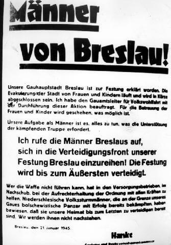

import FBBoxImageWrapper from '../../components/FBBoxImageWrapper.astro'

### Hitler

Majewski:

>[Hitler] 22 stycznia zdecydował przerwać działania zaczepne na froncie zachodnim i zwolnione dzięki temu siły, przede wszystkim 6 Armię Pancerną SS, skierować na wschód.

6 Armia Pancerna SS to związek bojowy utworzony na froncie zachodnim dość pospiesznie jesienią 1944. Miał mieszany charakter, były tam jednostki Wehrmachtu, jak i SS. Ostatecznie nigdy formalnie nie otrzymał insygniów SS, ale po wojnie tak powszechnie zaczęto tę Armię określać, po części dlatego, że już w momencie utworzenia w skład wchodziły dwa korpusy pancerne SS: I i II, po części ze względu na dowódcę, którym był generał SS Josef "Sepp" Dietrich, zaciekły hitlerowiec i jeden z ważniejszych SS-manów.

Finalnie na front wschodni wysłano tylko część 6 Armii Pancernej SS, np. LXVI Korpus Armijny włączony do 6 Armii dopiero w styczniu 1945 pozostał w Niemczech i w lutym został przeniesiony w skład 5 Armii Pancernej po czym zniszczony w Zagłębiu Ruhry. Sama natomiast 6 Armia rzeczywiście została wsadzona na pociąg i wysłana na wschód. Perspektywa jej dyslokacji w Polsce wywołała zrozumiałe zainteresowanie w sztabach Żukowa i Koniewa, więcej o tych planach poniżej w podrozdziale "Zielona Góra". Plany jednak zmieniono i trafiła na Węgry, gdzie w marcu została rozbita w operacji Frühlingserwachen (pl. wiosenne przebudzenie) w rejonie Balatonu, a potem jej resztki skierowano do obrony Wiednia.

Takie mieszanie formacji i błyskawiczne zmiany składów były typowe dla armii niemieckiej tego okresu.

### 2 Front Białoruski

W ramach operacji mławsko-elbląskiej (część operacji wschodniopruskiej) zdobył dziś Iławę i Olsztyn.

Iława stała się interesującym przykładem eksploatacji prowadzonej przez nowego okupanta. Na terenie dawnego hitlerowskiego obozu pracy powstał sowiecki obóz jeniecki, w którym wykorzystywano pracę niewolniczą, a potem tych jeńców wywożono na wschód. Na wschód wywieziono też maszyny i co tylko się dało zabrać.

Niemców wysiedlono dopiero w 1948. Podobnie jak we Wrocławiu ludność cywilna otrzymała polecenie ewakuacji dopiero 19-20 stycznia, nie mieli szans na ucieczkę.

Olsztyn został zdobyty w wyniku śmiałej akcji korpusu kawaleryjskiego generała Nikołaja Oslikowskiego, który w śnieżnej zadymce, przez lasy pokonał 60 km i wziął miasto zupełnie nieprzygotowane z zaskoczenia. Olsztyn był w tym momencie nietknięty. Potem kiedy już czerwonoarmiści znaleźli sobie kwatery, spalili połowę miasta.

### 1 Front Białoruski

Dla 1 Frontu Białoruskiego to dziewiąty dzień ofensywy. Dziś na froncie poznańskim oddziały 1 Gwardyjskiej Armii Pancernej generała Michaiła Katukowa zdobyły Wrześnię.

Inne miejscowości dzisiaj zdobyte to Gołańcz, Kcynia, Margonin, Pobiedziska, Pasym i Odolanów.

### Zielona Góra

Według założeń operacyjnych z dzisiaj 6 Armia Pancerna SS miała bronić środkowego odcinka Odry w ramach operacji Sonnenwende (pl. przesilenie dnia z nocą). Po dotarciu w rejon Zielonej Góry miała uderzyć na północ przez Międzyrzecz w kierunku Gorzowa Wielkopolskiego. Gdyby to było niemożliwe, zadaniem była obrona Zielonej góry zamienionej w kolejną "twierdzę".

Ostatecznie do tego nie doszło. 6 Armia została skierowana na front węgierski i tam rozbita.

- [Plany na Festung Grünberg [Nieznana Zielona Góra]](https://www.wzielonej.pl/informacje/zielona-gora/plany-na-festung-grunberg-nieznana-zielona-gora/)

### Wędrujący kocioł

"Wędrujący kocioł" dotarł do Warty na południe od Sieradza, przez ostatni dzień ukryty przed sowieckim lotnictwem pod niespodziewaną osłoną gęstej mgły. Spotkanie z jednostką rozpoznawczą Korpusu "Großdeutschland" przetransportowanego koleją z Prus Wschodnich.

### 1 Front Ukraiński

1 Front Ukraiński wciąż walczy w okolicach Krakowa. Dzisiaj zdobył Nowy Sącz, Pyskowice i Wąsocz.

### Manewr 3 Armii Pancernej Gwardii

Jednym z ważniejszych elementów tej fazy operacji wiślańsko-odrzańskiej był zaskakujący i niezwykle trudny manewr elity pancernej Frontu - 3 Armii Pancernej Gwardii pod dowództwem generała Rybałki. Polegał on na tym, że cała armia pancerna w trakcie walki, na czole frontu, zachowując prędkość i pełną zdolność bojową miała zawrócić pod kątem prostym "z rejonu Opola w kierunku Gliwic". Celem tego manewru było odcięcie od zachodu zgrupowania sił niemieckich na Górnym Śląsku.

Górny Śląsk był dla sowietów najważniejszym celem na obszarze pomiędzy Wisłą a Odrą, jak to powiedział wprost Stalin, było to złoto. Manewr okrążający miał na celu z jednej strony uniknięcie morderczych walk w okręgu przemysłowym, a z drugiej zapewnić, że całe to bogactwo i zasoby i maszyny wpadną w ręce sowieckie nietknięte i gotowe do eksploatacji.

Tutaj Majewski opisując przebieg walk wchodzi w dyskusję z autorami radzieckimi, którzy piszą, że rozkaz Koniewa padł 20 stycznia, a jego realizacja rozpoczęła się 22 stycznia: wg Majewskiego dopiero 23 stycznia zakończyło się rozpoznanie sił niemieckich na Górnym Śląsku, a Koniew kiedy zobaczył, jak wiele jest tych jednostek, zadecydował o okrążeniu tego zgrupowania i zmuszeniu go do wycofania się. Wzięcie nietkniętego górnośląskiego okręgu przemysłowego było ważniejsze niż zniszczenie wojsk niemieckich.

Majewski o chronologii:

>Z relacji dowódcy Frontu (być może z powodu zbyt skrótowego przedstawienia tego problemu) można byłoby sądzić, że decyzja "głębokiego manewru górnośląskiego" zapadła już 20 stycznia. Tymczasem dowództwo 1 Frontu Ukraińskiego zamierzało niewątpliwie dokonać oskrzydlenia Górnośląskiego Okręgu Przemysłowego od północy siłami 21 Armii, 31 Korpusem Pancernym i 1 Korpusem Kawalerii Gwardii. Natomiast 23 stycznia, jak pisze marszałek Koniew, bardziej precyzyjnie ustalony został skład wojsk hitlerowskich na Górnym Śląsku. "Liczyły one dziewięć dywizji piechoty, dwie samodzielne brygady, sześć samodzielnych pułków, dwadzieścia dwa samodzielne bataliony [...]. I sądząc z wszystkiego, można było oczekiwać, że w najbliższym czasie przybędą dwie, trzy dywizje piechoty i jedna dywizja pancerna [...]. Tak więc zgrupowanie nieprzyjaciela, chociaż złożone w zasadzie z mocno przetrzebionych w walkach wojsk, reprezentowało solidną siłę"

Majewski o samej operacji:

>W dniu następnym [czyli 1945-01-22] armia generała Rybałki, zgodnie z decyzją marszałka Koniewa podjętą 20 stycznia 1945 r., zmieniła kierunek natarcia i ruszyła na południe. Jak pisze w swoich wspomnieniach ówczesny członek Rady Wojennej Frontu generał pułkownik K. Krajniukow: "Koniew i Sokołowski byli zaniepokojeni tym, że 5 Armia Gwardii po zdobyciu Częstochowy wyraźnie zwolniła tempo natarcia. Dlatego też podjęli decyzję, by 3 Armia Pancerna Gwardii, która osiągnęła rejon Namysłowa, wykonała głębokie uderzenie skrzydłowe w kierunku Opola na tyły sił niemieckich broniących się przed frontem armii Żadowa. Manewr ten został przeprowadzony pomyślnie". 
>Skierowanie 3 Armii Pancernej na południe zmusiło jednostki niemieckiego VIII Korpusu do gwałtownego odwrotu za Odrę, co ułatwiło działania 5 Armii Gwardii. Ponadto manewr na południe odsłonił od północy tyły hitlerowskiego zgrupowania na Górnym Śląsku, co wykorzystały jednostki 21 Armii generała Gusiewa, która wprowadzona w rejonie Miechowa do pierwszego rzutu Frontu, wsparta 31 Korpusem Pancernym i 1 Korpusem Kawalerii Gwardii, nacierając na Tarnowskie Góry miała obejść od północy Górnośląski Okręg Przemysłowy, a następnie współdziałać w okrążeniu znajdujących się tam wojsk hitlerowskich.

Ten manewr zagrozi siłom niemieckim na Górnym Śląsku. A 3 Armia jest jednostką, która może tak trudny rozkaz wykonać. Kieruje się na południe. VIII Korpus wycofuje się za Odrę.

### Dolny Śląsk

4 Armia Pancerna jest już na Dolnym Śląsku. Przy czym, jeśli chodzi o datowanie zdobycia Milicza, jest tu niespójność, datę 22 stycznia podają Dolata i Jurga w "Walki zbrojne na ziemiach polskich 1939-1945", natomiast Majewski:

>4 Armia Pancerna, dowodzona przez generała-pułkownika D. Leluszenkę, która na 30-40 km wysunęła się przed związki ogólnowojskowe, działała głównymi siłami wzdłuż lewego brzegu Baryczy. Na prawym skrzydle Armii nacierał 6 Korpus Zmechanizowany (dowódca pułkownik W. Orłow), na lewym 10 Korpus Pancerny (dowódca pułkownik N. Czuprow), 21 stycznia żołnierze generała Leluszenki wyzwolili Ostrzeszów i Milicz. 17 Brygada Zmechanizowana (dowódca podpułkownik L. Czuryłow), która wraz z podporządkowanym jej 126 samodzielnym pułkiem czołgów nacierała na prawym brzegu Baryczy, osłaniała 6 Korpus od północy. W dniu 22 stycznia wyzwoliła ona Rawicz, następnie Wąsosz. W nocy z 22 na 23 stycznia brygada ruszyła z Wąsosza przez Barycz na południowy zachód [...]

4 Armia Pancerna nacierała w kierunku Odry. O 11.30 jej dowódca generał Leluszenko nakazał dowódcy 93 Brygady Pancernej, która zdobyła wcześniej Milicz, wydzielić grupę bojową. Miała ona, współdziałając z elementami 22 Brygady Artylerii Pancernej, uderzyć na Rawicz. Napotykając niewielki opór, o 14.30 wdarli się do Rawicza i rozbili miejscowy garnizon, zdobyli do 200 pojazdów kołowych. Wieczorem w Rawiczu skoncentrowały się główne siły 93 Brygady Pancernej. Przed północą do dotarły tam też pododdziały 17 Brygady Zmechanizowanej Gwardii.

- [Zdobycie Rawicza - 23 stycznia 1945 r.](https://www.facebook.com/bobr1945/posts/3378528802260759)

### Opole

Wieczorem czołowe jednostki 3 Armii Pancernej Gwardii dotarły na północ od Opola. Bitwa o Opole zacznie się jutro.

Majewski:

>Nie mniej dynamicznie rozwijały się działania na innych odcinkach frontu. W dniu rozpoczęcia walk o Opole (tj. 22 stycznia) wyszły nad Odrę oddziały wydzielone 5 Armii Gwardii.

### Oleśnica

Majewski o działaniach 73 Korpusu (3 dywizje piechoty), który na drodze do Wrocławia napotkał niespodziewaną przeszkodę:

>W dniu następnym jednostki korpusu rozwinęły natarcie w kierunku Oleśnicy, jednak na linii Bukowie-Lipka-Gaszowice powstrzymał je silny opór przeciwnika. Na podstawie zeznań jeńców ustalono, że dowództwo hitlerowskie wprowadziło do walki na tym odcinku przybyłą z frontu zachodniego 269 Dywizję Piechoty wspartą niewielką ilością czołgów i dział pancernych. Dywizja ta, dowodzona przez generała-leutnanta H. Wagnera, przerzucona pośpiesznie z 19 Armii znad Górnego Renu, składała się z 469, 489 i 490 pułków piechoty, 269 pułku artylerii, batalionu dział szturmowych (pancernych), batalionu przeciwlotniczego oraz batalionów saperów i łączności. Liczyła ogółem 10,5 tysiąca żołnierzy, co odpowiadało liczebności dwóch radzieckich dywizji piechoty. Mimo że nie wszystkie transporty dywizji znalazły się 21 stycznia we Wrocławiu, generał kawalerii R. Koch-Erpach (dowódca Grupy Korpuśnej "Breslau"), wobec alarmujących meldunków o postępach wojsk radzieckich, podjął decyzję wysunięcia przybyłych jednostek na dalekie przedpola Wrocławia dla opóźnienia natarcia radzieckiego w rejonie na wschód od Oleśnicy.

Było to ponad 10 tys. żołnierzy. Prosto z rampy zostali wysłani na obronę Oleśnicy.

Był to ważny węzeł kolejowy i ostatnia rubież przed Wrocławiem. Niemcy chcieli opóźnić zdobycie Oleśnicy o 3 do 4 dni, po to by zyskać na czasie. Każdy dodatkowy dzień miał ogromne znaczenie dla szykowania obrony Wrocławia. Dalej Majewski tak opisuje znaczenie pozycji w Oleśnicy i sytuację na tym odcinku:

>Z pojawieniem się nowej dywizji niemieckiej zmienił się w pasie natarcia 73 Korpusu stosunek sił, czego wyrazem były dwudniowe zacięte walki w rejonie Oleśnicy. Wybór tego miejsca przez dowództwo hitlerowskie nie był przypadkowy. Oleśnica, ważny węzeł kolejowy i drogowy, była ostatnią większą miejscowością na szlaku prowadzącym z północnego wschodu do Wrocławia. Zdobycie tego punktu obrony umożliwiłoby rozwinięcie bezpośredniego natarcia na "Festung Breslau", miasta-twierdzy w tym czasie jeszcze nie przygotowanego do obrony. 
>W Oleśnicy znajdował się stosunkowo silny garnizon wojskowy. W okresie wojny stacjonował tu sztab 322 pułku piechoty (wchodzącego w skład rezerwowej 408 Dywizji Piechoty), wraz z pododdziałami artylerii, moździerzy i kwatermistrzostwa, 8 szkolny batalion rozpoznawczy, zapasowy oddział kawalerii, batalion radiotechniczny oraz szereg pomniejszych oddziałów i instytucji wojskowych. Na miejscowym lotnisku bazował szkolny pułk lotniczy, obok zaś mieściły się zakłady naprawcze, w których remontowano wówczas około 200 uszkodzonych samolotów. Ponadto w pobliskich lasach znajdowały się duże składy materiałów pędnych, szczególnie cennych dla armii hitlerowskich. Wszystko to, według dowództwa niemieckiego, uzasadniało celowość obrony tego miasta. 
>Rozkaz wydany generałowi Wagnerowi przez dowódcę Grupy Korpuśnej "Breslau" nakazywał przybyłym już oddziałom 269 Dywizji (489 pułkowi piechoty, 2 batalionowi 490 pułku, dywizjonowi 269 pułku artylerii), wspartym przez dwa bataliony Volkssturmu, zbiorczy batalion policji i grupę czołgów, obsadzić w nocy z 21 na 22 stycznia pozycje obronne nad Widawą od Dziadowej Kłody do Idzikowic. Na linii tej dowództwo hitlerowskie zamierzało w ciągu 2-3 dni prowadzić działania obronne, aby uzyskać czas niezbędny do umocnienia "Festung Breslau", jak również wywiezienia nagromadzonych w rejonie Oleśnicy zapasów oraz odtransportowania znajdujących się w naprawie samolotów. Kolejna linia obrony przebiegać miała przez Miodary, Boguszyce i Oleśnicę do Ligoty Małej. Stąd po dalszych 3-4 dniach planowano wycofanie się do północno-wschodniej części zewnętrznego pierścienia obrony wokół Wrocławia. Plany te zostały jednak przekreślone przez zdecydowane działanie 73 Korpusu, który nie dopuścił do zajęcia przez nieprzyjaciela przewidywanych pozycji, odrzucając go na zachód. 
>Na prawym skrzydle korpusu 254 Dywizja Piechoty, dowodzona przez pułkownika P. Ziwaliewa, po przecięciu drogi z Sycowa do Namysłowa nacierała przez Dalborowice i Poniatowice w kierunku Boguszyc, dążąc do obejścia Oleśnicy od północy. W centrum 50 Dywizja Piechoty (pułkownik N. Ryban) przez Lipkę i Stronię spychała hitlerowców bezpośrednio w kierunku miasta. Natomiast na lewym skrzydle 294 Dywizja pułkownika G. Korolenki atakowała wzdłuż osi Idzikowice, Gorzesław, Smolna, Krzeczyn.

### Marsz śmierci

Marsz śmierci z Auschwitz dotarł dziś do Wodzisławia Śląskiego.

Pociąg z więźniami Auschwitz zatrzymał się po dotarciu do stacji Rzędówka (8 km przed Rybnikiem), wszyscy zostali wypędzeni z wagonów i mieli dalej odbyć drogę pieszo. Tych którzy nie mogli dalej iść, SS-mani zastrzelili. Znajduje się tam pomnik upamiętniający ofiary. Napis na nim głosi:

>Dnia 22.1.1945 350 więźniów oświęcimskich różnych narodowości zakończyło tu swą męczeńską drogę pod kulami niemieckich oprawców. Pamięć o nich niech przyświeca wszystkim broniącym pokoju człowieczeństwa w świecie.

- ["Historia: Masowy mord na Rzędówce !"](https://iknurow.pl/historia-masowy-mord-na-rzedowce/)

### Berlin

Za: ["Berlin 1945: Tagebuch einer Großstadt"](https://www.imdb.com/title/tt12264166/) - [Berlin 1945 Tagebuch einer Großstadt teil 1 DOKU](https://www.youtube.com/watch?v=zUBXgDM0VjY)

>22 stycznia. Przyjechał pierwszy pociąg ze Śląska. Jeden wagon był pełen martwych dzieci. Stał na mrozie przez 96 godzin. Dzieci były w nim upchnięte jak sardynki. Szef kazał nam odgarniać śnieg i kopać groby. Ziemia była zamarznięta do głębokości pół metra. Kopaliśmy łopatami, kruszyliśmy ziemię młotami i kilofami. Wcześniej było ciężko, ale teraz jeszcze się pogorszyło.

### Jan Skala

Dzisiaj w wiosce w pobliżu Namysłowa jedną z ofiar Armii Czerwonej został Jan Skala. Został zastrzelony, kiedy protestował przeciwko ograbianiu swojej rodziny przez czerwonoarmistów.

Z zawodu ceramik, znany najbardziej jako poeta i literat górnołużycki, aktywnie przeciwstawiający się germanizacji Serbołużyczan i antynazista. W 1920 założył Łużycką partię Ludową. W 1925 z jego inicjatywy powstała gazeta Kulturwehr, której misją była ochrona mniejszości narodowych w Niemczech. Nawiązał kontakty z powstałym w 1924 Związkiem Polaków w Niemczech. W 1932 powiedział:

>Dojście Hitlera do władzy oznacza, że za kilka lat będzie wojna. Przeciw Polsce, Związkowi Radzieckiemu, przeciw całemu światu.

Prześladowany przez hitlerowców, ale zabiła go Armia Czerwona. Jedna z tysięcy codziennych tragedii tamtych dni. W 1965 staraniem Towarzystwa Miłośników Ziemi Namysłowskiej i łużyckiej organizacji Domowina postawiono mu pomnik w Namysłowie.

- [Jan Skala](https://pl.wikipedia.org/wiki/Jan_Skala), [Domowina](https://pl.wikipedia.org/wiki/Domowina)

### Warszawa

19 września 1944 PKWN mające wówczas siedzibę w Lublinie mianowało Mariana Spychalskiego Prezydentem Warszawy. Był to działacz traktowany podejrzliwie przez władze sowieckie, podejrzewano go o odchylenie narodowe, był zwolennikiem przyjmowania akowców do władz i integracji wszystkich sił politycznych. Sojusznik Gomułki.

Dzisiaj Spychalski już jako urzędujący Prezydent powołał Biuro Organizacji Odbudowy m.st. Warszawy pod kierownictwem Jana Zachwatowicza. 14 lutego zostanie przekształcone w Biuro Odbudowy Stolicy, mając już wówczas pełne polityczne poparcie swojego działania, także ze strony Stalina.

Do odbudowy jeszcze było daleko. Pierwszym zadaniem było rozminowanie stolicy i udrożnienie głównych dróg. Potem inwentaryzacja strat i ocalałych zabytków. Ratowanie tego, co się da. Zapewnienie minimalnej bazy sanitarnej koczownikom w ruinach. A potem przygotowanie się do kolejnej zimy tym razem z wielokrotnie większą liczbą ludzi. Dopiero wtedy mogła nastąpić budowa nowego miasta na morzu ruin. Przed Zachwatowiczem i jego ekipą stało zadanie, jakiego nikt jeszcze na świecie się nie podjął.

Tragicznym kontekstem tego wydarzenia jest fakt, że kilka innych miast Europy w naszym regionie najbardziej zniszczonych wojną: Wrocław, Gdańsk, Poznań, Drezno i Berlin tego dnia były nietknięte. Berlin był bombardowany od dawna, ale zniszczenia nie były wielkie. Do końca wojny trzy miesiące.

### Wrocław

Jak relacjonuje to ksiądz Paul Peikert we wpisie datowanym na 22 stycznia:

>Począwszy od czwartku 19 [stycznia] ciągnie się teraz nieprzerwana rzeka uchodźców dniem i nocą i nie można jeszcze przewidzieć, kiedy ona wyschnie.[...] Ze Świebodzic doniesiono mi telefonicznie, że tam u podnóża gór piętrzy się rzeka uchodźców. W zimnych stodołach, w zamarłych, lodowato zimnych fabrykach lokuje się tłumy uchodźców. [...] Nastała nieopisana niedola i nieopisana nędza. Od niemal 10 dni, a nawet dłużej, dworce były zatłoczone ludźmi, co zastraszeni chcieli opuścić zagrożony obszar. Matki z małymi dziećmi, matki w ciąży, starzy, wynędzniali ludzie, z trudem poruszający się o lasce, wśród nich duża gromada dzieci i młodszych kobiet - oto był obraz ówczesnych dworców kolejowych. Przez wiele godzin, a nawet dzień albo i dwa na przejmującym zimnie musieli uchodźcy czekać na dworcach do czasu, aż ich wpuszczono do pociągu ewakuacyjnego. Jakaś kobieta z czworgiem małych dzieci (najstarsze w wieku 8 lat, najmłodsze 8 dni) leżała przez 36 godzin na Dworcu Świebodzkim. Wyczerpana poszła potem ze swoimi dziećmi do domu, ponieważ nie mogła odjechać pociągiem. Trafiało się też, że na dworcach matki rodziły przedwcześnie z przestrachu i podniecenia wywołanego ucieczką. W potwornym tłoku, obładowane licznymi bagażami, gubiły często swe dzieci, których nieraz więcej już nie odnajdywały. Wywoływano potem nazwiska tych dzieci, lecz matka się nie zgłaszała. Bywało też, że matki poszukiwały swych dzieci i polecały same ogłaszać nazwisko, a dziecko nie zgłaszało się więcej. Doniesiono mi, że na samym Dworcu Głównym zaduszono na śmierć lub stratowano 60-70 dzieci.

i w innym miejscu:

>Pewna obwodowa grupa partyjna na terenie tutejszej parafii zawiadomiła matki, że następnego dnia rano o godzinie 9 powinny stawić się w punkcie zbornym; dzieci załadowałoby się na ciężarówkę, matki natomiast z większymi dziećmi musiałyby długą drogę do Lubania (120 km) odbyć pieszo. Są to wymagania, którym nie sprosta najsilniejszy organizm, zwłaszcza że ludzie wskutek wojennego niedożywienia i udręk tych czasów są bardzo wycieńczeni. Nigdy chyba nie stanęły w świadomości ludzi tak przejmująco i wyraźnie słowa Zbawiciela: "A proście, by uciekanie wasze nie było w zimie...".

Wraz z cofaniem się frontu wschodniego władze niemieckie wyrzuciły na mróz, bez żadnego przygotowania ponad 6 milionów własnych obywateli, w Prusach Wschodnich, na Pomorzu, w Kraju Warty i na Śląsku. Była to tzw. Wielka Ucieczka (niem. die große Flucht).

17 stycznia, kiedy padła Warszawa, zaczęło się inne makabryczne wypędzenie. Rankiem 17 stycznia miał miejsce ostatni apel w KL Auschwitz, w którym wzięło udział 67 tysięcy więźniów, bezpośrednio po nim zaczęła się ewakuacja obozu. Często z braku środków transportu więźniów konwojowano pieszo, w samych pasiakach, bez posiłków i z noclegiem pod gołym niebem. Takie konwoje nazwano Marszami Śmierci. Czy na drogach spotykali się z uciekającymi Ślązakami? 22 stycznia, kiedy pozostali w mieście wrocławianie czytają odezwę Gauleitera, taki Marsz Śmierci wyruszył z AL Fünfteichen (obecnie Miłoszyce) do obozu macierzystego Groß-Rosen.

W poniedziałek 22 stycznia zakończyło się funkcjonowanie resztek cywilnego Wrocławia - jak opisuje to pastor Ernst Hornig:

>lokalne władze opuściły miasto lub zakończyły swoje urzędowanie. Urzędnicy dostali urlopy i pozwolono im wyjechać z Wrocławia, o ile, rzecz jasna, nie podlegali Wehrmachtowi czy Volkssturmowi. Tego samego dnia Uniwersytet został przeniesiony do Drezna. Exodus ten dosięgnął również politechnikę, kliniki uniwersyteckie na Szczytnikach, seminaria oraz instytuty wyższych uczelni. Także profesorowie uniwersyteccy zdecydowali się, z niewielkimi wyjątkami, na wyjazd z miasta. Budynki sądów, nowa siedziba zarządu rejencji przy pl. Powstańców Warszawy oraz Urząd Pracy na Pomorskiej - nagle opustoszały.

### Mobilizacja

Tego samego dnia Schlesische Tageszeitung publikuje odezwę Gauleitera Karla Hanke, tym razem jest to rozkaz pozostania w mieście szykującym się do obrony:

>Mężczyźni Wrocławia! 
>Nasza stolica regionu Wrocław została ogłoszona twierdzą. Ewakuacja z miasta dzieci i kobiet trwa i wkrótce zostanie zakończona. Zleciłem przeprowadzenie tej akcji szefowi okręgu partii ds. dobra publicznego. Dla opieki kobiet i dzieci zostanie powzięte wszystko co będzie możliwe. 
>Wzywam mężczyzn Wrocławia do wstąpienia w szeregi frontu obrony naszej twierdzy Wrocławia. Twierdza będzie broniona do końca. 
>Kto nie jest zdolny do noszenia broni, ma pomagać z całych sił w zakładach użyteczności publicznej, w zaopatrzeniu i utrzymaniu porządku. Dolnośląscy volkssturmiści, którzy na granicach naszego okręgu z sukcesem zwalczyli bolszewickie czołgi, dowiedli że są gotowi bronić naszej ojczyzny do końca. Nie będziemy im w tym ustępować. 
>Wrocław, 21 stycznia 1945 r. 
>Hanke 
>Gauleiter i Komisarz Obrony Rzeszy.

<FBBoxImageWrapper>

Obwieszczenie Gauleitera Karla Hanke z 21 stycznia opublikowane dzień później.
</FBBoxImageWrapper>

I w ten sposób natychmiast po Wielkiej Ucieczce nastąpiła mobilizacja, pod broń powołano wszystkich mężczyzn od szesnastego do sześćdziesiątego roku życia.
