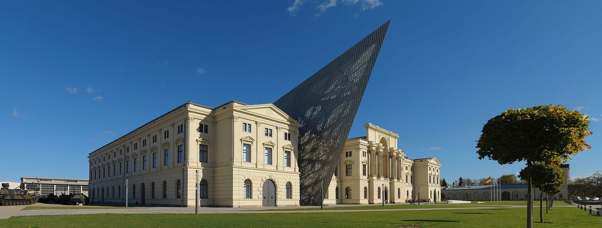

import FBBoxImageWrapper from '../../components/FBBoxImageWrapper.astro'
import SeeAlso from '../../components/FBSeeAlso.astro'

### Sikorsky R-4

Igor Sikorski to Rosjanin urodzony w 1889 w Kijowie, piąte dziecko profesora psychologii na uniwersytecie kijowskim. W latach 1906-08 zapoznał się z dokonaniami rodzącej się wtedy inżynierii lotniczej we Francji i w Niemczech. W 1909 dzięki finansowej pomocy siostry wrócił do Paryża poznać najnowsze rozwiązania i jeszcze w tym samym roku wrócił z ideą skonstruowania pierwszego rosyjskiego śmigłowca. Budował też samoloty, co było dużo łatwiejsze. Pilotując własny samolot S-5 w 1911 zdobył licencję lotniczą wydaną przez Imperial Aero Club of Russia, 64. w Rosji. W 1912 został głównym inżynierem Russo-Bałtu (ros. Руссо-Балт) producenta wagonów kolejowych, a potem samochodów. Skierował zainteresowanie w stronę dużych samolotów - szczytowym osiągnięciem w tej dziedzinie było skonstruowanie największego samolotu na świecie - czterosilnikowego dwupłatowca Ilja Muromiec G-II. Został oblatany w 1913.

W 1919 rozczarowany sytuacją w Rosji i Europie, nie widząc dla siebie perspektyw w zniszczonym wojną kontynencie, wyemigrował do USA. Tam był nauczycielem i szukał okazji, żeby zaangażować się w przemyśle lotniczym. Z pomocą innych imigrantów z Rosji założył przedsiębiorstwo lotnicze. W 1928 uzyskał naturalizację. Uzyskał kilka patentów i eksperymentował. W 1939 odniósł wreszcie pierwszy techniczny sukces - jego śmigłowiec Vought-Sikorsky VS-300 wzniósł się w powietrze. Pierwszy swobodny lot 13 maja 1940.

Kolejną konstrukcją był VS-316, którym zainteresowała się armia. Został nazwany XR-4 (e**X**perimental **R**otorcraft) i został oblatany 14 stycznia 1942. Odbył lot z Connecticut do Ohio: 1200 km, wysokość maksymalna 3700 m i ponad 100 godzin lotu bez większej awarii. 5 stycznia 1943 zamówili 29 prototypów i jak przystało na konstrukcje prototypowe, zostały nazwane YR-4. 5 listopada powstał setny YR-4 i fabryka ogłosiła, że produkuje 25 śmigłowców na miesiąc. Ogółem wyprodukowano ich 131.

Już w styczniu 1944 śmigłowce Sikorskiego przewoziły krew, a od kwietnia wykonywały misje medevac w China Burma India Theater.

Najbardziej skomplikowana i wymagająca misja medavac tej wojny nastąpiła w dniach 24-26 stycznia 1945. 22 stycznia został dostarczony przez C-54 na lotnisko w Myitkyina (stolica stanu Kaczin w Mianma / Birma). Już po przybyciu załoga dowiedziała się, że misja ewakuacyjną, do której zostali wysłani na drugi koniec świata, została zrealizowana przez siły lądowe. Mimo to postanowili złożyć śmigłowiec. Rano 23 stycznia przystąpili do montażu. Zajęło to cały dzień i śmigłowiec miał być gotowy do lotu w południe następnego dnia. Ale jeszcze tego samego dnia w nocy dotarła wiadomość, że w stacji meteorologicznej odległej 240 km NE żołnierz postrzelił się w rękę, wdało się zakażenie i wymaga natychmiastowej ewakuacji. Nigdzie w pobliżu nie ma lotniska, a stacja meteorologiczna znajduje się na górze mającej wysokość 1400 m. Zrzucenie medyków na spadochronach było zbyt ryzykowne.

Po próbnym locie w południe śmigłowiec w asyście dwóch samolotów L-5 ruszył na misję. Maszyna była dwuosobowa więc w R-4 było dwóch zmieniających się pilotów, ale nie mieli radia. Zaplanowano lot do Sinkaling, które było po drodze. Tam miał zatankować i ruszyć po rannego. Samoloty asysty były dużo szybsze od mającego szybkość przelotową 100 km/h śmigłowca więc krążyły wokół niego, często tracąc go z oczu. Z braku paliwa R-4 musiał lądować po drodze i L-5 wzięły benzynę z Sinkaling, żeby zrzucić mu w kanistrach. Tam po krótkiej przerwie i wzbudzeniu sensacji w odciętej od świata bazie RAF R-4 ruszył do celu. W międzyczasie poinformowana o wysłanej pomocy, ale bez żadnych konkretnych informacji jak ta pomoc będzie wyglądać. Załoga stacji meteorologicznej zbudowała prowizoryczny pas startowy. Wystarczył dla R-4 dla L-5 był zdecydowanie za krótki.

Rano następnego dnia nie wystartował z rannym, pilot z białych kawałków materiału ułożył czytelny dla pilotów L-5 napis OIL. L-5 musiały wrócić na Sinkaling i po raz kolejny zrzucić kanistry. Dopiero wtedy śmigłowiec mógł wystartować. O 1645 dostarczył rannego na lotnisko Sinkaling skąd L-5 zabrały go do szpitala. Udzielono mu pomocy na czas i amputacja nie była potrzebna. Tymczasem R-4 pozostał na noc na lotnisku w Sinkaling i dopiero następnego dnia, czyli 27 stycznia, mógł powrócić na lotnisko w Myitkyina.

Następcą R-4 był Sikorsky R-6 oblatany w październiku 1943, produkowany od 1944, używany głównie przez US Navy.

- helis.com [Rescue Mission in Burma MEDEVAC Flight in WWII by Ed Holmes](https://www.helis.com/stories/burma45.php)
- Mark Felton [Productions "Daring WW2 Helicopter Mission - Burma 1945" [YT 10:08]](https://www.youtube.com/watch?v=GjYNPPrjAnc)

### McDonnell FH-1 Phantom

I kolejna okazja, by wspomnieć o lotnictwie. Jak to kiedyś powiedział towarzysz Stalin ilość to jakość. Wbrew pozorom nie zawsze wojna napędza postęp techniczny nawet w dziedzinie wojskowości. Wszystkie projekty samolotów odrzutowych zarówno brytyjskich i amerykańskich, jak i niemieckich dość długo były odsyłane na półkę, bo angażowanie się w nowe technologie zużywa zasoby tak potrzebne w udoskonalanie i produkcję broni, która już istnieje i którą wojsko już zna. Hitler był pewien, że wojnę wygra samolotami z silnikami tłokowymi. Przełom nastąpił, gdy w wyścigu technologicznym prędkość osiągnęła maksymalny poziom dostępny dla ówczesnej techniki.

Prędkość była szczególnie ważna dla Niemców na froncie zachodnim, gdzie wojna powietrzna oznaczała głównie walkę z osłoną flotylli bombowców. Samoloty odrzutowe po raz pierwszy pojawiły się masowo nad Europą latem 1944 podczas inwazji na Normandię (Operacja Overlord) - najpierw był to niemiecki Me 262, a kilka tygodni później w sierpniu 1944 brytyjski Gloster Meteor. Swoimi prędkościami 800 do 900 km/h przewyższały wszystkie myśliwce tłokowe (z praktyczną granicą w okolicach 700 km/h). Niemcy mieli również bombowiec odrzutowy Arado Ar 234, pomimo nowatorstwa stosowany bez powodzenia.

Dziś odbył się zakończony sukcesem oblot pierwszego amerykańskiego samolotu odrzutowego Marynarki McDonnell FH-1 Phantom. Był to pierwszy wyłącznie odrzutowy samolot, który operował z amerykańskiego lotniskowca. Do końca wojny zbudowano ich tylko 62, ale ta konstrukcja zbudowała pozycję McDonnella w dziedzinie samolotów Marynarki.

Dwusilnikowiec, ale choć dzisiaj działał tylko jeden silnik, lot został zakończony sukcesem. Samolot osiągnął prędkość 805 km/h. W 1947 wprowadzono go na lotniskowce. Nie miał wybitnych cech bojowych i był samolotem rozpoznawczym krótkiego zasięgu. Był też pierwszym samolotem odrzutowym używanym przez eskadry akrobatyczne US Navy.

Sprawdził się w roli samolotu szkoleniowego, przejściowego. Służył szkoleniu pilotów samolotów tłokowych, którzy mieli służyć na odrzutowcach następnej generacji: F2H Banshee i Grumman F9F Panther. Wycofany ze służby w 1954.

### Amerasia

W latach 1937-47 ukazywała się "Amerasia". Jak wskazuje tytuł pismo poświęcone ważnym dla Ameryki sprawom Azji Wschodniej. Jego założycielem, redaktorem i głównym sponsorem był Frederick Vanderbilt Field (praprawnuk tego Corneliusa "Commodore'a" Vanderbilta) lewicowy pisarz i publicysta wydziedziczony za poglądy. W redakcji pisma był również Philip Jaffe naturalizowany obywatel USA urodzony w Rosji. Jaffe przyjaźnił się z Earlem Browderem, pierwszym sekretarzem Komunistycznej Parti Stanów Zjednoczonych (Communist Party of the United States). Jak się później okazało, wielu współpracowników pisma to byli aktualni albo byli komuniści.

Pismo nie było wpływowe ani rozpoznawalne. Nie miało ważnych czytelników ani dużego nakładu. Sprzedawano je w cenie 15 centów za egzemplarz. W dzisiejszym wydaniu ukaże się artykuł, który zmieni historię USA.

Za kilka dni przeczyta go Kenneth Wells analityk Biura Służb Strategicznych (Office of Strategic Services). Artykuł pt. "Differences in U.S and British Attitude Towards Thailand Colonial Economics..." był niemalże kopią jego własnego raportu. Jak tajny dokument agencji wywiadowczej dostał się do redakcji tajemniczego pisma? Rozpoczęło się śledztwo, którego skutkiem będzie epoka makkartyzmu.

Dalszy ciąg tej sprawy nastąpi 11 marca.

{/* ### Audie Murphy

FBTODO

- [Audie Murphy](https://en.wikipedia.org/wiki/Audie_Murphy)
- [Daniel R. Champagne "On this day in 1945, Audie Murphy climbed a burning tank and schwacked Nazis with a 50-cal"](https://www.militarytimes.com/news/your-military/2021/01/26/on-this-day-in-1945-audie-murphy-climbed-a-burning-tank-and-schwacked-nazis-with-a-50-cal/) */}

### Operacja Blackcock

Na froncie zachodnim zakończona została sukcesem operacja Blackcock. W ciągu 12 dni walk brytyjska Druga Armia wypchnęła niemiecką 15 Armię z silnie bronionego trójkąta pomiędzy miastami Roermond, Sittard i Heinsberg, ustalając front już na terenie Niemiec.

Heinsberg (Nadrenia Północna-Westfalia) jest niemieckim miastem. Wehrmacht nie tylko walczy na dwóch frontach i na obu przegrywa. Na obu przegrywa już na niemieckiej ziemi.

### Królewiec

Z bliżej niewyjaśnionych przyczyn ok. północy z 25 na 26 stycznia w powietrze wyleciał fort Stiehle w Pilawie. Najpewniej był to wypadek podczas przygotowywania fortu do wysadzenia.

Znajdował się tam olbrzymi skład amunicji, torped i min morskich. Wszyscy w forcie zginęli natychmiast. W samym mieście było ponad 300 ofiar śmiertelnych. Zaśnieżony Królewiec pokrył się czerwonym pyłem z cegieł fortu.

### 2 Front Białoruski

Zdobył Tolkmicko, może nie nazbyt znaną miejscowość, ale spójrzmy na mapę. Wczoraj dotarli do Zalewu Wiślanego, a teraz umocnili tę pozycję - Tolkmicko jest położone na południowym brzegu Zalewu Wiślanego, 10 km na wschód od Fromborka.

47 brygada zmechanizowana, 91 brygada pancerna i 1 gwardyjski pułk motocyklowy ze składu 5 Armii Pancernej.

W wyniku walk ta niewielka miejscowość została zniszczona w 50%.

### 1 Front Białoruski

1 Front Białoruski dziś zdobywa Nakło nad Notecią, Osiek nad Notecią, a na froncie poznańskim Szamotuły i Wolsztyn, ważny węzeł kolejowy.

W rejonie Kielc zginął w walce generał Johannes Block, dowódca LVI Korpusu Pancernego, wycofującego się z oblężenia wokół Warszawy.

### 1 Armia WP

1 Brygada Pancerna 1 Armii WP zdobyła Bydgoszcz. Zbieranina oddziałów paramilitarnych i zebranych naprędce żołnierzy broniła miasta od 23 stycznia. Wtedy zdobyto więzienie na ul Kujawskiej. Dziś w rejonie ulicy Ugory polska kawaleria rozbiła niemiecką barykadę. Jedyną polską ofiara był ułan potrącony przez czołg. Polskie straty 10, niemieckie 100 zabitych.

### 1 Front Ukraiński

1 Front Ukraiński natomiast Wadowice i Kalwarię Zebrzydowską. Z godziny na godzinę pogarsza się sytuacja wojsk niemieckich na Górnym Śląsku. Już nie chodzi o okręg przemysłowy. To jest już przegrana sprawa. Zachodzi obawa, że utracone zostaną dywizje liniowe, jeżeli nie wycofa się ich na czas. Meldunek dzienny z 26 stycznia mówi:

>We froncie wokół strefy przemysłowej nastąpiły liczne, głębokie wyłomy, a na południowy wschód od Katowic także wyłom taktyczny.

Ostatecznie zgodę na wycofanie jednostek dostaje Schörner podczas rozmowy z Hitlerem w nocy z 27 na 28 stycznia.

10 Korpus zajął Oborniki Śląskie, Wołów i Brzeg Dolny.

### Ścinawa

Majewski:

>Wobec niepowodzenia próby zdobycia Ścinawy uderzeniem czołowym generał Leluszenko rozkazał dowódcy 10 Korpusu Pancernego, pułkownikowi N. Czuprowowi, sforsować Odrę na południe od miasta. Zgodnie z tym zaleceniem żołnierze 29 Brygady Zmechanizowanej, dowodzonej przez pułkownika A. Jefimowa, 26 stycznia w godzinach przedpołudniowych sforsowali rzekę w rejonie Dziewina. Zdobyty tu przyczółek nie zapewniał jednak warunków do budowy przeprawy dla czołgów, których brak dotkliwie odczuwali walczący na lewym brzegu piechurzy. Wpłynęło to na decyzję dowódcy 4 Armii Pancernej, by cały 10 Korpus przeprawić przez Odrę na odcinku działań 6 Korpusu w rejonie Chobieni. 27 stycznia brygady pancerne 10 Korpusu w całości ześrodkowały się na przyczółku pod Chobienią.

### KL Auschwitz

W Auschwitz II Birkenau kończy się zacieranie śladów, ostatnie istniejące krematorium i komora gazowa zostały wysadzone w powietrze.

### Wrocław

Raport Naczelnego Dowództwa Wehrmahtu z dnia 26.01.1945:

>Nasze oddziały udaremniły Sowietom liczne próby przekroczenia Odry między Koźlem i Wrocławiem. Na wschód i północny wschód od Wrocławia nieprzyjaciel przedarł się bliżej miejskiego pasa obronnego.

Dzisiejsza Schlesische Tageszeitung Breslau:

>Za zgodą gauleitera i komisarza obrony Rzeszy przejąłem z dniem dzisiejszym wyłączą moc wydawania rozkazów w Festung Breslau. 
>Wszystkie przedsięwzięcia zostaną przeprowadzone w porozumieniu z gauleiterem i komisarzem obrony Rzeszy, którego siedziba pozostanie w Breslau.

### Gauleiter Karl Hanke

Gauleiter Hanke tak jak zapowiedział, pozostał we Wrocławiu. O swojej decyzji poinformował w dzisiejszym obwieszczeniu:

>Obwieszczenie 
>Twierdza Wrocław, 26 stycznia 1945 r. 
>Na mojego zastępcę jako gauleitera Dolnego Śląska, wyznaczam Kreisleitera Waltera Müllera. 
>Ja sam pozostaje w Twierdzy Wrocław. 
>Hanke 
>Gauleiter i Komisarz Obrony Rzeszy 

### Garnizon Wrocławia

Dziś też nastąpił koniec pierwszego etapu formowania się garnizonu Twierdzy, powołano sztab 609 Dywizji.

17 stycznia ogłoszono stan gotowości wrocławskich oddziałów zapasowych, tzw. alarm Gneisenau (Gneisenau był legendarnym pruskim dowódca, który zasłynął obroną Kołobrzegu i od tamtej pory w niemieckiej armii Gneisenau jest symbolem bezwzględnego trwania na pozycji). Na drogach wylotowych i dworcach kolejowych utworzono 7 posterunków, które zatrzymywały wszystkich wojskowych i niezależnie od formacji, stopnia czy otrzymanych rozkazów kierowały ich do punktu zbornego w Koszarach Kirasjerów Wielki Elektor przy obecnej ul Hallera.

Dowódcą punktu jest komendant batalionu garnizonowego major rezerwy hrabia Adolf Seidlitz-Sandretzky. Przedstawiciel starej śląskiej szlachty, ostatni niemiecki właściciel zamku Roztoczniki (niem. Schloß Olbersdorf; odbudowany, obecnie w rękach prywatnych) oraz Owiesno (niem. Habendorf; obecnie w ruinie). Ród Seidlitzów znany był na Śląsku od XII wieku i nie ma żadnej ważnej śląskiej rodziny, która nie byłaby z którąś z gałęzi Seidlitzów skoligacona. To jedno z najważniejszych nazwisk na Śląsku, a charakterystyczny herb: trzy czerwone ryby, jedna nad drugą, spotkać można wszędzie (w polskiej heraldyce Korzbok). Miał 49 lat, zginął 2 maja, cztery dni przed kapitulacją.

Wrocław został hitlerowską "twierdzą" jeszcze latem 1944, kiedy Armia Czerwona dotarła do Wisły. Ale bardzo długo była to papierowa decyzja, z której nic nie wynikało.

Dopiero 25 września mianowano dowódcę, został nim generał Johannes Krause. Zadanie, które otrzymał, było niezwykle trudne. We wrześniu 1944 całość sił twierdzy to był batalion garnizonowy i 599 batalion strzelców krajowych, oba składały się z niezdatnych do służby. Większość sił wojskowych we Wrocławiu nadal podlegała dowódcy VIII Okręgu Wojskowego. Jesienią udało się sformować kolejne 6 baterii fortecznych (3048, 3075, 3076, 3082), kompanię saperów oraz łączności. Baterie te tak jak dwa pierwsze bataliony składały się z mężczyzn uznanych za niezdolnych do służby i Volkssturmu skierowanego na 2 tygodniową służbę. Dopiero na początku lutego 1945 udało się sformować sztab twierdzy.

W momencie ogłoszenia alarmu Gneisenau pod komendą Krausego znalazły się dodatkowe trzy bataliony:

- 49 zapasowy batalion szkolny strzelców, od października we Wrocławiu
- 28 zapasowy batalion saperów, powstał we Wrocławiu w 1940, w sierpniu 1944 przekształcony w 28 zapasowy batalion saperów pancernych
- 599 batalion strzelców krajowych

Ponadto dotychczasowy VIII Okręg Wojskowy przekształca się w Grupę Korpuśną Wrocław, która bierze czynny udział w formowaniu garnizonu Twierdzy. Przenosi do Wrocławia i podporządkowuje komendantowi Twierdzy dwa kolejne oddziały:

- Szkoła Podoficerska Piechoty Nr 8 w Ząbkowicach
- 83 zapasowy batalion szkolny strzelców przybyły 18 stycznia z Trutnowa

Z powyższych oddziałów oraz z żołnierzy zebranych w Koszarach Kirasjerów sformowano pułki nazywane od dowódców:

- Pułk A: "Hanf" szkoła podoficerska z Ząbkowic, lewy brzeg
- Pułk C: "Sauer" oddziały zapasowe Karłowice i Różanka
- Pułk D: "Besslein" batalion zapasowy Waffen-SS w Leśnicy
- Pułk E: "Wehl" wciąż w fazie formowania, jednostki naziemne Luftwaffe
- Pułk B: słynny "Mohr", który tak odznaczył się podczas obrony przedmieścia południowego, utworzono dopiero w lutym.

Wrocławia broniła też 269 DP zlokalizowana na pierwszej linii uderzenia sowieckiego, na północy Wrocławia.

Na 21 stycznia stan Twierdzy przedstawiał się następująco:

- 9900 żołnierzy (nie licząc 296 DP), z tego 25 tys. w już sformowanych jednostkach, gotowych do walki
- ponad 1000 kaemów
- 11 tys. panzerfaustów
- 65 armat 8,8 cm Flak 18
- ponad 100 10,5 cm leichte Feldhaubitze 18/40 (sprowadzone w ostatniej chwili z Laskowic 23 stycznia)
- 21 10,5 cm leichte Feldhaubitze 18 (10,5 cm leFH 18)
- 3 155 mm haubica FH-70
- 58 lekkich dział plot
- 47 innych dział gł. zdobycznych

<SeeAlso txt="Volkssturm" url="/festung-breslau/article/volkssturm" />

### 609 Dywizja do Zadań Specjalnych

26 stycznia w Dreźnie ukończono formowanie sztabu 609 Dywizji do Zadań Specjalnych (tym zadaniem specjalnym była obrona Wrocławia). Na początku lutego wraz z dwoma kompaniami łączności przybył do Wrocławia i został podporządkowany grupie korpuśnej Wrocław. 609 Dywizja stała się bazą dalszego formowania się garnizonu, np. przejęła elementy 269 DP, którym nie udało się przedrzeć z Wrocławia na południe.

Do początku lutego wszystkie oddziały 609 Dywizji dotrą do Wrocławia.

Formowanie tej dywizji miało miejsce w Dreźnie z dwóch powodów: po pierwsze było to odległe zaplecze frontu i można było dobrać żołnierzy do jednostki, a nie tworzyć jednostkę z takich żołnierzy, jakich akurat ma się do dyspozycji. Po drugie Drezno to nie tylko barokowe zabytki tak cenione przez turystów - jego północna część Albertstadt to największe miasto garnizonowe Rzeszy.

### Muzeum Bundeswehry w Dreźnie

W 1876 po włączeniu Saksonii do zjednoczonych przez Prusy Niemiec powstaje nowy budynek Zbrojowni. Już w 1897 zostaje przekształcony w muzeum wojskowe. Z czasem, przez kolejne epoki w dziejach Niemiec zmieniał się charakter tego muzeum: było to po kolei muzeum Wehrmachtu a potem NVA (niem. Nationale Volksarmee).

Jest to obecnie, po przebudowie dokonanej przez Daniela Libeskinda otwarte w 2011 Muzeum Bundeswehry.

- [Military History not Visualized "Underground Panzer Depot Tour (Military History Museum Dresden)" [YT 17:11]](https://www.youtube.com/watch?v=ae6c0zJLLyY)

<FBBoxImageWrapper>

Muzeum Bundeswehry, Albertstadt - miasto garnizonowe w Dreźnie. Projekt obecnej przebudowy Daniel Libeskind. 
Źródło: Wikipedia [Von User:Kolossos - Eigenes Werk, CC BY 3.0](https://commons.wikimedia.org/w/index.php?curid=29391988)
</FBBoxImageWrapper>

Z wojskowych rzeczy wartych obejrzenia w Dreźnie polecam właśnie to muzeum, a ponadto:
- [Festung Dresden](https://www.festung-xperience.de/), czyli muzeum dawej twierdzy miejskiej
- warto też zobaczyć Zbrojownię i Gabinet Turecki w [Nowym Zielonym Sklepieniu](https://gruenes-gewoelbe.skd.museum/en/ausstellungen/neues-gruenes-gewoelbe/) na Zamku
- natomiast w okolicach oczywiście saksońska twierdza państwowa [Festung Königstein](https://www.festung-koenigstein.de/en/welcome.html).

<SeeAlso comment="Historia Drezna opisana jest w dziale 'Turystyka / Saksonia'" txt="Historia Drezna" url="/turystyka/saksonia/historia-drezna" />

### Maria Langner

>PRZED ATAKIEM 
> 
>Babunia znowu zrywa kartkę z kalendarza: 26 stycznia 1945. Strzelanina zbliża się coraz bardziej. Czas się wlecze, chociaż jest pełen napięcia. Nasze zdenerwowanie wzrasta i uwijamy się bezcelowo, choć przeczuwamy, że wszelkie nasze przygotowania są bezsensowne. 
>Znosimy do piwnicy koce, materace, kufry, świece i żywność. Harry i Pietro zakładają antenę, wbijają gwoździe, budują, sprawdzają przejścia w piwnicy i podziemne drogi ucieczki. Spokojny głos Harry'ego działa odprężająco na nasze skołatane nerwy. Pietro natomiast, typ prawdziwego południowca, jest jak żywe srebro. Od wielu dni zapomina o swoich włosach, które zwykle ujarzmia przy pomocy wody i siatki. Jak czarny dziki las unosi się w górę ciemna chmura włosów nad jego spiczastą, żółtą twarzą dziecka o czarnych, mysich oczkach. 
>Małgorzata, która z zawodu jest fotografką i posiada szósty zmysł w typowaniu "obiektów", potrząsa ciągle głową i wzrusza ramiona - Nie mogę tego pojąć - mówi, kiedy Pietro zasiada z nami do stołu. Wygląda pan jak doniczka szczypiorku. Chętnie sfotografowałabym pana, ale to wydaje mi się zbyt idiotyczne. 
>Małgorzata jest kobietą pełną rozmachu i fantazji. Czesze się i ubiera skromnie, a siła jej indywidualności, którą można natychmiast wyczuć, skoncentrowana jest w mądrych, pełnych wyrazu oczach. 
>Ośrodkiem naszego zainteresowania jest dziecko. Nie można pojąć, że leży tak spokojnie wśród przepełniającego nas niepokoju i oczekiwania i z dziecięcą powagą wydaje nieartykułowane dźwięki lub pogrążone jest we śnie. Różowe i pulchniutkie, prowadzi między nami swoje własne odrębne życie. 
>Babunia gotuje w wielu rondelkach potrawy dla małego gościa i jest szczęśliwa, że może być pożyteczna. 
>Dotąd odkładaliśmy z dnia na dzień przeniesienie naszej kwatery do piwnicy. Radio często zapowiada zbliżanie się nieprzyjacielskich samolotów, które zataczają nad miastem jakieś tajemnicze, niezrozumiałe kręgi. Spoglądając przez okno na szeroką ulicę, łączącą północną część miasta z południową, przy której znajduje się nasz dom, widzi się przygotowania i pośpiech wojska. Wyciągnięte w marszu kolumny nowych jednostek płyną nieprzerwanie na front. Formują się przeważnie z dywizji cofających się z frontu wschodniego. Czołg za czołgiem toczy się obok domu, łącznicy na motocyklach, oficerowie w samochodach, z mapami sztabowymi rozłożonymi przed sobą, mkną w największym pośpiechu. 
>Fala uchodźców już dawno odpłynęła. Całe miasto wydaje się gotowe do zbrojnej obrony. Wszędzie wystawione są posterunki wartowników w szerokich i obszernych płaszczach. Pietro nazywa ich okrycia głowy żelaznymi kapeluszami i nikt tego nie prostuje, gdyż uważamy, że należy wyeliminować z naszego języka zaszczepione przemocą nazwy wojskowe i rzeczowo podejść do tych spraw. Mówi się tak lekko "hełm stalowy", a słowo to obejmuje cały świat pojęć. 
>Wieczorem siedzimy przy stole w małym pokoiku i rozmawiamy na ten temat. - Dlaczego mundur - mówię z uśmiechem - dlaczego nie ubranie żołnierskie? 
>\- Dlaczego nie strzelec przymusowy - mówi Pietro - zamiast żołnierz. 
>Babunia potrząsa głową: - Ubranie przymusowego strzelca - chcecie chyba świat przewrócić do góry nogami. 
>\- Tak, babuniu mówi Małgorzata z zapałem - ku temu zdążamy, świat dojrzał już do tego, aby stanąć na głowie, o ile przez głowę ma się na myśli "rozum". 
>Ja też nie chcę używać słowa "hełm stalowy" - mówię z humorem. - To zbyt przypomina pomnik bohaterów, gwałtowny zapał, stal, chociaż te kapelusze są ze znacznie tańszego materiału, a podobieństwo do hełmu polega na tym, że przepasany rzemykiem podbródek nadaje najniewinniejszej twarzy wyraz zdecydowania i pewności. Istotnie, pod nazwami i określeniami kryje się tak wiele strasznych rzeczy. Zresztą często używany wyraz z biegiem czasu traci na ostrości i w stosunku do nas, i do rzeczy, którą oznacza. 
>\- Dowód? przerywa Harry. 
>\- "Hełm stalowy" - cytuję śmiejąc się - "to żelazny kapelusz służący do ochrony ludzkiej glowy. Jest to męskie nakrycie glowy o charakterze wojennym, którego stopniowe przeobrażenie się można łatwo zaobserwować. W Niemczech nakrycia te pojawiły się wpierw u dawnych Germanów jako głowy zwierząt, z których zwisała skóra, a przeznaczenie ich było podwójne. Przejawia się to w dzisiejszych formach wojskowego nakrycia głowy. Te noszone przez Germanów głowy zwierząt mają na celu wywołanie uczucia strachu i nie ustępują w niczym celom, jakie miały żelazne kapelusze w r. 1945". 
>Wtem zadźwięczał dzwonek u drzwi. 
>Popow i Nennow, dwaj bułgarscy studenci, przyszli do nas w odwiedziny. Dziwią się, że znajdują nas w tak wesołym nastroju, 1 Greta objaśnia, że przed chwilą cytowałam pewien rozdział z Brockhausa z roku dwa tysiące czterdzieści pięć. Ciekawi są, o czym mówiliśmy; przyznają mi rację. 
>Popow mówi, że zbyt szybko zapomina się o tym, iż żelazne kapelusze mają chronić ludzkie glowy od kul. Niestety udaje się to tylko w rzadkich wypadkach, o wiele częściej zdarza się, że głowa zostaje urwana wraz z hełmem stalowym. Nie chodzi jednak o określenie, choć zmiana nazwy pociąga za sobą zmianę pojęć. Najlepszy dowód to propaganda hitlerowska, która z Niemiec i krajów anektowanych stwarza "Wielkie Niemcy". Słowa te, które oznaczają coś wspaniałego, lekko i wytwornie przechodząc do porządku dziennego nad stosowanymi metodami zwyczajnego rozboju, usiłują ukazać narodowi i światu prawdziwą hostię "Wielkich Niemiec" w aureoli promiennego blasku i zwycięskiej potęgi. Więc nie tylko z pojęciami, lecz i z samymi faktami musiałoby się raz na zawsze zrobić porządek. A te czasy już się zbliżają. hełm stalowy...Wielkie Niemcy" z artylerią przeciwlotniczą, i bronią M-P (przypis: Maschinenpistole (pistolet maszynowy).), aneksjami i inwazjami, wystawione są na poważną próbę, do której nie dorosły. Te słowa znikną, i to właśnie w Niemczech, w kolebce faszystowskiego militaryzmu. 
>\- Co pan robi w Niemczech, panie Popow pytam. 
>\- Ot, studiujemy trochę. 
>\- Obawiam się, że przy takich poglądach tutejszy grunt jest za gorący dla pana. 
>\- Oczywiście. Rozumiem przyznaje Popow - wydaje mi się  jednak, że pani też nie może narzekać na zimno. 
>\- Czy pan zna rosyjski język? - pyta Greta. 
>Popow spogląda na nią badawczo. - Wyciąga pani fałszywe wnioski - mówi - Nie jestem rosyjskim agentem. Ale istotnie mówię trochę po rosyjsku. 
>\- Pisze pan też? - pytam. 
>\- Trochę. Czy pani sobie czegoś życzy? 
>Znaleźliśmy więc człowieka, który ułoży po rosyjsku plakat dla lazaretu doktora Heisiga. Popow pisze parę słów na karteczce. 
>\- Będziecie państwo musieli się pośpieszyć z wręczeniem tej kartki doktorowi. Możliwe, że bardzo szybko. będzie mu potrzebna Na zachodzie wojska radzieckie wtargnęły już na przedmieścia. 
>\- W takim razie główna linia kolejowa na Berlin jest już odcięta? 
>\- A więc oni posuwają się w górę od strony zachodniej; doktor Heisig może na południu czekać, aż osiwieje. 
>\- A może upatrzyli sobie wpierw lotnisko? 
>\- Stacja nadawcza na południu jest przecież niemniej ważna. 
>Każdy z nas kolejno wypowiada swe naiwne zdanie laika. 
>\- Na pewno tak jest - sądzi Popow - najpierw twierdza zostanie okrążona ze wszystkich stron. A wiele już nie brakuje, aby tak było.
>To zdanie działa na mnie jak dotknięcie różdżki czarodziej skiej. Ma oczywiście rację. Jak niedorzeczne wydaje mi się naraz wyobrażenie, że Rosjanie mogliby wkroczyć z jakiejkolwiek strony do miasta. Gdyby chociaż wiadome było, jak daleko posunęło się już okrążenie. Ale nie można tego stwierdzić w żaden sposób. Nikt nie wie, gdzie właściwie przebiega front. 
>\- Niewiarygodne - mówi Harry do Popowa - znam pana już przeszło rok i nagle dziś otwiera pan usta. Ze nie jestem nazistą, mógł pan już chyba dawno zauważyć. 
>\- Oczywiście - mówi Popow. - Ale co poza tym wiedziałem o panu? Jeśli się nie jest nazistą, to musi się być czymś innym, Więc jest p a n a obowiązkiem, jako Niemca, pouczyć mnie, że pan jest czymś innym. Proszę mi wybaczyć, nie chciałem pana obrazić. Ale czy, jako obcokrajowiec, nie miałem powodu do zachowania większej niż pan ostrożności? 
>Harry nie może zrozumieć, o co mu chodzi, ale Małgorzata pojmuje natychmiast, co Popow ma na myśli - To znaczy, że powinniśmy byli każdemu obcokrajowcowi przede wszystkim dać dowód, że nie jesteśmy nazistami. 
>\- Bezwzględnie - mówi Popow. 
>\- No! Te problemy już wkrótce się skończą - odzywa się babunia 
>\- Obawiam się, że pani się rozczaruje. 
>\- Posłuchajcie mnie - wtrąca milczący dotąd Pietro zrywając się z krzesła. To już się skończyć - w tej chwili tak, ale dużo krew płynąć, bo dużo jeszcze walczyć, bo Hitler chcieć, nie ludzie. 
>\- No i co z tego? Czyż "ludzie" nie walczą za Hitlera? Myśli pan, że wystarczą spóźnione zapewnienia, iż chętnie się tego nie robiło? 
>\- Oni musieć, musieć - woła podniecony Pietro. 
>\- Nie, oni nie muszą. Gotów jestem wymienić setki przykładów, że ludzie, o których pan by również powiedział, że muszą, dali dowód, że nie muszą. 
>\- Ależ Popow - sam pan wie o tym, że te pana mówi Harry "setki przykładów" przypłaciły to życiem. Tak skrajnie nie może pan na to patrzeć. >Byłem też cztery lata żołnierzem. 
>Popow podnosi się z krzesła. Jest bardzo wzburzony i twarz jego przybiera wyraz powagi. 
>\- Jestem również żołnierzem - mówi. Ale dla, nie wbrew moim przekonaniom. T&nbsp;e&nbsp;r&nbsp;a&nbsp;z mnie pan rozumie? 
>\- Tak - mówi Harry po prostu i milknie. 
>Pietro chciałby jeszcze coś dodać, zaczyna już gestykulować rękami. Ale nagle odzywa się moja matka: - Daj pan spokój, Pietro, pan Popow ma zupełną rację. 
>[...]
