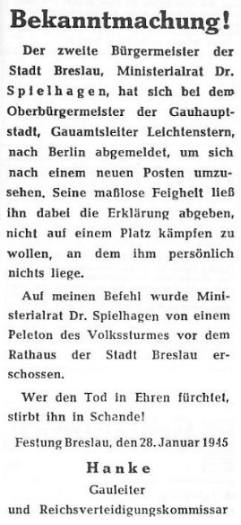

import FBBoxImageWrapper from '../../components/FBBoxImageWrapper.astro'
import SeeAlso from '../../components/FBSeeAlso.astro'

### Camp Papago Park

Wielka ucieczka kojarzy nam się z filmem o słynnej ucieczce z obozu jenieckiego Luftwaffe, Stalagu Luft III k. Żagania. Wtedy w nocy z 24 na 25 marca 1944 uciekło 81 jeńców, w tym sześciu Polaków. Trzem jeńcom ucieczka się udała, reszta została schwytana, 51 z nich Göring kazał rozstrzelać.

Może mniej spektakularna, ale również masowa ucieczka miała miejsce kilka miesięcy później w... USA. Camp Papago Park (Phoenix, Arizona) to był obóz jeniecki dla schwytanych żołnierzy niemieckich, głównie były to załogi U Bootów. Większość z nich ze względu na warunki jakie tam panowały nazywała go Schlaraffenland (pl. Kukania - znana ze średniowiecznej legendy o krainie mlekiem i miodem płynącej). Wydawali własną gazetę The Papago Rundschau.

Obóz był położony na twardej glinie, co jak uważano uniemożliwia wykonanie tunelu. Pustynna okolica utrudniała przetrwanie nieprzygotowanym i nieznającym terenu ludziom. Poza tym... dla jeńców wojna się skończyła, kto by uciekał i dokąd?

A jednak w obozie znajdowali się zagorzali naziści, przewodził nim kapitan Jürgen Wattenberg. Udało im się wykopać 50-metrowy tunel i w nocy z 23 na 24 grudnia zbiegło nim 25 jeńców. Do granicy z Meksykiem było 200 km. Większość z nich szybko wyłapano, ale pościg ciągnął się prawie przez cały styczeń, niektórych schwytano mniej niż 50 km od granicy meksykańskiej.

Najdłużej ukrywał się Wattenberg, który prawdopodobnie chciał przeczekać pościg i zbiec do Meksyku dopiero kiedy zbierze dość żywności. Z dwoma podwładnymi schronił się w jaskini w pobliżu Phoenix i korzystali z pomocy miejscowych, niemieckich robotników. Jego podwładni w końcu wpadli i 27 stycznia Wattenberg po utracie zapasów, mając 75 centów udał się do miasta, zjadł posiłek w restauracji. Potem spacerował w nocy po Phoenix, zapytał sprzątacza o drogę, ten zdziwiony jego akcentem zgłosił to na policję. Dzisiaj, po 35 dniach ucieczki, o 9 rano policja odnalazła Wattenberga i aresztowała go.

Tak zakończyła się największa ucieczka jeńców niemieckich w USA.

Warto dodać, że w dniu przybycia 12 marca 1944 w obozie zamordowany został Werner Drechsler, załogant U 118, który chętnie przystał na współpracę z Amerykanami, prawdopodobnie dlatego, że jego ojciec został wysłany do obozu koncentracyjnego. Zidentyfikowano sprawców i wszyscy trafili przed sąd polowy, który skazał ich na karę śmierci. Wyrok został wykonany 25 sierpnia 1945 w Fort Leavenworth (Kansas). Była to ostatnia masowa egzekucja w USA.

- [Great Papago Escape](https://en.wikipedia.org/wiki/Great_Papago_Escape)
- Dark Docs ["Super Nazi Crawls Out of a Hole Inside America - The Great Papago Escape" [YT 10:10]](https://www.youtube.com/watch?v=kA5dBs47xsY)
- Zakazane historie ["Ostatni żołnierz Hitlera" [YT 19:14]](https://www.youtube.com/watch?v=SpSwzrq4flI)

### Kłajpeda

16 Litewska Dywizja Strzelecka 3 Frontu Białoruskiego zajmuje dziś opuszczoną przz Niemców Kłajpedę (niem. Memel). W mieście przebywało tylko 50 ludzi. Miasto-symbol, krótko było tymczasową stolicą Prus i dla wszystkich Niemców było rozpoznawalnym miejscem na mapie.

"Odzyskanie" Kłajpedy w marcu 1938 było wielkim triumfem Hitlera opisywanym entuzjastycznie przez prasę.

### Budapeszt

18 stycznia IV. SS-Panzerkorps atakujący w kierunku Budapesztu od jeziora Balaton rozpoczął Operację Konrad II, była to ostatnia próba deblokady Budapesztu. W momencie największego sukcesu byli 20 km od miasta.

28 stycznia ta operacja się zakończyła. Niemcy zrezygnowali z przełamania oblężenia. Musieli przy tym oddać wszystkie zdobyte tereny, utrzymali się tylko w Székesfehérvár. Hitler odmówił pozwolenia na dokonanie próby przebicia się z wewnątrz Budapesztu.

W mieście trwają zażarte walki, szczególnie ważne i bezlitosne jest starcie o Wyspę Małgorzaty, która przez obrońców używana jest jako strefa zrzutów. Wszystkie próby desantu przez Dunaj były nieudane, obrońcy z łatwością dziurawili gumowe łodzie.

Ale 19 stycznia woda zamarzła, wykorzystując nieuwagę obrońców sowiecki desant pieszo dostał się na wyspę i utworzył przyczółek. Przez dziesięć dni obrońcy i atakujący z 25 Gwardyjskiej Dywizji Strzeleckiej walczyli ze sobą w bezpośredniej bliskości ostrzeliwani przez artylerię z obu stron. Jedni i drudzy w pułapce. Dopiero 28 stycznia obrońcy korzystając z ciemności zdołali się wymknąć uciekając na łodziach i ciągle istniejącą, zachodnią częścią Mostu Małgorzaty potem wysadzoną przez ukraińskie SS.

<SeeAlso txt="Węgry" url="/festung-breslau/article/wegry" />

### Iwan Koniew

Jak do tej pory cała operacja była oszałamiającym sukcesem, siły sowieckie wdarły się głęboko, Niemcy byli w defensywie, bez możliwości kontruderzenia, jak pisze Majewski:

>Jeszcze w całej pełni trwały walki o zdobycie i rozszerzenie przyczółków na lewym brzegu Odry, gdy dowództwo 1 Frontu Ukraińskiego przystąpiło do planowania dalszych działań zaczepnych przeciwko hitlerowcom. Na zasięg i skalę tych planów w poważnym stopniu wpłynęła szybkość działania wojsk radzieckich w operacji "Wisła - Odra" oraz osiągnięte w niej efekty, w znacznym stopniu przewyższające poprzednie założenia. Dowództwo Frontu, oceniając optymistycznie sytuację, doszło do przekonania, że pod wpływem poniesionej klęski armia hitlerowska wyczerpała swoje możliwości obronne i nie jest już w stanie stawiać skutecznego oporu. Równocześnie jednak należało się liczyć, że w razie przejściowego wstrzymania działań zaczepnych Niemcy zdołają częściowo odbudować siłę bojową swoich wojsk i zorganizować stosunkowo silną obronę, wykorzystując do tego dogodną rubież Odry, co w rezultacie musiałoby przedłużyć wojnę. Dlatego też działania ofensywne należało kontynuować bez przerwy operacyjnej, dążąc przede wszystkim do najszybszego zdobycia Berlina. 
>28 stycznia 1945 r. marszałek Koniew skierował do Głównej Kwatery Naczelnego Dowództwa Armii Radzieckiej propozycję, zgodnie z którą wojska podległego mu Frontu miały: "Zadać główne uderzenie z dwóch dużych przyczółków na Odrze - na północ i na południe od Wrocławia. W jego wyniku [...] okrążyć to silnie umocnione miasto, następnie zaś po zdobyciu go lub po obejściu [...] rozwijać natarcie głównego zgrupowania na Berlin. W tym samym czasie wojska lewego skrzydła 1 Frontu Ukraińskiego miały rozbić nieprzyjaciela na kierunku drezdeńskim". Marszałek Koniew liczył przy tym na pomoc lewego sąsiada 4 Frontu Ukraińskiego. 
>Z podobnymi propozycjami wystąpił dowódca Frontu Białoruskiego, marszałek Żukow, którego wojska zaatakować miały Berlin od wschodu i północnego wschodu. 
>Główna rola w planowanej operacji 1 Frontu Ukraińskiego przypaść miała zgrupowaniu uderzeniowemu rozwiniętemu na przyczółku pod Ścinawą. Miało ono za zadanie rozgromić wojska hitlerowskie broniące linii Odry na północ od Wrocławia, i nacierając w ogólnym kierunku na Szprotawę, Kottbus, Jüterbog, pokonać opór wojsk hitlerowskich na południowy wschód od Berlina, następnie zaś wspólnie z 1 Frontem Białoruskim zdobyć stolicę Trzeciej Rzeszy. Do wykonania tych zadań marszałek Koniew skupił na przyczółku znaczne siły: 3 Armię Pancerną Gwardii (przegrupowaną z Górnego Śląska), 4 Armię Pancerną, dwa korpusy (21 i 76) 3 Armii Gwardii, 13 Armię i dwa korpusy (48 i 78) 52 Armii oraz podporządkowany 3 Armii Gwardii 25 Korpus Pancerny. 120 Korpus 3 Armii Gwardii (wraz z 329 DP 21 Korpusu) działał w dalszym ciągu przed niemieckim przedmościem na wschód od Głogowa, zaś 73 Korpus 52 Armii, zajmujący pozycje na wschód od Wrocławia, miał za zadanie współdziałać w szturmie stolicy Dolnego Śląska. Na przyczółku pod Malczycami (na południe od ujścia Kaczawy do Odry), zdobytym pod koniec stycznia przez 13 Armię, ześrodkowana została 6 Armia z podporządkowanym jej 7 Korpusem Zmechanizowanym Gwardii, przybyła tu po likwidacji rozbitych jednostek hitlerowskich w wielkim łuku Wisły. Jej zadaniem było okrążenie Wrocławia od zachodu, następnie zaś zdobycie go. 
>Łącznie na przyczółkach na północ od Wrocławia skoncentrowano 26 dywizji piechoty, 4 korpusy pancerne (z których trzy w składzie armii pancernych i 3 korpusy zmechanizowane (dwa w składzie armii pancernych). Z sił tych: w północnej części przyczółka ścinawskiego ześrodkowana została 3 Armia Gwardii, w centrum 13 Armia, W południowej części 52 Armia. W szykach bojowych armii ogólnowojskowych rozmieszczone zostały jednostki pancerne, które od początku natarcia wspierać miały działania dywizji piechoty pierwszego rzutu. W ugrupowaniu bojowym 13 Armii znalazły się korpusy 4 Armii Pancernej, w szykach 52 Armii - 3 Armia Pancerna Gwardii. 
>Drugie zgrupowanie uderzeniowe 1 Frontu Ukraińskiego, składające się z 5 Armii Gwardii (której podporządkowano 4 Korpus Pancerny Gwardii) oraz 21 Armii (z podporządkowanym jej 31 Korpusem Pancernym) nacierać miało z przyczółków na południe od Wrocławia w ogólnym kierunku na Świdnicę, Zgorzelec i Lipsk z zadaniem rozgromienia wojsk hitlerowskich w rejonie Wrocławia, w dalszej zaś kolejności zdobycia rejonu Drezna i wyjścia na Łabę, gdzie miało zarazem osłaniać od południa siły Frontu walczące w Berlinie. 
>Trzecie zgrupowanie Frontu, składające się z 59 i 60 Armii, 1 Korpusu Kawalerii Gwardii oraz 152 Samodzielnej Brygady Pancernej, działające na lewym skrzydle, sforsować miało Odrę w rejonie Koźla i Raciborza i nacierać w kierunku Wałbrzycha i Zittau. 
>W odwodzie dowódcy Frontu pozostała jedynie 150 Samodzielna Brygada Pancerna i 87 samodzielny pułk ciężkich czołgów. Tak więc przystępujące do operacji wojska 1 Frontu Ukraińskiego ugrupowane były w jednym rzucie, nie mając odwodu, który według planów marszałka Koniewa powstać miał dopiero po zdobyciu Wrocławia i uwolnieniu 6 Armii od zadań oblężniczych. Stwierdzić trzeba, że choć decyzja, by przez kontynuowanie działań zaczepnych nie dopuścić do stabilizacji obrony hitlerowskiej, była słuszna, to jednak pełna realizacji założeń taktycznych przekraczała możliwości wojsk Frontu.

W przypisach Majewski uściśla, że marszałek Żukow swój plan wysłał do Stawki wcześniej:

>Marszałek Żukow wystąpił ze swoimi propozycjami dwa dni wcześniej, tj. 26 stycznia, zostały zaś one zatwierdzone przez Stalina w dniu następnym

Jak widać, marszałek Iwan Koniew zdecydowany jest rzucić wszystkie swoje oddziały do walki, nie pozostawiając żadnej Armii w odwodzie operacyjnym. Rysuje się w tym momencie kilka kluczowych elementów:

- Decydujące znaczenie Berlina. Koniew, choć odebrano mu Front, którym dowodzi teraz Żukow, z Berlina nie zrezygnował. To właśnie na tym kierunku i z tym celem umieścił swoje główne i najlepsze siły zgromadzone na odcinku ścinawskim. Wprost Berlin określa jako swój cel operacyjny w planach wysłanych do Stawki.
- Wciąż los Wrocławia nie jest rozstrzygnięty, to nie Poznań i można go pozostawić w oblężeniu - atak na Berlin ma nastąpić "po zdobyciu go lub obejściu". Do ataku na Wrocław wyznaczona została 6 Armia o drugorzędnym znaczeniu, która po jego - ewentualnym - zdobyciu ma zostać skierowana do rezerwy operacyjnej. Według planu Wrocław ma zostać okrążony i odcięty dwoma atakami wychodzącymi z przyczółków.
- Drugorzędne znaczenie Drezna, tu do ataku wyznaczono dwie armie i dosłownie wyznaczono im zadanie osłonowe. Tu ponuro wybrzmiewa los 2 Armii WP zmasakrowanej w nieprzemyślanym i bezsensownym ataku na Drezno.
- Jest jeszcze trzeci, najbardziej wysunięty na południe, kierunek operacji czyli Sudety, tak od Wałbrzycha po Zittau (pl. Żytawa), ale z braku sił to nie zostanie zrealizowane.
- Wszystko jest na pierwszej linii, praktycznie nie ma rezerw operacyjnych. W zadaniach wyznaczonych swoim armiom, żaden z marszałków nie bierze pod uwagę ani formującej się linii oporu, ani zmęczenia sił własnych.

Pierwotny termin rozpoczęcia nowej ofensywy 6 lutego, z powodu opóźnienia logistyki zostanie przesunięty na 8 lutego.

### Wyczerpanie wojsk

Żołnierze nacierających oddziałów obu Frontów są już skrajnie wyczerpani. Jednostki po wielu dniach walki (odpowiednio 16 i 14 dni) mają ogromne straty, często wahające się w okolicy połowy pierwotnego składu. Równie poważne były straty w sprzęcie. Pojawiają się trudności w zaopatrzeniu - do 2 lutego nie można było liczyć na kolej. Zerwana jest łączność. Wkrada się chaos. Opór niemiecki tężeje, od czterech dni trwa bitwa o Poznań. Już teraz wiadomo, że Wrocław będzie broniony zaciekle.

Majewski:

>Na przełomie stycznia i lutego 1945 r. wojska 1 Frontu Ukraińskiego poważnie odczuwały skutki dotychczasowych walk, toczonych od
Wisły do Odry. Liczebność ogromnej większości dywizji piechoty spadła znacznie poniżej 5000 żołnierzy (w stosunku do stanu etatowego 9600). Kompanie strzeleckie liczyły przeciętnie 30 - 50 ludzi. W znacznym stopniu została również osłabiona siła bojowa wojsk pancernych. 8 lutego 1945 r. 1 Front Ukraiński posiadał łącznie 2215 czołgów i dział pancernych (wobec 3661 przed rozpoczęciem operacji "Wisła - Odra"), których zdolność do działań była obniżona wskutek wyczerpania czasu pracy silników. 
>Znaczne wydłużenie linii zaopatrzenia Frontu (o ponad 500 km) nastręczało wiele trudności, albowiem główne składy i bazy materiałowe pozostały na prawym brzegu Wisły. Występowały również dość wyraźne symptomy znużenia fizycznego i psychicznego. Po nieprzerwanych trzytygodniowych walkach, prowadzonych w bardzo szybkim tempie od Wisły do Odry, żołnierzom Frontu - od szeregowców poczynając, na generałach kończąc - należał się choć krótki wypoczynek.

### 1 Front Białoruski

1 Front Białoruski wkroczył na teren przedwojennych Niemiec, zdobył Nowe Kramsko k. Babimostu i Krzyż Wielkopolski.

### 1 Front Ukraiński

1 Front Ukraiński zdobył Kęty, Maków Podhalański, Mikołów, Mysłowice Tychy i Chorzów.

### Katowice

Główne siły niemieckie opuściły już Górny Śląsk, po czterech dniach oblężenia Armia Czerwona w nocy z 27 na 28 stycznia wkracza do Katowic, napotykając niewielki opór. W wyniku podpaleń dokonanych przez nich dokonanych spłonęła część śródmieścia pomiędzy ulicą św. Jana i Pocztową oraz pierzeja między Rynkiem i ul. Stawową.

Andrzej Rożanowicz tak wspomina wejście czerwonoarmistów do Katowic, działo się to samo co wcześniej w Gliwicach:

>Działy się straszne rzeczy. Tylko w naszej kamienicy żołnierze zgwałcili dwie kobiety. Rosjanie rabowali też co popadnie, pili, dzielili się łupami. W centrum nie było prądu. Żołnierze palili ogień w budynkach, by się ogrzać, szukali wódki, rabowali. Podkładali też ogień. Spłonął ratusz, cała południowa pierzeja rynku, kilka kamienic przy ul. Pocztowej, dwa domy towarowe na ul. 3 Maja i słynne delikatesy Emila Misery. Spalono też jedną z restauracji czy kino Colloseum. Rosjanie Katowice kontrolowali przez parę dni.

### Wędrujący kocioł

Oddziały "wędrującego kotła" przechodzą przez Górę, która jak się okazuje, została już zdobyta i opuszczona przez oddziały 3 Armii Pancernej Gwardii, które zapuściły się daleko na zachód, oderwane od reszty własnych wojsk.

Majewski:

>Na przebieg walk o przyczółki odrzańskie wpływał nie tylko silny opór wojsk niemieckich na lewym brzegu rzeki, lecz również rozwój sytuacji w rejonie Góry i Głogowa, gdzie pod koniec stycznia przybyły wycofujące się ze wschodu "wędrujące kotły" pod dowództwem generała W. Nehringa. Ich trzonem były jednostki XXIV i XXXX Korpusu Pancernego: 16 Dywizja Pancerna, część 17 i 19 Dywizji Pancernej oraz 20 Dywizji Grenadierów Pancernych, do których dołączyły resztki 6 i 45 Dywizji Grenadierów Ludowych oraz 17, 72, 88, 214 i 342 Dywizji Piechoty. Do sił tych, jak już była o tym mowa, dołączył dowodzony przez generała D. von Sauckena Korpus Pancerny "Grossdeutschland" w składzie: Dywizji Pancerno-Spadochronowej "Herman Göring" i Dywizji Grenadierów Pancernych "Brandenburg". Oba zgrupowania, liczące około 100 tysięcy żołnierzy i ponad 100 wozów bojowych, omijając Kalisz, Krotoszyn, Leszno i Rawicz, wycofały się na zachód, w znacznym stopniu opóźniające natarcia 3 Armii Gwardii w kierunku Głogowa. Jedynie lewoskrzydłowy 76 Korpus tej armii (dowodzony przez generała-lejtnanta M. Głuchowa), wykorzystując wcześniejszy sukces 4 Armii Pancernej, wysunął się znacznie do przodu. 28 stycznia wyzwolił on Górę, dotarł do Odry i sforsował ją pod Radoszycami. Natomiast pozostałe korpusy (21, 120 i 25) 3 Armii Gwardii znajdowały się w tym dniu na rubieży Gostyń-Leszno-Rydzyna-Bojanowo.

### Ścinawa - Chobienia

Jednostki 4 Armii Pancernej, które przeprawiły się już na lewy brzeg Odry, zaczynają okrążać Ścinawę. Broni jej silny garnizon złożony m in ze szkoły podoficerskiej, oddziałów zapasowych i batalionów Volkssturmu. Do 30 stycznia Ścinawa zostanie zamknięta w oblężeniu. 31 stycznia zostanie zdobyta od zachodu.

Majewski:

>Przegrupowanie na lewy brzeg głównych sił 4 Armii Pancernej i 13 Armii umożliwiło dowództwu radzieckiemu przejście do działań zaczepnych, mających na celu połączenie poszczególnych przyczółków i powiększenie zdobytego terenu. 28 stycznia jednostki 10 Korpusu Pancernego, wsparte przez dywizje piechoty 13 Armii, rozpoczęły natarcie wzdłuż drogi Naroczyce, Górzyn, Olszany, Tymowa, Reszów, obchodząc od zachodu Ścinawę, bronioną przez silny garnizon, złożony m.in. ze szkoły podoficerskiej, oddziałów zapasowych i batalionów Volkssturmu. W tym samym czasie oddziały 6 Korpusu Zmechanizowanego i 102 Korpusu 13 Armii osłaniały skrzydła i tyły klina uderzeniowego kontratakami niemieckimi z rejonu Głogowa i Polkowic.

W przypisach dodaje:

>67 O działaniach tych napisał general-lejtnant M. Fomiczew, w styczniu 1945 r. pułkownik, dowódca 63 Brygady Pancernej 10 Korpusu Pancernego 4 Armii Pancernej: ",Brygada weszła z marszu do walki. Nasze zadanie: nacierając na południe, wspólnie z pozostałymi jednostkami korpusu, zdobyć Ścinawę. Szło nam wyjątkowo ciężko. Przez dwie doby toczyliśmy niezwykle zacięte walki. Hitlerowcy silnie kontratakowali. Ich czołgi raz po raz nieoczekiwanie pojawiały się z ukrycia. Kompania Akinszyna w ciągu dnia odparła dziewięć kontrataków, nie ustępując jednak ani na krok. Akinszyn został ranny, lecz nie opuścił pola walki. Poległ przybyły niedawno ze sztabu armii dowódca 3 batalionu czołgów major gw. Bondariew. Śmiercią walecznych poległ również jego zastępca do spraw politycznych kpt. Moszew. 
>Wstał szary świt. Południowy wiatr przyniósł falę ciepła i śnieg na polach zaczął w oczach topnieć. Zebrałem dowódców batalionów i rozłożyłem przed nimi mapę. Znajdujemy się w tym oto punkcie. Trzy kilometry stąd, za laskiem znajduje się wieś Lampersdorf [Zaborów, około 9 km na płd. zachód od Ścinawy My, którzy w ciągu ostatnich dni posuwaliśmy się po 70-80 km dziennie, dziś musimy przebyć w walce te trzy kilometry i zdobyć Lampersdorf. Nie przyjdzie to łatwo, ale zrobić trzeba" (Put' naczinatsja s Urała, s. 191 - 194). 
>O wioskę tę, przez którą przebiegała ostatnia droga odwrotu ze Ścinawy, 63 Brygada Pancerna toczyła uporczywy bój przez przeszło dwie doby. Zdobycie Zaborowa zdecydowało ostatecznie o okrążeniu Ścinawy.

Jest to ostatni akt wojny na tym etapie ofensywy 1 Frontu Ukraińskiego, wszędzie pod koniec stycznia widoczne jest spowolnienie działań i przejście do defensywy. Więcej już nie można zrobić.

Nastąpiło ustalenie linii frontu. Z chwilą zdobycia Ścinawy sytuacja będzie się przedstawiać następująco: na szerokim odcinku front sowiecki jest opary o Odrę. Ma dwa przyczółki: Ścinawa - Chobień oraz Oława, na zapleczu wciąć mająca dużą swobodę pozycja niemiecka w Głogowie z dużym zgrupowaniem wojsk.

### Brygada Świętokrzyska NSZ

Dziś w asyście SS przechodzą przez Bobolice.

### Egzekucja w Środzie Śląskiej

W rzeźni miejskiej w Środzie Śląskiej z rozkazu średzkiego Kreisleitera NSDAP Ernsta Dickmanna SS zamordowało 93 więźniów.

### Wrocław

Majewski o natarciu z kierunku Oleśnicy, siły sowieckie nacierają szerokim łukiem:

>Główne siły 73 Korpusu zdobyły m.in. Domaszczyn, Pasikurowice, Czerńczyce i Szewce, późnym zaś wieczorem 28 stycznia wyszły nad Odrę między ujściem Widawy a Kotowicami (10 - 12 km na północ od Wrocławia). Podjęta natychmiast próba sforsowania rzeki była nieudana. Wznowiono ją już ze znacznie lepszym skutkiem po kilkunastu godzinach.

Dla jasności - chodzi tu o Kotowice w gminie Oborniki Śląskie, powiecie trzebnickim. Większość wrocławian kojarzy tę nazwę z miejscowością koło Siechnic. Ten atak wyszedłby na wsie Wilkszyn i Pisarzowice.

Wzmianka o zdobyciu Domaszczyna wskazuje, że w tym dniu majątek Szczodre (niem. Sibyllenort), legendarny pałac zwany Śląskim Windsorem był już w rękach sowieckich. Bywali w tym pałacu August II Mocny i jego syn August III Sas, był też car Mikołaj I. Od 1884 należał do saksońskiej dynastii Wettynów, było to już po wielkiej przebudowie w stylu gotyku angielskiego, której swój przydomek. Monumentalny i olśniewający był perłą Dolnego Śląska. Od przejęcia przez Wettynów była to ich ulubiona rezydencja, to tu zmarli Albert I w 1902 i Fryderyk August III w 1932. Podczas bitwy o Wrocław został całkowicie zniszczony.

Natomiast na południe od Odry:

>28 stycznia 97 Dywizja Piechoty Gwardii [5 Armii Gwardii], dowodzona przez pułkownika A. Garana, wsparta przez 39 pułk ciężkich czołgów i 1889 artylerii pancernej, zdobyła szturmem Oławę.

- [Przemysław Pawłowicz "Oława poddana, wojna sojuszników"](https://www.tuolawa.pl/artykul/25732,olawa-poddana-wojna-sojusznikow)
- Zbigniew Pryjda ["Walki o Oławę w styczniu 1945 roku - wykład Marka Włodarczyka" [YT 1:37:42]](https://www.youtube.com/watch?v=dE5KgKBvQrw)

### Wolfgang Spielhagen

W mieście zaczynają się rządy terroru. W niedzielę 28 stycznia o godzinie 6 rano, na rozkaz Gauleitera Karla Hanke na Rynku obok pomnika Fryderyka II "starego Fryca", został rozstrzelany, odpowiedzialny za finanse miasta, wiceburmistrz Wolfgang Spielhagen. Jak to opisał Hugo Hartung:

>Jeden z naszych podchorążych przychodzi blady i wzburzony na kwaterę i opowiada, że na Rynku widział rozstrzelanie burmistrza doktora Spielhagena, które nastąpiło na rozkaz Gauleitera Hankego. Często spotykaliśmy doktora Spielhagena w tramwaju, kiedy rano jechaliśmy do naszych biur, Przeprowadziłem kilka rozmów z tym bardzo mądrym człowiekiem, który bez ogródek sarkastycznie krytykował skrywane przez władze nadużycia i niedomogi. Jestem wstrząśnięty jego strasznym końcem.

Oszczędny i zasadniczy Spielhagen od lat był w konflikcie z Hanke. Hanke żyjąc na zesłaniu, odtwarzał życie dworu berlińskiego, do którego za wszelką cenę chciał powrócić. Wystawne i wydawane na koszt miasta przyjęcia, przepych i gigantomania spotykały się z krytyką i oporem wielu miejskich urzędników, szczególnie zaś odpowiedzialnego za finanse miasta zasadniczego i oszczędnego wiceburmistrza Spielhagena. Hanke nienawidził go i chciał się pozbyć.

Pierwsza okazja przydarzyła się 20 lipca 1944, po zamachu Stauffenberga oświadczył "*Spielhagen, jak sądzę też w tym uczestniczył i przyszła na niego kolej*" ale ponieważ oskarżenia się nie dało udowodnić, zemsta musiała poczekać.

W styczniu 1945 Spielhagen z powodu choroby serca zwolniony ze służby w Volkssturmie zgłosił zamiar wyjazdu do Berlina, skąd pochodził. Tym razem Hanke nie potrzebował żadnych dowodów, bo wojna w granicach Śląska dawała mu pełnię władzy. Dopiero wejście wrogiej armii na Śląsk dało mu upragnioną pełnię władzy dyktatorskiej w Twierdzy.

Ciało Spielhagena wleczono samochodem po ulicach i z mostu wrzucono do Odry. Był to początek całej serii publicznych egzekucji, także urzędników i funkcjonariuszy partyjnych.

<FBBoxImageWrapper>

Obwieszczenie gauleitera Karla Hanke o egzekucji wiceburmistrza Wilfganga Spielhagena. Egzekucji dokonano w niedzielę 28 stycznia, o 6 rano, przy nieistniejącym już pomniku Fryderyka II Wielkiego. Pomnik stał w środku placu pomiędzy Nowym Ratuszem a zachodnią pierzeją Rynku. 
Źródło: Wikipedia: [Von Unbekannt - Eigener Scan, Gemeinfrei](https://commons.wikimedia.org/w/index.php?curid=23162858)
</FBBoxImageWrapper>

Na ulicach Twierdzy pojawiło się obwieszczenie:

>Obwieszczenie! 
>Drugi burmistrz miasta Wrocław, radca ministerialny dr Spielhagen, zgłosił u nadburmistrza stolicy prowincji, Leichtensterna, swój wyjazd do Berlina, celem poszukania sobie nowego stanowiska. Jego bezgraniczne tchórzostwo kazało mu jednocześnie złożyć oświadczenie, że nie zamierza walczyć na stanowisku, na którym mu osobiście nie zależy. 
>Na mój rozkaz radca ministerialny dr Spielhagen został przed ratuszem miasta Breslau rozstrzelany przez pluton Volkssturmu. 
>Kto obawia się śmierci w chwale, umiera w hańbie! 
>Twierdza Wrocław, 28 stycznia 1945 
>Hanke 
>Gauleiter i Komisarz Obrony Rzeszy

### 600. (russ.) Infanterie-Division

Dzisiaj na poligonie w Münsingen (Badenia-Wirtembergia) zakończono formowanie 600 DP niemieckiej... tzn. rosyjskiej. To dłuższa historia.

Otóż 12 lipca 1942 do niewoli niemieckiej dostał się zdolny sowiecki generał Andriej Andriejewicz Własow. Barwna osobowość i ciekawy życiorys. Aż do Wielkiej Czystki jego życie to była zwyczajna kariera ambitnego i zdolnego oficera. Związany był z Leningradzkim Okręgiem Wojskowym. Od aresztowania marszałka Tuchaczewskiego w maju 1937 zaczyna się Wielka Czystka w wojsku. W tym czasie Własow zostaje oddelegowany do Kijowskiego Okręgu Wojskowego i obu okręgach zasiada w trybunałach wojskowych, biorąc czynny udział w represjach. Ma na koncie kilkaset wyroków. Ogółem podczas tej czystki zamordowano 40 tys. oficerów, przy czym im wyższy stopień, tym większe straty, w niektórych szarżach przekraczają połowę składu. Miejsce doświadczonych oficerów zajmują zastraszeni ignoranci. Armia Czerwona zostaje pozbawiona mózgu.

Kiedy z wyczerpania liczby ofiar Czystka wygasa, Własow zostaje wysłany do Chin jako doradca wojskowy. Wraca stamtąd w grudniu 1939 i zaczyna się jego kariera generalska. Jest jednym z pupilów Stalina. W krytycznym momencie Operacji Barbarossa dowodzi 20 Armią na przedpolach Moskwy. Potem zostaje wysłany do obrony Leningradu. Dowodził 2 Armią Uderzeniową, której nie udało się wydostać z okrążenia.

Wtedy schwytali go Niemcy. Od samego początku niewoli Własow deklarując antykomunizm, zgłaszał chęć przyłączenia się do armii niemieckiej w walce przeciwko sowietom.

Wszyscy czerwonoarmiści wiedzieli o istnieniu Rosyjskiej Armii Wyzwoleńczej (niem. Russische Befreiungsarmee, ros. Русская освободительная армия), wielu nawet chciało się do niej przyłączyć. W rzeczywistości taka armia nie istniała. To był tylko twór propagandy hitlerowskiej mający na celu osłabienie ducha walki. Rozczarowany Własow uznał, że trzeba ją stworzyć. Było to niemożliwe na tym etapie wojny. Hitlerowcy gardzili Słowianami i z niewielkimi wyjątkami (Słowacy, Chorwaci) nie zgadzali się na ich uzbrajanie.

Do pewnego stopnia sytuację zmieniła klęska w Stalingradzie. Już wcześniej Własow uzyskał pewną swobodę. 27 grudnia 1942 ogłosił Deklarację Smoleńską mówiącą o potrzebie stworzenia rosyjskiej armii u boku Wehrmachtu. Na wiosnę 1943 miał serię publicznych wystąpień, jego artykuły publikowała praca na terenach okupowanych. 8 czerwca Hitler kazał to zakończyć i odesłać Własowa do izolacji.

Wbrew zakazom i odgórnej polityce praktyka wcielania Słowian z podbitych terenów była normą Wehrmachtu. Hilfswilliger czyli jak to w skrócie mówiono Hiwisi (opaska "Im Dienst der Deutschen Wehrmacht") byli ważnym elementem armii niemieckiej, było to ponad 10% żołnierzy Wermachtu na wschodzie. Początkowo kierowani byli do służby tyłowej i nie byli uzbrajani. Potem zdarzało się, że tworzyli formacje frontowe.

Operacja Bagration, czyli dotarcie Armii Czerwonej do Wisły sprawiła, że sytuacja Wehrmachtu stała się dramatyczna.  16 września 1944 poza wiedzą Hitlera Himmler spotkał się z Własowem. Zezwolił na powołanie Komitetu Wyzwolenia Narodów Rosji. 14 listopada w Pradze został przedstawiony i podpisany Manifest KONR, a Własow został mianowany głównodowodzącym Sił Zbrojnych KONR..., które jeszcze nie istniały.

Dopiero bowiem 1 grudnia powołano pierwszą dywizję tych sił zbrojnych, właśnie powyższą 600 DP. W sumie powstały trzy, kolejną była 650 DP.

600 Dywizja składała się z żołnierzy 29 oraz 30 Dywizji Grenadierów Waffen SS, oraz 13 rosyjskich batalionów Wehrmachtu, jeńców wojennych i robotników przymusowych. Dość niecodzienny skład, a jeszcze dziwniejszy, jeżeli zobaczymy co to za dywizje.

Otóż 29 Waffen-Grenadierdivision der SS RONA to tzw. Brygada Kamińskiego, czyli znana wszystkim Polakom zbrodnicza jednostka, tak wsławiona podczas tłumienia Powstania Warszawskiego. Została powołana pod koniec 1941 do zadań policyjnych, ale z czasem do 1943 jej liczebność wzrosła do 10 tys. ludzi. Kamiński nazwał ją Rosyjska Narodowa Armia Wyzwoleńcza (ros. Русская освободительная народная армия). Po bitwie pod Kurskiem zostali skierowani na Białoruś w okolice Witebska, gdzie odznaczyli się niebywałym okrucieństwem. W marcu 1944 jednostkę przemianowano na Volksheer-Brigade Kaminski, a w czerwcu zostali włączeni do Waffen-SS jako Waffen-Sturm-Brigade RONA. Kamiński dostał nieistniejący stopień Waffen-Brigadeführer der SS.

Jednostkę charakteryzowały trzy rzeczy: kompletny brak dyscypliny, brak zdolności bojowych oraz bestialstwo wobec ludności cywilnej w stopniu sprawiającym kłopoty armii niemieckiej. Zdziesiątkowani podczas Operacji Bagration do połowy, zostali skierowani na poligon w Świętoszowie (niem. Neuhammer) i tam ostatecznie powstała wzmiankowana właśnie 29. Waffen-Grenadier-Division der SS (russische Nr. 1), którą kojarzymy z Powstania. Było ono również fatalne dla dywizji. 18 sierpnia Niemcy zabili Kamińskiego za niesubordynację. 27 sierpnia cała jednostka została wycofana z Warszawy i skierowana do tłumienia powstania na Słowacji. Ostatecznie w październiku 1944 rozformowani.

Jeszcze dziwniejszą historię ma 30 Dywizja. Otóż latem 1941 na wschodnich terenach okupowanych zostały powołane bataliony policyjne Schutzmannschaft (w skrócie Schuma), tzw. czarna policja. Składały się z lokalnych, słowiańskich ochotników i jeńców wojennych. Była to jedyna siła policyjna na tych terenach, podlegała niemieckiej policji porządkowej (Ordnungspolizei, Orpo). W lipcu 1944 z takich właśnie jednostek został powołany Schutzmannschaft-Brigade Siegling o mieszanym rosyjsko-białorusko-ukraińskim składzie w sile 1500 ludzi. Przeszli przeszkolenie w Niemczech. 31 lipca wydano rozkaz utworzenia 30. Waffen-Grenadierdivision der SS (weißruthenische Nr. 1), do końca sierpnia było to ok. 11600 ludzi.

Zostali wysłani do północno-wschodniej Francji, i już tydzień po przeniesieniu jeden z batalionów w całości z bronią w tym ciężką, po zabiciu niemieckiego dowódcy, przeszedł na stronę francuską. Spora część jego żołnierzy została później wcielona do Legii Cudzoziemskiej i walczyła po stronie aliantów. Nie był to jednostkowy przypadek. 29 sierpnia 2 bataliony uciekły do Szwajcarii. Niesubordynacja, zabijanie niemieckich dowódców i liczne dezercje można by rzec, potwierdzały opinię dowództwa niemieckiego o słowiańskich oddziałach. Jednostkę zreorganizowano, część żołnierzy odesłano do oddziałów cywilnych (służba kolejowa). Zmniejszona o połowę dywizja zdążyła jeszcze wziąć udział w walkach w kotle kolmarskim. Rozformowana 1 stycznia 1945.

Z takich to żołnierzy powstawała ROA Własowa.

- [Mark Felton Productions "Hitler's Russian Army" [YT 11:20]](https://www.youtube.com/watch?v=3u5k7Pd3vPU)

### Lockheed P-80 Shooting Star

W USA pionierem napędu odrzutowego był Lockheed. Już w 1939 opracowali projekt samolotu o nazwie L-133. Tak wyprzedzał swoją epokę, że armia go nie zrozumiała i nie była zainteresowana. Pomysłodawcą zastosowania nowego rodzaju napędu był Nathan Price, który we wczesnych latach 30 eksperymentował z samolotami napędzanymi... silnikiem parowym. Ostatecznie skierowało to jego zainteresowania do podobnego co do zasady silnika odrzutowego. Przekonał do swojego pomysłu szefa działu rozwoju Clarence'a "Kelly'ego" Johnsona co ostatecznie doprowadziło do L-133. Szacowano, że może osiągnąć prędkość prawie 1000 km/h. Szacowano, bo ostatecznie żaden samolot nie powstał. Prace nad L-133 zostały zakończone w 1942, zaraz po tym, jak armia uznała go za niewykonalny i niepotrzebny.

Do napędu odrzutowego powrócono już rok później na wiosnę 1943, kiedy wywiad odkrył Me 262 na niemieckich lotniskach. Amerykanie potrzebowali odrzutowca natychmiast, a ponieważ żaden silnik turboodrzutowy nie był dostępny, zdecydowali się użyć brytyjskiego (Brytyjczycy byli pionierami w tej dziedzinie). Kiedy okazało się, że i ten nie zostanie dostarczony na czas, wzięli tylko dokładne wymiary i w 143 dni od podstaw zbudowali samolot dopasowany do nowego rodzaju napędu. Założenia L-133 zostały poważnie zredukowane do tego, co się da zrobić bardzo szybko. Projekt był tak tajny, że tylko 130 ludzi wiedziało, że ma to być odrzutowiec. Specjalnie skonstruowano mu fałszywe śmigła, żeby nie wzbudzał niepotrzebnego zainteresowania podczas transportu. Kiedy w końcu dostarczono silnik, podczas pierwszej próby został zniszczony przez zassanie zewnętrznego obiektu. Trzeba było ściągnąć jeszcze jeden silnik. Lot testowy 8 stycznia 1944 okazał się pełnym sukcesem - samolot osiągnął 808 km/h.

Jesienią 1944 jeszcze wersje eksperymentalne weszły do służby. Amerykanie chcieli sprawdzić je w walce. Tak szybko, jak tylko mogli, w końcu grudnia 1944 wysłali cztery sztuki do Europy. Dwa do Anglii do testów i porównania z Gloster Meteor i dwa do Włoch bez ściśle określonego zadania bojowego, być może chodziło o walkę z bombowcem odrzutowym Arado Ar 234, który dzięki prędkości ponad 700 km/h bezkarnie wykonywał misje zwiadowcze.

Dzisiaj niestety jeden z nich na lotnisku RAF Burtonwood zakończył lot katastrofą spowodowaną pożarem silnika. Pilot major Fred Borsod zginął. Być może dlatego dwa YP-80 włączone do 1st Fighter Group w bazie lotniczej Lesina we Włoszech były trzymane z daleka od akcji. Wykonały kilka lotów, ale nie zostały skierowane do walki.

Za rok, 27 stycznia 1946, P-80 wykona pierwszy lot transkontynentalny z napędem odrzutowym: Long Beach (Kalifornia) - Nowy Jork w 4 godziny 13 minut co daje średnią prędkość przelotu 940 km/h.

P-80 był nie tylko krokiem wstecz wobec ambitnej, futurystycznej wizji L-133, miał wiele wad pospiesznie wdrażanej nowatorskiej konstrukcji. To wysoce awaryjny samolot, który zabił wielu pilotów i nie był dobrym myśliwcem. Wziął udział w wojnie koreańskiej, sowiecki MiG-15 bił go, jak chciał. Stosunek zestrzeleń do strat to 17/277. Bardzo szybko został w pierwszej linii wymieniony na F-86 Sabre i służył jako samolot szturmowy i szkoleniowy. Wycofany z czynnej służby w USAAF w 1957.

- The Atomic Cafe ["F-80 Shooting Star | Americas first jet fighter" [YT 13:59]](https://www.youtube.com/watch?v=GOT4UDbheiU)
- Mark Felton Productions ["P-80 Shooting Star - America's WW2 Combat Jet" [YT 9:33]](https://www.youtube.com/watch?v=0hf4ET6CGfI)

### Maria Langner

>DOKTOR HEISIG 
> 
>Wydaje się, że przemarsz wojsk, przeznaczonych dla obrony miasta, już się zakończył. Ulica znowu jest jak wymarła. Prócz nielicznych wozów tramwajowych, które przejeżdżają w dużych odstępach czasu, nie widać już cywilnych pojazdów. Od czasu do czasu przez szeroką, zaśnieżoną ulicę miasta przesuwa się samotny samochód. I znowu ulica pogrąża się w niecodzienną ciszę i pustkę. 
>Stoję przy oknie i patrzę w dół. Już prawie od dziesięciu minut nic się nie porusza. Cicho pada śnieg. Tylko na przeciwległej stronie ulicy niewyraźnie zarysowują się kontury zdechłego psa, który od kilku dni tam leży. Na najbliższym rogu ulicy stanął zegar wiszący nad kawiarnią. Wszystko przypomina dekorację dobrze znaną, a jednak obcą, daleką i martwą. 
>Nagle środkiem jezdni zbliża się mały samochód. Jak dziecinna zabawka toczy się po szerokiej pustej ulicy, zabudowanej wysokimi, okazałymi domami o potężnych i wspaniałych bramach, ozdobionych pięknymi fasadami. 
>Z auta, które zatrzymuje się pod moją bramą, wysiada doktor Heisig i kobieta w stroju pielęgniarki. 
>Dobrze, że doktor przyjechał. Nie można sobie teraz pozwolić na przygnębienie. A ten kwadrans przy oknie frontowego pokoju był jak pożegnanie, przeczucie, że upiorna cisza tej opuszczonej wielkomiejskiej ulicy to ostatnie tchnienie jej wygasającego życia. 
>Podczas gdy otwieram drzwi, słyszę przyśpieszone mocne kroki, głos Heisiga i ożywiony, ochoczy śmiech kobiecy. Doktor wnosi ze sobą wspaniały, ożywczy humor. 
>\- Dzieci!- woła wchodząc do pokoju za pięć minut skończy się "Heil Hitler". Będziemy w Rosji. Już wkrótce tamci będą mogli nas w nos pocałować. Babciu! Pani nie musi już stać na baczność moi państwo, zwariuję chyba życie bez führera... zaraz, zaraz, jak to się mówiło? Moje życie za führera moje w każdym razie nie, panie Hickelmeier, Hickelgruber czy jak tam się nazywał ten oszust [przypis: Prawdziwe nazwisko Hitlera brzmiało Schickelgruber]. 
>Matka, Małgorzata i Harry, którzy dotąd siedzieli w tylnym pokoju milczący i nieco przygnębieni, nagle się ożywili. 
>Siostra Anneliese, która towarzyszy doktorowi Heisigowi, wynosi do przedpokoju jasnoszary płaszcz skórzany, który doktor rzucił na poręcz fotela. 
>Doktor nawet tego nie dostrzega, cały jest pochłonięty myślą, że wkrótce zrzuci z siebie to znienawidzone jarzmo. Opowiada, że zdejmie mundur i poświęci się jako rentgenolog pracy naukowej. Anneliese, która zna Małgorzatę, dopytuje się o dziecko. Harry, przy którego zwolnieniu doktor Heisig współdziałał postarał się o zmianę czy sfałszowanie zdjęcia rentgenowskiego jest z doktorem zaprzyjaźniony. Opowiada o Popowie i o karteczce. Zasób rosyjskich słów Popowa nie zawierał odpowiedniego określenia na "wojskowy punkt opatrunkowy", napisał więc "Punkt Czerwonego Krzyża" czy coś w tym rodzaju. 
>Anneliese, która z Małgorzatą poszła zobaczyć dziecko, wraca do pokoju. Słyszy jeszcze ostatnią część rozmowy, ale doktor Heisig widocznie nie ma żadnych zastrzeżeń i darzy Anneliese pełnym zaufaniem. Zastanawiają się, komu powierzyć wykonanie tabliczki, Anneliese proponuje, aby na razie wszystko do tego celu przygotować. Ostrożność jeszcze ciągle jest wskazana. Przecież to musi być spora tablica. Gdy tylko zbliżą się odgłosy strzelaniny, można będzie umieścić na tablicy napis. Anneliese jest zdania, że pani doktor Gerlach to niebezpieczna gadzina i należy się jej wystrzegać. Sprawa z odznaką partyjną wyraźnie dotknęła lekarkę. Anneliese jest zadowolona, że może się z nami czymś ważnym podzielić, wyjaśnia nam bliżej sprawę, o której wspominała. Pani doktor Gerlach jest lekarką HJ [przypis: HJ - Hitlerjugend. - Nazwa hitlerowskiej organizacji młodzieżowej]. Lazaret był poprzednio szpitalem dla młodzieży hitlerowskiej. Doktor Heisig energicznie domagał się zarekwirowania szpitala i przez okręgową komendę wojskową dopiął celu. Pani doktor Gerlach, która poprzednio w tym zakładzie odgrywała dużą rolę, przeszła wraz z częścią personelu sanitarnego do szpitala wojskowego. Od chwili gdy szpital objęli lekarze Wehrmachtu, straciła swoje dawne znaczenie. Anneliese sądzi, że to musiało bardzo dotknąć tę ambitną kobietę, przywykłą do komenderowania. W dodatku przed kilkoma dniami doktor dokuczył jej porządnie. Jej partyjna odznaka, przypięta do białego kitla, działa na doktora jak czerwona płachta - lekarz to lekarz - i dosłownie powiedział: "Niech pani usunie ten cukiereczek. W wojsku nie praktykuje się takich rzeczy". 
>Doktor Heisig się śmieje. - Nie należy straszyć chorych - mówi doktor - ta Gerlach i bez odznaki przedstawia pożałowania godny widok. 
>\- I na domiar jeszcze jest w panu zakochana - drwi Anneliese. 
>\- Nie wykluczone - mówi doktor. - Czasami jest taka zapłakana, może rzeczywiście ma katar. W każdym razie odznakę zdjęła. Pewno w przyszłym tygodniu przypnie sobie czerwony goździk papierowy. - Doktor Heisig nie bierze poważnie pani doktor Gerlach. Nie bierze poważnie żadnej kobiety, chociaż w życiu jego odgrywają dość dużą rolę. Nazywa je wszystkie "dzieciakami" i chociaż nigdy się o to poważnie nie stara, spotyka je ciągle na swojej drodze. Zawsze coś kobiecego jest w jego otoczeniu, zawsze jakaś istota między siedemnastką a czterdziestką siedzi przy nim w samochodzie. 
>Heisig nie należy do tak zwanych przystojnych mężczyzn. Wyraz żywości i inteligencji, malujący się na bladej twarzy o szerokim płaskim czole, czyni jego powierzchowność pociągającą: szkła okularów przesłaniają oczy. Jest zaledwie średniego wzrostu i nawet dobrze na nim leżący wojskowy mundur lotniczy nie nadaje mu postawy bohatera, jaka charakteryzuje każdego oficera lotnictwa czy SS-mana. Na tych, którzy nie znają bliżej Heisiga, doktor robi wrażenie czarującego lekkoducha. To na pewno decyduje o jego powodzeniu u kobiet; w jego obecności przybierają przemyślane pozy i patrzą oczami pełnymi nadziei. Możliwe, że doktor te nadzieje spełnia. Ale to nie umniejsza wcale wartości człowieka tej miary, co Walter Hei- sig, lecz jest właśnie jakby uzupełnieniem jego natury pełnej żywotności. 
>Najszlachetniejszą jego cechą jest to, że przyjaciele mogą w zupełności na nim polegać i że ze swojego zawodu nie robi obiektu handlu. Doktor jest aż do przesady uczynny jako człowiek i jako lekarz. Antyfaszysta Walter Heisig bez zastanowienia ofiaruje swą pomoc człowiekowi tych samych co on przekonań, jeśli chodzi o zwolnienie ze służby frontowej lub w ogóle z wojska. Sam opowiada, że ogołaca z ludzi lotnictwo, ale w sposób bardziej humanitarny, niż robi to Goering. Heisig za pomocą odpowiedniej diagnozy i zdjęć rentgenowskich robi z kandydatów na śmierć ludzi niezdolnych do służby wojskowej i w ten sposób ratuje im życie. Tym potrafił sobie zjednać wielu entuzjastycznych przyjaciół i zwolenników, którzy z biegiem czasu utworzyli polityczną bojówkę. 
>Jedynie na wypadek poboru do volkssturmu nie będzie w stanie nikogo uratować, jak sam twierdzi. Nakazy stawienia się wychodzą od kierownictwa miejscowej grupy partyjnej. Przy poborze do volkssturmu przepuklina, brak zębów, okaleczenia wojenne lub zdjęcia rentgenowskie wykazujące nawet owrzodzenie żołądka nie stanowią podstaw do zwolnienia. W akcji, którą podejmuje partia, zmierzająca do powołania wszystkich mężczyzn od czternastu do sześćdziesięciu lat według spisu mieszkańców, lekarz nie bierze udziału. 
>Rocznik Harry'ego nie został jeszcze powołany. Jego stary mundur wojskowy jest w pogotowiu. Harry omawia z doktorem, w jaki sposób mógłby uniknąć powołania do volkssturmu. 
>\- Przejść na stronę wroga - mówi Heisig. - I to w miarę możności nie w pojedynkę, ale całymi grupami. 
>Karteczkę Popowa schował do kieszeni. Harry Laue dostał od doktora na wszelki wypadek zaświadczenie z pieczątką wojskową, stwierdzające, że Harry jest sanitariuszem wojskowego punktu opatrunkowego: może to mu coś pomoże. Małgorzata jest zaopatrzona w taką samą legitymację, jaką i ja otrzymałem od Helsiga - Bądźcie, państwo, w pogotowiu - mówił Heisig. - Chwilowo mam tylko trzech chorych na rewirze. Skoro tylko zaczną napływać pierwsi ranni, musicie przybyć szybko jeden za drugim. Po babunię i dziecko samochodem będę tutaj w ciągu trzech minut. Rzeczy muszą być tak ustawione, abym mógł je natychmiast znieść do samochodu. Proszę, aby nie było zbyt wiele bagaży - chyba zrozumiałe. To może nastąpić najpóźniej pojutrze. Cieszę się jak uczniak. - Ściska nam wszystkim rękę. 
>Małgorzata pyta jeszcze pośpiesznie, czy nie byłoby wskazane, abyśmy przybyli wcześniej, może nawet już jutro, ale siostra Anneliese uważa, że lazaret już i tak jest po prostu rodzinnym lazaretem. Nie należy niepotrzebnie ściągać na siebie uwagi. Skoro tylko pewna ilość łóżek będzie zajęta, nikomu nie wyda się podejrzane, jeżeli zatrudnione zostaną dodatkowo pomocnicze siły cywilne. 
>Doktor Heisig stoi już w drzwiach: - Gestapo piekielnie depcze ludziom po piętach. Ta hołota wszędzie się wałęsa i węszy szpiegostwo, sabotaż, powstanie, nie dowierzając panującym nastrojom, a w każdym razie tym, którzy dobrowolnie pozostali w twierdzy. Dziś każdy jest podejrzany. Mam wrażenie, że pozostaniemy przy naszej umowie. Nie ulega wątpliwości, że u mnie będziecie się lepiej czuli niż w tym domu. Pobudowaliśmy niebywałe bunkry. 
>\- A co będzie z Pietrem? 
>\- Czy umie prowadzić samochód? 
>\- Tak. 
>\- Niech się zamelduje w kancelarii. Zostawię tam dyspozycje. - Heisig i Anneliese odchodzą.

### Odnośniki

- Walki o Rudną. [Z WALK O RUDNĄ - RAUDTEN 1945](https://www.facebook.com/bobr1945/posts/3767364470043855)
- Boguszyce. [TRAGEDIA W BOGUSZYCACH - GOTTESDORF 1945](https://www.facebook.com/bobr1945/posts/3764699453643690)
- [Vox populi czy na pewno vox Dei](http://info-gora.blogspot.com/2015/12/vox-populi-czy-na-pewno-vox-dei.html)
- Oblicza XX Wieku ["Bitwa o Leningrad cz. 1 "Inwazja"" [YT 25:51]](https://www.youtube.com/watch?v=awct4aukQTQ) | ["Bitwa o Leningrad cz. 2 "Blokada"" [YT 27:59]](https://www.youtube.com/watch?v=kZx3lCoVMYQ) | ["Bitwa o Leningrad cz. 3 "Przełamanie"" [YT 37:55]](https://www.youtube.com/watch?v=L1czrZVFvBc)