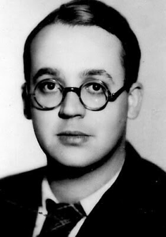

import FBBoxImageWrapper from '../../components/FBBoxImageWrapper.astro'
import SeeAlso from '../../components/FBSeeAlso.astro'

### 1 Front Białoruski

11 Korpus Pancerny zdobywa Kunowice, jest już 4 km od Odry na drodze do Frankfurtu nad Odrą.

### Dziennik Zachodni

W Sosnowcu ukazał się pierwszy numer górnośląskiego "Dziennika Zachodniego" (nie wchodzę w dyskusję czy Zagłębie to Górny Śląsk). Na Wikipedii znajdziemy informację, że "Nazwa dziennika Zachodni związana jest z faktem, iż początkowo gazeta ukazywała na terenie całego Śląska, a także na Ziemiach Zachodnich" otóż nie może to być prawda, bo 6 lutego Wrocław jeszcze nawet nie był w oblężeniu, nie było tam nawet polskich wojsk a co dopiero polskiej administracji, po prostu Górny Śląsk, to były wówczas dla Polski ziemie zachodnie.

Założycielem gazety był Stanisław Ziemba związany z Katowicami dziennikarz, były AK-owiec i powstaniec warszawski.

### Jałta

Trzeci dzień Konferencji Jałtańskiej.

### Wał Pomorski

Zakończyły się walki o Nadarzyce, najmocniej broniony element Wału Pomorskiego.

Niemcy zamordowali kilkunastu wziętych do niewoli polskich jeńców.

### ZSRR dekret o internowaniu Niemców

Państwowy Komitet Obrony ZSRR wydał dekret o internowaniu wszystkich Niemców od 17 do 50 roku życia. Skierowanie na roboty przymusowe będzie stanowić częściową rekompensatę strat wojennych. Nie będą się domagać reparacji, sami je sobie wezmą.

Jeżeli chodzi o jeńców wojennych, to nie ma żadnych pewnych liczb. Maksymalną jest 3 mln ludzi, z czego wróciło 2/3, niektórzy dopiero w 1956. Równolegle przeprowadzono i na wschodnich terenach odebranych Rzeszy i w sowieckiej strefie okupacyjnej zorganizowany, masowy rabunek. Zasadniczo im później wzięci do niewoli, tym większa szansa na życie. Najgorzej miała 6 Armia ze Stalingradu, z 90 tys. żołnierzy, którzy wyszli z ruin miasta, do Niemiec wróciło 5 tys. Najsłynniejszym z nich był dowódca 6 Armii feldmarszałek Friedrich Paulus, którego Stalin trzymał jako osobisty triumf. Dopiero po śmierci Stalina jesienią 1953 Paulus mógł wrócić do Niemiec, gdzie w Dreźnie spędził ostatnie 3 lata życia.

Sytuacja, w której pełnię realnej władzy w terenie mają sowieccy komendanci trwała na Dolnym Śląsku do 1948, a na obszarze późniejszego DDR do 1949.

### Robert Brasillach

Paryż jeśli chodzi o powierzchnię jest niewielkim miastem, to jest 100 km2 czyli 1/3 obecnego Wrocławia. Granicę Paryża wyznacza obwodnica autostradowa Bulwar Peryferyjny Paryża (fr. Boulevard périphérique de Paris), popularnie przez Polaków nazywany Peryferykiem.

Około kilometra na południe od Peryferyku znajduje się Fort de Montrouge - element wewnętrznego pierścienia fortów zbudowanych wokół Paryża w XIX wieku. Fort de Montrouge został zbudowany w latach 1843-45 i odegrał ważną rolę podczas bitwy o Paryż w 1870. Dziś został tam rozstrzelany francuski intelektualista Robert Brasillach.

Został skazany za kolaborację. Proces odbył się zaledwie dwa tygodnie wcześniej 19 stycznia 1945. Sędzia oprócz samego faktu zaangażowanej kolaboracji, pochwalania hitleryzmu i ataków na ruch oporu, podniósł kwestię antysemityzmu oraz - co jest interesującym świadectwem epoki - niedwuznacznie sugerował homoseksualizm oskarżonego. Miało to być okolicznością obciążającą. Brasillach wszystkie te oskarżenia przyjął, był z nich wręcz dumny.

Wyrok śmierci wywołał wiele protestów wśród francuskich intelektualistów - przeciwni wykonaniu wyroku byli Paul Valéry, Paul Claudel, Albert Camus, Jean Cocteau, Colette, Arthur Honegger, Jean Paul Sartre i Simone de Beauvoir. Stojący na czele Tymczasowego Rządu Republiki Francuskiej generał Charles de Gaulle nie skorzystał z prawa łaski, być może dlatego, że Brasillach wzywał do egzekucji przedwojennego polityka francuskiego Georgesa Mandela, którego de Gaulle bardzo cenił. Mandel, zagorzały przeciwnik kolaboracji, został aresztowany przez Gestapo w listopadzie 1942 i zamordowany w lesie Fontainebleau 7 lipca 1944 w zemście za udany zamach na kolaboranckiego ministra propagandy Philippe'a Henriota. Wet za wet za wet.

Brasillach był poetą i dramaturgiem. Wziął udział w delegacji do Katynia, potem napisał reportaż obciążający sowietów. Od 1941 redaktor naczelny pisma "Je suis partout" (pl. jestem wszędzie) reprezentującego środowiska prawicowe popierające kolaborację i Francję Vichy. Ostatni numer ukazał się w sierpniu 1944, kiedy alianci wkraczali do Paryża.

Fort de Montrouge od wyzwolenia był używany jako więzienie i miejsce egzekucji kolaborantów. Najsłynniejszym był marszałek Petain internowany tam z żoną od aresztowania 27 kwietnia do rozpoczęcia procesu 23 lipca 1945. W grudniu 1944 rozstrzelano tam trzech francuskich kolaborantów:
- 26 grudnia **Henri Lafont**, kryminalista który sam nawiązał kontakt z SS, od stycznia 1944 dowódca Brygady Północnoafrykańskiej, w skład której wchodziło od 200 do 300 Francuzów i Algierczyków. Zadaniem Brygady była walka z Résistance, w trakcie której została unicestwiona.
- 27 grudnia **Pierre Bonny**, uzdolniony i słynny jeszcze z lat 20. policjant, znany jeszcze bardziej z korupcji i wysługiwania się Francji Vichy, a w końcu twórca Carlingue - (fr. Gestapo française de la rue Lauriston) francuskiego biura Gestapo
- również 27 grudnia **Alexandre Villaplane** zawodowy piłkarz, w 1928 członek reprezentacji narodowej, podczas wojny kryminalista zaangażowany w czarny rynek i szantażowanie Żydów, w końcu schwytany przez Niemców przystąpił do Carlingue

Od 1949 fort jest ważnym ośrodkiem rozwoju zaawansowanej techniki wojskowej. To właśnie tam powstał pierwszy francuski komputer Uniwersalny Kalkulator Binarny Wojskowy (fr. la Calculatrice universelle binaire de l'Armement, w skrócie CUBA) budowany w latach 1949-51.

<FBBoxImageWrapper>

Robert Brasillach (1909-45) 
Źródło: Wikipedia Von Cliché anonyme, l'auteur du portrait n'a JAMAIS revendiqué la paternité de l'œuvre. - www.executedtoday.com, Gemeinfrei, [Link](https://commons.wikimedia.org/w/index.php?curid=24935376)
</FBBoxImageWrapper>

### Rheintochter

Dwustopniowa sterowana radiowo rakieta plot produkcji Rheinmetall-Borsig. Planowany zasięg: 14 km. Prace nad nią rozpoczęto w 1941. Działający prototyp powstał jesienią 1943. Ośrodek doświadczalny był ulokowany na Łebie - tzw. Małe Peenemünde.

Rakieta na paliwo stałe - paliwem był proch bezdymny. Pierwsza wersja R-1 była nieudana. Kolejna R-3 naddźwiękowa miała inną konstrukcję. Pierwszy stopień tworzyły odrzucane dwa silniki, drugi stopień był napędzany paliwem ciekłym. To rozwiązanie też się nie sprawdziło, powrócono do napędu na paliwo stałe.

Ostatecznie prace nad rakietę zarzucono 6 lutego 1945. I nie był to jedyny program rozwoju broni zatrzymany dziś.

### Henschel Hs 117 Schmetterling

Sterowany radiowo rakietowy pocisk plot zaproponowany przez prof. Herberta A. Wagnera w 1941. Jego najbardziej znanym i zrealizowanym projektem była sterowana radiowo rakieta Henschel Hs 293 służąca do niszczenia okrętów. Pomysł Wagnera początkowo odrzucony, ale wrócono do niego w 1943. Detonator miał być wyposażony w czujnik zbliżeniowy: akustyczny lub fotoelektryczny. Był to pierwszy zastosowany bojowo i skutecznie pocisk tego typu.

W Zatoce Biskajskiej 25 sierpnia 1943 uszkodził korwetę HMS Bideford. Dwa dni później zatopił HMS Egret.

W maju 1944 przeprowadzono 59 prób z tymi rakietami wynoszonymi przez samolot He 111, połowa z nich była udana. W styczniu wykonano prototyp produkcyjny, ale 6 lutego 1945 projekt anulowano.

W zasadzie w całym lotnictwie wstrzymano prace rozwojowe nad wszystkimi nowymi konstrukcjami już (już?) 17 stycznia 1945, polecając skoncentrować wszystkie wysiłki i dostępne jeszcze środki na Me 262 i Heinkel He 162 (Volksjäger).

<SeeAlso txt="Wunderwaffe" url="/festung-breslau/article/wunderwaffe" />

Schmetterling miał mieć dwie wersje: odpalane z ziemi i Hs 117H wystrzeliwane z samolotu nosiciela takiego jak Do 217, Ju 188, lub Ju 388.

Tu można by się zapytać: jaki jest sens nazwać rakietę plot Motylem? Może wybuchający pocisk albo samolot tak się komuś skojarzył.

### Ostfront

Majewski o przyczynach przestoju operacyjnego i planach 1 Frontu Ukraińskiego:

>Zadanie stojące przed 1 Frontem Ukraińskim komplikowały dodatkowo właściwości taktyczno-operacyjne i geograficzne śląskiego teatru działań wojennych. Wprawdzie największa przeszkoda wodna - Odra - została już wcześniej w wielu punktach i na dość znacznej szerokości przełamana, jednak na skrzydłach głównego kierunku uderzenia Frontu silnie umocnione miasta-twierdze znacznie ograniczały rozwinięcie działań zaczepnych. W zachodniej części Dolnego Śląska przed głównym zgrupowaniem uderzeniowym Frontu znajdowały się średniej wielkości przeszkody wodne: Bóbr wraz z dopływami: Kwisą, Szprotawą i Czerną oraz Kaczawa i Nysa Łużycka, zaś przed południowym zgrupowaniem uderzeniowym Nysa Kłodzka i Bystrzyca. Największe trudności mogły wystąpić przy forsowaniu zwłaszcza Bobru i Kwisy, płynących znacznym odcinku w dolinach, których krawędzie stanowią kilku - lub kilkunastometrowe strome ściany. 
>Dogodny do działania (zwłaszcza wojsk pancernych i zmechanizowanych) obszar na lewym brzegu Odry wyraźnie zwęża się ku zachodowi, tworząc wąską "bramę" w rejonie Zgorzelca, ograniczoną od południa przez Sudety oraz Podgórze Sudeckie, Podgórza Kaczawskie i Izerskie, od północy zaś przez kompleks Borów Dolnośląskich, rozciągających się na północ od linii Pieńsk-Bolesławiec. Przez bory te, sięgające Chocianowa, Przemkowa, Szprotawy i Zagania, prowadzą na zachód i północny zachód stosunkowo nieliczne i łatwe do zablokowania szlaki komunikacyjne. Ułatwiało to niewątpliwie organizację obrony. 
>Do wszystkich tych czynników, które w różnym stopniu zaważyły na przebiegu operacji i jej rezultatach, należy dodać, że przegrupowanie wojsk 1 Frontu Ukraińskiego i ich koncentrowanie w rejonach wyjściowych do natarcia odbywało się w warunkach nie ustających na wielu - odcinkach (np. na wschód od Głogowa czy na przyczółku pod Malczycami) walk. Długie trasy przemarszów (zwłaszcza 3 Armii Gwardii i 52 Armii na przyczółek ścinawski oraz 3 Armii Pancernej Gwardii przegrupowanej na prawe skrzydło Frontu z Górnego Śląska) oraz brak środków transportowych były przyczyną znacznych opóźnień w luzowaniu poszczególnych jednostek i zajmowaniu przez nie wyznaczonych rejonów. 
>Z ogromnymi trudnościami borykały się także służby kwatermistrzowskie Frontu. Dzięki ogromnej ofiarności polskich kolejarzy, wspieranych przez żołnierzy radzieckich wojsk kolejowych, do 2 lutego 1945 r. zdołano odbudować i uruchomić linię kolejową z Rozwadowa przez Częstochowę do Oleśnicy, głównej stacji rozładowczej Frontu. Nie zdołano już jednak zapewnić wystarczających zapasów amunicji i materiałów pędnych. Dlatego też ustalony początkowo na 6 lutego termin rozpoczęcia natarcia z przyczółka pod Ścinawą został przesunięty na 8 lutego.

### Głogów

Majewski:

>Do utrzymania przedmościa w tym rejonie Głogowa dowództwo hitlerowskie przywiązywało bardzo dużą wagę. W rozpatrywanej pod koniec stycznia przez OKH koncepcji miało ono być wykorzystane jako podstawa wyjściowa do uderzenia, przerzuconej właśnie z frontu zachodniego, 6 Armii Pancernej SS na tyły wychodzących nad Odrę pod Kostrzyniem wojsk 1 Frontu Białoruskiego. Dlatego skoncentrowano tu znaczne siły, przede wszystkim przerzuconą ponownie z lewego brzegu 16 Dywizję Pancerną, grupę bojową 72 Dywizji Piechoty oraz liczne pomniejsze grupy bojowe i 3-4 bataliony Volkssturmu. 
>Jednostki 3 Armii Gwardii wyczerpane walkami, prowadzonymi nieprzerwanie od 18 dni, nie zdołały do 6 lutego zlikwidować przedmieścia i wyprzeć hitlerowców za Odrę.

### Lubin

Ostatni kontratak załogi Lubina. [LUBIN 1945 - OSTATNI KONTRATAK](https://www.facebook.com/bobr1945/posts/3396080340505605)

### Brzeg

Majewski:

>W tym samym dniu [1945-02-06] zdobyty został również okrążony Brzeg. O jego szybkim opanowaniu w znacznym stopniu zadecydował zmasowany ogień artylerii radzieckiej, która wysunięta do przodu, obezwładniła środki ogniowe nieprzyjaciela i umożliwiła żołnierzom 78 Dywizji Piechoty Gwardii, dowodzonej przez generała-majora G. Motowa, skuteczny szturm tego umocnionego miasta.

Rusza atak na Strzelin. Majewski o dzisiejszych walkach o Grodków, miasto 20 km na południe od Brzegu, w połowie drogi do Nysy:

>Okrążeniu Brzegu próbowało przeciwdziałać dowództwo hitlerowskiej 17 Armii. Siłami doraźnie zebranych jednostek, których trzonem była przybyła z 1 Armii Pancernej 208 Dywizja Piechoty, zmontowane zostało uderzenie wzdłuż linii kolejowej Grodków-Brzeg. Próby deblokady Brzegu zostały jednak pokrzyżowane przez jednostki 55 Korpusu i 31 Korpusu Pancernego, które po przekroczeniu Nysy Kłodzkiej i połączeniu się z 5 Armią Gwardii zawróciły na zachód, w boju spotkaniowym zatrzymały, a następnie odrzuciły Niemców i zdobyły Grodków, skąd rozwinięto natarcie w kierunku miasta Nysy. Zareagowało na to natychmiast dowództwo Grupy Armii "Środek", wprowadzając w tym rejonie do walki 8 Dywizję Pancerną oraz 45 Dywizję Grenadierów Ludowych, Do szczególnie zaciętych bojów doszło 6 lutego w rejonie Starego Grodkowa (5 km na południe od Grodkowa), który parokrotnie przechodził z rąk do rąk, ostatecznie jednak został utrzymany przez wojska radzieckie.

### Wrocław

Nastroje w mieście stają się coraz gorsze; rozstrzelanie wiceburmistrza Spielhagena było początkiem całej serii publicznych egzekucji urządzanych dla postrachu. Po nim zostali rozstrzelani: jeszcze w styczniu dyrektor rejencji dr Sommer, oraz kierownik obwodowej grupy NSDAP z Kleciny Paul Glückel, 4 lutego burmistrz Kleciny Eugen Pfand, 6 lutego burmistrz Brochowa Bruno Kurzbach, robotnicy przymusowi przyłapani na grabieży, później już zwykli cywile z zupełnie groteskowych powodów jak np. pewien siedemnastolatek, który zapytany czemu jeszcze nie poszedł do Volkssturmu, miał nieszczęście odpowiedzieć, iż "*to nie zmieni losów wojny*". Według oficjalnej propagandy mylił się, i to bardzo, nie można było pozwolić by jego pomyłka stała się powszechna. Mobilizacja stała się powszechnym obowiązkiem, teraz każdy musiał myśleć, mówić i działać w duchu regulaminu polowego z 1908:

>I tak naczelnym wymogiem wojny pozostaje zdecydowanie w działaniu. Każdy, zarówno naczelny dowódca, jak i najmłodszy żołnierz - musi przez cały czas mieć świadomość, że zaniechanie i zaniedbanie bardziej go obciążają niż błąd w wyborze środków.

Volkssturm zajmuje budynki należące do różnych instytucji.

Jest zimno, plus 5 stopni i ciągle pada deszcz. Kopanie umocnień jest męką. Każdy dół wypełnia się błotem. Głębiej ziemia jest wciąż zamarznięta. Dwa dni temu Oberkommando der Wehrmacht (OKW) ogłasza w raporcie stan wznowionej przedwczoraj ofensywy:

>Nad Odrą stoi VI Armia rosyjska szerokim frontem od Gliwic aż do Wałbrzycha. Należy oczekiwać wzięcia Wrocławia w potrzask na linii Oława-Malczyce.

Więc choć Wrocław uwolnił się od niebezpieczeństwa okrążenia z małych, blisko położonych przyczółków, to ogólna sytuacja staje się dramatyczna. O ile nie nastąpi przełom, jeśli siły Armii Czerwonej wciąż będą zdolne do postępów, miasto zostanie okrążone, i to z pozycji leżących zupełnie poza zasięgiem garnizonu wrocławskiego.

W tej sytuacji powracający uchodźcy są coraz większym problemem. Dziś, 6 lutego Gauleitung wydaje na plakatach następujące obwieszczenie:

>Mieszkańcy i mieszkanki Wrocławia! Na dworcach i ulicach wylotowych ciągle spotyka się ewakuowanych już z Wrocławia rodaków, którzy wracają po swoje rzeczy. Ponieważ muszą być wywiezione rodziny z dziećmi, to wracający nie będą już mogli być odwiezieni koleją do swoich miejsc ewakuacyjnych. Służby porządkowe otrzymały zadanie zatrzymania osób powracających bez zezwolenia i wyprowadzania ich piechotą poza obszar twierdzy. W celu uniknięcia osobistych nieprzyjemności należy [...] bezwzględne przestrzegać tego rozporządzenia.

Te ogłoszenia i nakazy będą ponawiane, co dowodzi ich nieskuteczności. Ludzie będą wracać do bezpieczniejszego, jak im się zdaje, Wrocławia, dopóki nie oblegną go zewsząd wrogie wojska. A to nastąpi za dziesięć dni.
