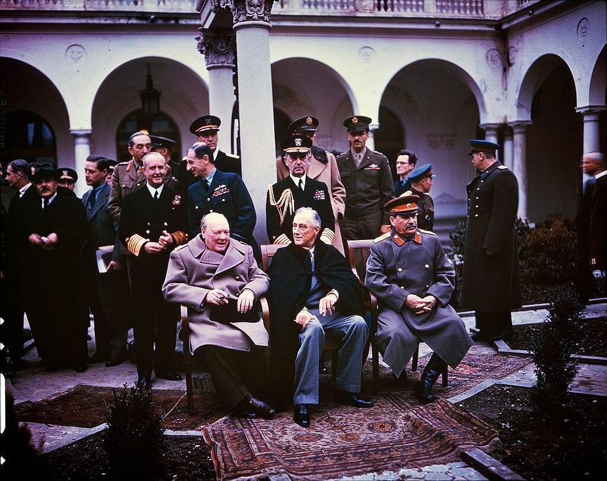

import FBBoxImageWrapper from '../../components/FBBoxImageWrapper.astro'
import SeeAlso from '../../components/FBSeeAlso.astro'

### Jałta

Zakończyła się konferencja jałtańska. Trwała od 4 lutego - osiem dni. Ostatecznie postanowienia są następujące:

- Niemcy zostaną obciążone reparacjami wojennymi i podzielone na cztery strefy okupacyjne.
- Sowiety dostają jedną ze stref okupacyjnych (składającą się z Turyngii, Saksonii, Meklemburgii, Brandenburgii i Pomorza Przedniego) i gwarantowaną strefę wpływów z Polską w roli głównej.
- transfer ludzi i granic na zachód: Polska i Niemcy tracą kresy wschodnie, Polacy i Niemcy będą przewiezieni na zachód w ramach tzw. repatriacji; ponadto Niemcy opuszczą Prusy Wschodnie, Czechosłowację i Węgry.
- Polska w ramach rekompensaty dostaje, to co później w komunistycznej propagandzie określane było jako "Ziemie Odzyskane": Śląsk, ziemię lubuską, Pomorze Zachodnie, Prusy Wschodnie i obszar Wolnego Miasta Gdańska.
- w Warszawie na bazie dotychczasowego Rządu Tymczasowego powstanie Rząd Jedności Narodowej, działania NKWD także te wobec polskiego podziemia niepodległościowego są uznane za legalne, w zamian za obietnicę przeprowadzenia wolnych wyborów tak szybko, jak to będzie możliwe; oznacza to, że rząd warszawski zostanie uznany, a dotychczasowy rząd RP na emigracji straci uznanie międzynarodowe.
- konieczność uregulowania stosunków pomiędzy Bułgarią a Jugosławią.
- Sowiety w dwa do trzech miesięcy po pokonaniu Niemiec przystąpią do wojny z Japonią, w zamian zostanie uznany status quo tzw Mongolii Zewnętrznej oraz dostaną południowy Sachalin, Port Arthur i Wyspy Kurylskie.

Jak widać tak czasem wykpiwany "słoń a sprawa polska" akurat miał tu znaczenie, bo kwestie polskie wiązały sporą część wątków konferencji. Taki już los kraju pomiędzy Moskwą a Berlinem.

<FBBoxImageWrapper>

Wielka Trójka podczas konferencji w Jałcie 1945 
Źródło: Wikipedia By [[1]](https://history.blog.gov.uk/2015/02/04/whats-the-context-4-february-1945-the-yalta-conference-opens/) [[2]](https://history.blog.gov.uk/wp-content/uploads/sites/2/2015/02/INF14-447-Yalta-conference-Churchill-Stalin-Roosevelt-1945-1024x807.jpg), Domena publiczna, [Link](https://commons.wikimedia.org/w/index.php?curid=40547477)
</FBBoxImageWrapper>

### Budapeszt

17 stycznia Niemcy wycofali się z Pesztu i następnego dnia wysadzili wszystkie mosty na Dunaju. Bitwa o Budę z powodu ukształtowania terenu była dużo trudniejsza. Do 11 lutego cała Buda poza wzgórzami Zamkowym i Gellerta została zdobyta.

<SeeAlso txt="Węgry" url="/festung-breslau/article/wegry" />

11 lutego Wzgórze Gellerta zostało zdobyte. Wojska niemieckie i węgierskie wciąż trzymały wzgórze zamkowe. Generał Pfeffer-Wildenbruch wbrew rozkazowi Hitlera pozwolił na ewakuację wzgórza. Będą się tam trzymać jeszcze dwa dni. Korzystając z ciemności i mgły, żołnierze cywile uciekają z okrążenia. Niektórym się udało. Większość jednak została zmasakrowana ogniem przygotowanych na to oddziałów Armii Czerwonej.

Niemcy ponieśli ogromne straty w Budapeszcie. Tylko dzisiaj zginęli:

- drezdeńczyk z pochodzenia generał Gerhard Schmidhuber (Wehrmacht) dowódca 7 i resztek 13 Dywizji Pancernej, przez Pála Szalaia faszystę węgierskiego utrzymywał kontakt z Raulem Wallenbergiem, i to na skutek jego nacisków Schmidhuber nie dopuścił do likwidacji budapeszteńskiego getta i ochronił je przed węgierskimi strzałokrzyżowcami.
- August Zehender generał, dowódca 22 Ochotniczej Dywizji Kawalerii SS (niem. 22. SS-Freiwilligen Kavallerie-Division) - używana czasem nazwa dywizji Maria Theresia jest niepotwierdzona.
- Dowódca 8 Dywizji Kawalerii SS generał Joachim Rumohr poważnie ranny podczas wycofywania się z Budapesztu, chcąc uniknąć dostania się do niewoli, popełnił samobójstwo.

- [Mark Felton Productions "The Nazi Gold Train" [YT 10:36]](https://www.youtube.com/watch?v=Tm_4NETGXpc)

### ROA

Chrzest bojowy 600 dywizji (rosyjskiej) ROA, bronią pozycji Odry wypierając nieprzyjaciela z okolic wsi Neulewin 20 km na NW od Kostzyna nad Odrą. Po trzech dniach wyniszczającej walki wycofani. Od 14 lutego maszerują w kierunku Pragi.

Dywizja była wyposażona w zdobyczne T-34-76 i Hetzery. Czy pod Neulewin Rosjanie w T-34 walczyli z Rosjanami w T-34?

### Warszawa

Dziś w praskim więzieniu karno-śledczym nr III tzw. Toledo przy ul. 11 Listopada w Warszawie stracony został Edward Nowicki ps. "Tyczka" porucznik kampanii wrześniowej, szef komendy AK Ostrów Mazowiecka. Schwytany przez NKWD w grudniu 1944. Wyrok śmierci wydał Wojskowy Sąd Garnizonowy.

### Dolny Śląsk

Od początku ofensywy opanowano 500 miejscowości, np. Kostomłoty. Do 13 lutego 650. Do 14 850.

Zmiana celów operacyjnych na odcinku ścinawskim: planowany atak na linii: Polkowice - Nowe Miasteczko - Nowa Sól, drugi blokując Głogów od wschodu, miał wyjść nad Odrę na północ od Bytomia Odrzańskiego. Widząc, że okrążenie Głogowa jest nieuchronne, generał Nehring pozostawił tam silną załogę, a resztę sił wycofał za linię Bobru, tak samo postąpił dowódca XL Korpusu Pancernego generał Gotthard Heinrici, broniący dotąd linii Odry od Bytomia Odrzańskiego do ujścia Nysy Łużyckiej.

Sowieci przekroczyli Bóbr w rejonie Żagania i zbliżyli się do Szprotawy. Zdobyli Przemków. Do 13 lutego opanowali Nowe Miasteczko, Bytom Odrzański i Kożuchów.

Majewski o planie okrążenia Głogowa:

>11 lutego dowódca 3 Armii Gwardii postawił swoim jednostkom kolejne zadania. 76 Korpus w ścisłym współdziałaniu z 93 Brygadą Pancerną i 22 Brygadą Artylerii Pancernej miał nacierać wzdłuż drogi Polkowice-Nowe Miasto-Nowa Sól, by po zdobyciu tej ostatniej miejscowości oraz Kożuchowa wykonać zwrot na zachód i wyjść nad Bóbr na północ od Nowogrodu Bobrzańskiego. 25 Korpus Pancerny i 21 Korpus, obchodząc Głogów od południa i zachodu, doprowadzić miały do okrążenia twierdzy i po pozostawieniu niewielkich sił do jej blokowania również wyjść nad Bóbr (na północ od odcinka 76 Korpusu). 
>Zadania te zostały w pełni zrealizowane.

Żagań - Szprotawa:

>11 lutego generał Leluszenko rozkazał jednostkom 6 Korpusu Zmechanizowanego obejść od północy silnie broniony Żagań, wyjść nad Bóbr na północ od tego miasta, z marszu sforsować rzekę i zdobyć ważny węzeł komunikacyjny na przeciwległym brzegu - Bieniów. Zgodnie z zaleceniem korpus przebył w tym samym dniu około 75 km (przez Witków, Jelenin, Jabłonów, Brzeżnicę) i pod wieczór wyszedł nad Bóbr w rejonie miejscowości Dolna Gorzupia i Zbrojów. Oddziały wydzielone 17 Brygady Zmechanizowanej Gwardii i 49 Brygady Zmechanizowanej natychmiast przystąpiły do przeprawy i w późnych godzinach nocnych uchwyciły przyczółki na przeciwległym brzegu. Tego samego dnia wieczorem dotarły do Bobru w rejonie Zagania również jednostki 10 KorPusu Pancernego. 29 Brygada Zmechanizowana Gwardii tego korpusu, Wsparta przez czołgi 62 Brygady Pancernej, zdobyła tamę na Bobrze i nie uszkodzoną elektrownię wodną. Pozostałe jednostki 10 Korpusu Pancernego przełamywały opór przeciwnika na przedpolach Szprotawy i tocząc ciężkie walki z jednostkami Korpusu Pancernego "Grossdeutschland", opanowały wschodni skraj miasta. 
>Na prawym skrzydle 13 Armii 102 Korpus, wykorzystując sukces jednostek zmechanizowanych, przesunął się dość znacznie do przodu i 11 lutego wieczorem osiągnął miejscowości: Mycielin, Borowina i Janowice. 24 Korpus przebił się przez kompleks leśny na południowy zachód od Przemkowa, wyszedł szerokim frontem nad Bóbr między Szprotawą a Lesznem Górnym i z marszu sforsował rzekę zdobywając przyczółek w rejonie Bobrowic. Działania te zdecydowały także o losach Przemkowa, który w powstałej sytuacji znalazł się na tyłach wychodzących nad Bóbr związków taktycznych 4 Armii Pancernej i 13 Armii i zajęty został przez przesuniętą z rejonu Polkowic 112 Dywizję Piechoty.

Oraz Bóbr na pólnoc od Bolesławca:

>Nawet jednak po ich [dywizji 48 Korpusu oraz pozostałych w tyle jednostek saperskich i pontonowych] nadejściu nie można było uruchomić przeprawy. Wysiłki saperów niweczyło przeciwdziałanie hitlerowców, którzy otwierając śluzy w górnym biegu rzeki, spowodowali powstanie fali powodziowej. W związku z tym dywizje piechoty 48 Korpusu, które 11 lutego na szerokim froncie sforsowały Bóbr środkami podręcznymi i łodziami, pozbawione wsparcia czołgów i artylerii większych kalibrów, posunęły się w tym dniu jedynie 6 km na zachód (pokonując połowę drogi pomiędzy Bobrem a Kwisą). Natomiast 12 lutego wyszły one nad Kwisę, oczyściły jej prawy brzeg pomiędzy Świętoszowem a Ławszową i zdobyły szereg, małych przyczółków na lewym brzegu.

### 5 Armia Gwardii

Majewski:

>Pomyślny rozwój natarcia 6 Armii i pojawienie się czołgów 3 Armii Pancernej Gwardii na tyłach wojsk niemieckich wpłynęły również na zdynamizowanie działań południowego zgrupowania okrążającego Wrocław. Armia generała A. Żadowa, wzmocniona nowymi siłami, znacznie przyspieszyła tempo akcji. Przez cały czas operacji okrążającej atakujące oddziały wspierane były skutecznie przez działania 2 Armii Lotniczej generała pułkownika S. Krasowskiego, zwłaszcza zaś przez jednostki 3 Korpusu Lotnictwa Szturmowego, 5 Korpusu Lotnictwa Myśliwskiego i 6 Korpusu Lotnictwa Bombowego Gwardii. W walkach tych zginął 11 lutego atakując w locie bombowym niemieckie baterie na południo-zachodnim skraju Wrocławia, znany lotnik radziecki, dowódca 6 Korpusu Lotnictwa Bombowego Gwardii, dwukrotny Bohater Związku Radzieckiego generał-major Iwan Połbin.

Opracowane na podstawie: Primke, Szczerepa "Kierunek Festung Breslau":

Fakt, że ważą się losy oblężenia i siły 6 Armii są poważnie zagrożone, nie uszedł uwadze dowództwa Frontu. Dlatego właśnie 52 Armia dostała rozkaz przejęcia Legnicy, co umożliwi skierowanie 22 Korpusu Strzeleckiego na wschód. Ponadto 3 Gwardyjska Armia Pancerna, która w tym czasie była już pod Bolesławcem dostała rozkaz zmiany kierunku uderzenia - miała zawrócić o 180 stopni i uderzyć na wschód na zaplecze niemieckie na południe od autostrady. Miało to odciążyć 6 Armię, pozwolić jej przesunąć się w stronę Wrocławia, co z kolei umożliwi skierowanie wszystkich sił 7 Korpusu Zmechanizowanego Gwardii na zamknięcie korytarza, tak zaciekle bronionego przez Niemców.

Na całym obszarze pomiędzy Legnicą a Wrocławiem panuje dziś bardzo dziwna sytuacja: skromne siły niemieckie skoncentrowane w licznych i nie do końca rozpoznanych punktach oporu usiłują zatrzymać postęp sowiecki. Tymczasem Armia Czerwona, która niejednokrotnie prowadzi zaciekłe boje na własnych tyłach, penetruje zaplecze nieprzyjaciela czasem siłami całego pułku. Wojska niemieckie i sowieckie są przemieszane, linia frontu czy też meldowana rubież zaznacza obszar przewagi, a nie panowania.

218 Dywizja Strzelecka pozostaje na rubieży Bartoszów - Rogoźnik chroniąc prawą flankę 6 Armii, aktywnie prowadzi zwiad i odpiera ataki. Usiłuje zdobyć Gniewomierz. 309 Dywizja Strzelecka przenosi się w trójkąt Piersno - Czechy - Kostomłoty.

Helena Hillman, mieszkanka Zabłot:

>11 lutego zostaliśmy napadnięci przez Rosjan i zamknięci w piwnicy na kartofle. Razem ze mną sto osób. Tam spędziliśmy trzy straszne dni i noce. Bez okrycia, światła, pożywienia. Z wartownikami pod drzwiami. Jeden jedyny słój po marmoladzie służył stu osobom do załatwienia potrzeb fizjologicznych. Dopiero potem kobiety i dziewczyny zostały wyciągnięte z piwnicy i zgwałcone w tym samym pomieszczeniu. Birgitte s. z Kamiennej Góry zgwałcono dziewięć razy pod rząd, a potem gdy zaczęła się wzbraniać, uderzono ją karabinem maszynowym. Broń wystrzeliła i trafiła 15-letnią Hildę Rabsch z Przecławic koło Wrocławia w tył głowy. Siedziałam dosłownie w kałuży krwi i nie miałam nic, żeby opatrzyć rany. Błagaliśmy o lekarza. Zamiast tego Rosjanin chwycił za nogi nieprzytomną Brigitte i zaczął ją ciągnąć po schodach tak, że jej głowa ciągle uderzała o stopnie. Na górze została znowu oddana na pastwę żołnierzy. Później podczas ostrzału musieliśmy wyjść i zostawić rzekome zwłoki młodej dziewczyny. Młody praktykant od nas ukrył się w stodole, a kiedy następnego dnia jeszcze raz zszedł do piwnicy, Hilde jeszcze się poruszała i rozpoznała go. Umarła krótko po tym.

Wciąż toczą się walki o Środę Śląską, która stanowi najsilniejszy punkt oporu na tym obszarze. Seria ataków i kontrataków na stację kolejową Środa Śląska, która znajduje się pomiędzy miastem a Szczepanowem.

Sachsenheimer melduje, że Niemcy trzymają pozycje Słup - Jaśkowice (wschodnia część Szczepanowa) - Chwalimierz. Dzisiejszy raport sowiecki donosi o wdarciu się i zdobyciu do końca dzisiejszego dnia do Słupa (181 Dywizja Strzelecka) i Chwalimierza (359 Dywizja Strzelecka). W zachodniej części Szczepanowa ulokowany jest sztab sowieckiego pułku. Wschodnia jest niemieckim bastionem. W Komornikach (zachodnia część Środy Śląskiej) znajduje się silna pozycja niemieckiej artylerii.

Jak bardzo ta linia jest symboliczna, wskazuje uwaga Sachsenheimera, że Lutynia i Radakowice zostały zaatakowane od południa. Sowiecki 1198 pułk zajął pozycję aż w Gałowie, Gałówku i Jarnołtowie. Pomimo kontrataków niemieckich nie tylko nie dał się wyprzeć, ale i prowadził intensywny zwiad w kierunku Leśnicy. Przekroczyli Strzegomkę i uderzyli na Samotwór.

Podążył za nim 1196 pułk i z samego rana zajął pozycje Jarząbkowice - Zakrzyce i prowadził zwiad w kierunku Lutyni.

### 7 Korpus Zmechanizowany Gwardii

Opracowane na podstawie: Primke, Szczerepa "Kierunek Festung Breslau":

Natomiast dla Korpusu nadszedł dzień krytyczny.

19 Dywizja Pancerna zaatakowała rejon 24 Brygady Pancernej Gwardii, nacierając w kierunku na Samborz. Odbył się dramatyczny bój o wieś Udanin, który utracono, ale potem odbito.

Ponadto w cały korytarz na południe od Wrocławia pomiędzy liniami kolejowymi 285 a 276, czyli między dawnym przebiegiem krajowej ósemki a drogą 395 Niemcy rzucili wszystkie posiadane przez siebie siły. Były to: 20 Dywizja Pancerna, 253 i 254 DP oraz resztki 269 DP.

Udało im się wypchnąć 57 Brygadę z Kobierzyc w rejon Chrzanowa. Brygada bezskutecznie atakowała w kierunku na Magnice i Księginice. Natomiast 25 Brygada nadal trzymała pozycję Domasław - Bledzów.

O godz. 1700 otrzymali rozkaz wyprowadzenia natarcia w kierunku Żórawiny, co miało doprowadzić do spotkania z 5 Armią, od której dzieliło ich tylko 6,5 km. Zadanie było utrudnione, ponieważ z powodu roztopów trzeba było trzymać się dróg bitych, co zmuszało do przejeżdżania obok budynków, w których ukrywali się żołnierze z panzerfaustami. Ponadto od 10 lutego nastąpiło nasilenie operacji lotniczej nieprzyjaciela, nie tylko zwiadowczej. Kilkanaście samolotów Bf 109 i Ju 88 regularnie atakowało sowieckie pozycje. Natomiast 2 Armia Lotnicza sowiecka była nieobecna.

W nocy doszło do połączenia obu Brygad i rozpoczął się bój o Księginice.

Tymczasem 8 Dywizja Pancerna niemiecka przebiła się do Krobielowic. Zastała je zniszczone i splądrowane. Zbezczeszczono grobowiec. Najwidoczniej nikt nie powiedział czerwonoarmistom, że marszałek był sojusznikiem Rosji:

>Wdzierający się tam sowieccy żołnierze zniszczyli (...) posiadłość, w której sędziwy feldmarszałek spędził ostatnie lata swojego życia i gdzie również zmarł. Nie uszanowano również znajdującego się w pobliżu grobowca rodziny von Blücher. Zniszczono zarówno pomnik, jak i zdobiące go wieńce i wstęgi, rozłupano żeliwny sarkofag marszałka i rozbito znajdującą się w nim drewnianą trumnę z ciałem "Marszałka Naprzód". Wydobytym z trumny zwłokom odcięto głowę, wyrzucając je następnie precz.

Podsumowując - wciąż nie dotarło wsparcie piechoty 22 Korpusu Strzeleckiego, wszystkie jednostki liniowe Korpusu były nadmiernie rozciągnięte i pod atakiem, a dwie Brygady będące w ataku zupełnie odcięte i pozbawione zaplecza. Działania Niemców zmierzały do podzielenia Korpusu na mniejsze części i zniszczenia każdej z nich. Dlatego tak walczyli o szosę Bielany Wrocławskie - Kobierzyce, była główną osią drogową korytarza i rozdzielała jednostki Korpusu na dwie części.

Czy jutrzejszy dzień przyniesie rozstrzygnięcie?

Tymczasem 5 Armia sowiecka nacierająca od strony Oławy napotyka poważny opór. Do 11 lutego posuwa się tylko kilka km naprzód i osiąga linię Kotowice - Grodziszów - Krajków.

### Wrocław

294 DP na drodze do Wrocławia zdobyła Zakrzów, wdarła się do fabryki Kornów i pobliskiego osiedla "Po pracy" (niem. Feierabendsiedlung), zagroziła stacji kolejowej Wrocław Zakrzów (niem. Sacrau). Na miejscu był tylko batalion pod dowództwem majora Tenscherta wspierany przez drugi batalion pod dowództwem kapitana Günthera. Na pomoc został wysłany batalion z pułku Wehl. Jutro kontratak.

Ksiądz Peikert:

>Z Wysokiego Kościoła spod Trzebnicy strzelały rosyjskie działa dalekiego zasięgu bez przerwy na nasze miasto. W mojej parafii liczne detonacje i wielkie spustoszenia na ulicach.

### Iwan Połbin

Dzisiaj we Wrocławiu zginął, wykonując misję bojowa generał Połbin. Jest to tak interesująca postać - ponadto ma ulice we Wrocławiu! - że poświęciłem mu osobny artykuł, jest też trochę kontekstu i ogólnie historii lotnictwa:

<SeeAlso txt="Generał Iwan Połbin (1905-45)" url="/festung-breslau/article/iwan-polbin" />

### Maria Langner

Od 1 lutego znajduje się w areszcie śledczym pod zarzutem pomocy w dezercji lekarza wojskowego doktora Heisiga. Czas akcji tego rozdziału wypada na dni 11 i / lub 12 lutego.

>ROZNOSZENIE JEDZENIA 
> 
>Pierwszym z więźniów, którego poznałam, był obłąkany z raną w głowie. Nie miał żadnych dokumentów. Kto nie miał dokumentów, uchodził za szpiega, kto uchodził za szpiega, podlegał karze śmierci. Pewnej nocy, gdy zdemolował swoją celę i walił wokół siebie dzbankiem i stokiem, dwaj policjanci, strażnik i klucznik poszli po urzędnika Gestapo. W parę minut później prowadzono więźnia korytarzem, obok naszych drzwi. Słyszeliśmy, jak go zapewniano, że idzie do generała. Podnieconym głosem pytał radośnie i z niedowierzaniem, czy generał wie, że on jest już wolny, czy przyjmie go jeszcze dziś w nocy, czy może skorzystać z samochodu... głosy rozpłynęły się. Wkrótce potem na podwórzu padł strzał. Celę obłąkanego zajął następnego dnia nowy więzień. 
>W ostatnich trzech dniach stycznia miejscowe grupy partyjne przysyłały na Gestapo wszystkich, którzy byli z jakiegokolwiek powodu podejrzani - wyszedł przecież rozkaz wzmożenia czujności - i w ten sposób dostawali się do więzienia, prócz poważnie i niebezpiecznie obciążonych, ludzie naiwni, zbłąkani, przerażeni, którzy nie mieli pojęcia, czego od nich chcą. 
>Heini, czternastoletni chłopiec, uciekł z transportu wychowanków ewakuowanego sierocińca. Nic mu nie pomaga, że wygląda jak dziecko, dzieci również podlegają mobilizacji. Nie ma dokumentów, nie może się niczym wylegitymować. Może być zarówno szpiegiem jak dezerterem. Heini dostaje się do więzienia. Wkrótce jest kalefaktorem wachmistrzów, czyści buty, zamiata wartownię, pali w małym żelaznym piecyku, zapala za dnia wszędzie światło, ma pieczę nad kluczami cel, zjada kawałki sera z porcji chleba, przeznaczonych dla więźniów. Ser ofiarował więźniom Hase po ciężkiej walce z sobą, gdyż ser wchodzi w skład przydziałów dla policji, a to, co zostaje, należy się panu Hasemu (przed Bogiem i światem) według starego zwyczaju i prawa. 
>W południe, po wydaniu obiadu dla policji, przenosi się przez podwórze resztki jedzenia w kubłach umieszczonych na nosidłach i rozdziela się je między więźniów. Początkowo starczył jeden kubeł, teraz jest ich trzy. Przy rozdzielaniu jedzenia w więzieniu asystuje mi jeden z wachmistrzów i Heini. Otwieramy celę za celą i napełniamy kolejno podstawiane nam miski. Patrzymy w stroskane, wstrząśnięte, wykrzywione lękiem, czasem zupełnie apatyczne twarze. Przeważnie jest to biedota, dużo kobiet, obcokrajowców i dezerterów. Ci ostatni to często bardzo młodzi ludzie, których dwa, trzy razy dziennie wywołują na przesłuchanie: czasem zdarza się, że z przesłuchania, które trwa jeden dzień lub dwa, wcale do celi nie wracają. Kessler nikogo ne wypuszcza ze swoich ramion polipa, które niewidzialnym uściskiem objęły całe miasto, a jeśli kogoś chwyci, nie zna pardonu. 
>Egzekucja odbywa się natychmiast po wyroku. 
>W jednej celi siedzi ich czterech. Jeden zrywa się, gdy otwierają się drzwi celi. Na jego twarzy maluje się pełne napięcia wyczekiwanie. Drugi leży na pryczy z wzrokiem utkwionym w sufit, trzeci siedzi w nogach pryczy, na samym brzegu, i gestem pełnym przerażenia zakrywa twarz rękami. Czwarty, jeszcze całkiem młody, siedzi na podłodze z głową opartą o drewniany zydel, twarz jego jest niewidoczna. Nie wiadomo, o czym z nimi mówić, każde słowo wydaje się bezsensowne. W obliczu takiej chwili należy zachować milczenie. Wachmistrz cicho zamyka drzwi celi. 
>Takich jest około piętnastu w więzieniu. 
>Czasami niedaleko, w odległości zaledwie kilku kroków, za innymi żelaznymi drzwiami siedzi czyjaś matka, narzeczona lub przyjaciółka. 
>Wachmistrz znowu otwiera jakieś drzwi. W celi umieszczono pięciu chłopców w wieku szesnastu czy siedemnastu lat. Plądrowali, powiada Heini. 
>W następnej celi jest taki tłok, że w chwili gdy otwieramy drzwi, wypada z niej kilka osób. Uderza w nas cuchnące powietrze. Ludzie stoją stłoczeni już od czternastu godzin, wśród nich matki z małymi dziećmi na ramieniu. Są to polskie rodziny robotnicze, które tu spędzono, obchodzą się z nimi gorzej niż z bydłem przeznaczonym na transport. Zgodnie z zarządzeniem Gestapo wszyscy muszą przebywać razem w jednym pomieszczeniu. Cele nie są obliczone na przeszło trzydzieści osób, dlatego ludzie muszą stać, cela jest natłoczona, nikt nie może się poruszyć, usiąść lub załatwić swą potrzebę. 
>W innej celi leży na pryczy młoda kobieta, pochylona nad dziesięciomiesięcznym dzieckiem, które stara się ogrzać własnym ciałem. Drzwi celi pozostają przez kilka minut otwarte, gdyż posłano Heinego po kromkę chleba. Matka chciałaby pożuć chleb i nakarmić nim dziecko, które od trzech dni nie dostaje innego pożywienia. Opowiada, że zwabiła ją tu jakaś nieznajoma kobieta pod pozorem, że mąż, który jest żołnierzem, pragnie się z nią zobaczyć. Zabrała z sobą dziecko, gdyż mąż od roku nie miał urlopu i dziecka jeszcze nie znał. 
>Nieznajoma podała w Gestapo, że młoda kobieta wypowiadała niewłaściwe, ostre uwagi na temat Hitlera. Dopiero po wielu dniach. gdy ta sama kobieta znów próbowała zwabić kogoś w ten sam sposób do Gestapo, okazało się, że młoda matka padła ofiarą obłąkanej członkini partii. 
>W następnej celi siedzi czterech mężczyzn: są zniechęceni i patrzą na nas z niepokojem. Zarzucili na plecy koce i przycupnęli jak kruki na dwóch pryczach stojących w celi. Jeden z nich sięga po miski, aby mi je podać. Koc zsuwa mu się z ramion, w klapie widnieje odznaka partyjna, cukiereczek, który miała również pani doktor Gerlach. Jakiś błysk, jak echo z odległego zapomnianego świata, przenika do mojej świadomości. 
>Czterej mężczyźni to naczelni inżynierowie fabryki zbrojeniowej. Heini jest dobrze poinformowany, zazdroszczę mu jego funkcji pucybuta. Mieli nakaz wywiezienia z miasta planów i rysunków w bezpieczne miejsce, mimo to zostawili w mieście najważniejsze papiery. - Gdyby Rosjanie to znaleźli - mówi Heini i pełnym lęku ruchem podnosi rękę do ust. 
>W sąsiedniej celi leży stara siwowłosa kobieta z ropiejącymi oczami, w stanie największego zaniedbania. - Panie wachmistrzu! Z całą pewnością nie byłam w tym mieszkaniu, ta kobieta podarowała mi halkę, jeszcze zanim wyjechała. To tylko moja synowa chce... Drzwi się zatrzaskują. 
>Tak, tak, kochani krewni. 
>Obok siedzi jakiś wytworny pan, w którego obecnym wyglądzie widać straszliwe zaniedbanie. Kilkudniowy pobyt w więzieniu szybko zaciera zewnętrzne oznaki różnic klasowych. Tutaj nawet wielki pan ma na twarzy szczeciniasty zarost, a dobrze zaprasowane spodnie wyglądają teraz jak harmonijka. 
>Heini uśmiecha się do mnie znacząco. Darzy mnie zaufaniem, gdyż niejednokrotnie przynoszę mu z kuchni coś do zjedzenia. Zdobyłam w ten sposób to małe, nie nawykłe do miłości serce dziecka z ochronki. Poza tym uważa mnie za przestępczynię, gdyż według jego światopoglądu chleb z kiełbasą może pochodzić tylko z kradzieży. To sprawia, że jest dla mnie wyjątkowo uprzejmy. Łączy nas rodzaj przyjaźni, jaką zwykle zawierają kieszonkowcy, którzy dużo o sobie wiedzą i potrafią ocenić zręczność w dziedzinie swego rzemiosła. Heini nabrał już takiej wprawy, że wieczorem otwiera moją celę, włącza światło i siada na brzegu mojej pryczy, aby ze mną pogawędzić. Jak tego dokonuje - nie wiem, może wyrośnie na wielkiego włamywacza. Opowiada wiele ze swego życia, życia małego wykolejeńca wśród wykolejonych. Nie ma żadnych moralnych skrupułów, żadne uwagi na ten temat nie trafiają do niego, powiada wtedy tylko: Ależ człowieku - i lekceważącym ruchem daje mi do poznania, że nie winnam obciążać mego sumienia tym balastem. 
>Jeśli się w tej chwili do mnie uśmiecha, oznacza to, że jegomość, którego mamy przed sobą, to szczególny wypadek. 
>Jegomość wymył swą miskę w myśl instrukcji zawieszonej w celi. Trzyma ją dnem do góry przy szwie spodni, przybrał pozycję pośrednią między ukłonem a staniem na baczność i prosi skromnie o kawałek mydła. 
>Jak wielu z więźniów uważa mnie początkowo za urzędniczkę więzienia. Prostuję tę omyłkę i przyrzekam, że przy rozdawaniu następnego posiłku przyniosę mu połowę mego mydła pierwszorzędnej marki RIF [przypis: Wyrabiana w Niemczech hitlerowskich w czasie wojny namiastka mydła.], prozaicznej osobliwości wielkiej epoki. 
>Jegomość pochyla się w niemym ukłonie i widać, że trudno mu pogodzić się z myślą, iż więźniarka chce mu podarować pół kawałka wojennego mydła. Nie może przecież wiedzieć, że w tym gmachu jestem niewiele dłużej niż on i że więźniów znałam tylko z powieści. 
>Każdy nowoprzybyły stopniowo przezwycięża nieufność i dopiero po pewnym czasie budzi się w nim poczucie wspólnoty, które pomaga mu znieść samotność i odosobnienie. Początkowo każdemu wydaje się, że jest jedynym porządnym człowiekiem między podejrzanymi typami. 
>Nieznajomy podaje miskę. Z głową pochyloną na bok śledzi uważnie każdy mój ruch przy nalewaniu zupy. Przyglądam mu się, zauważa moje zainteresowanie i szybko decyduje się na dalszy atak: - Może mógłbym dostać także papierosa? - szepcze pokornie i wyczekująco. 
>Wpierw jednak musiałabym wiedzieć, kim jest nieznajomy. Wiem, że moje pytanie wyda mu się okrutne, ale ten, kto się tutaj wstydzi wymienić nazwiska, nie może być moim przyjacielem. Nie jest hańbą być więzionym przez Gestapo. 
>Ale jegomość zaspokaja moją ciekawość tylko częściowo i mówi bardzo uprzejmie: Nazywam się Willi. 
>Na pewno po raz pierwszy w życiu właściciel wielkiej farbiarni i pralni przedstawił się w ten sposób. 
>Nazajutrz "Willi" opowiada, że chciał przewieźć samochodem swoją osiemdziesięcioletnią matkę w bezpieczne miejsce. Był zmobilizowany do służby w volkssturmie, ponieważ jednak na gościńcach powstał zator i nie mógł w porę zdążyć, spóźnił się o dwa dni. Mówi coś o chorej nodze i o świadectwie lekarskim. Możliwe, że mu to coś pomoże. Bądź co bądź jest to pan Willi. 
>W następnej celi siedzą dwie kobiety, których sprawa jest w śledztwie. Znamy się już z kuchni, dziś nie są tam potrzebne. Hase gotuje na jutro kaszę, dopiero jutro będzie się obierało kartofle. Obydwie są aresztowane za kontakt z cudzoziemcami. Mają po osiemnaście czy dwadzieścia lat. Gizela, wysoka piękna dziewczyna, jest zaręczona z młodym Francuzem. Chcą się pobrać po wojnie. Francuz siedzi też w więzieniu i czasami nocą wygwizduje ciche, tęskne, wabiące melodie Ruth jest przyjaciółką Gizeli jeszcze z czasów szkolnych. Nie jest zaręczona, ale "chodzi" z przyjacielem narzeczonego Gizeli. Gizela jest marzycielką. Jest to miłe stworzenie, piękne jak anioły Botticellego. Ruth natomiast jest tęższa i rumiana, ściąga Gizelę z obłoków na ziemię, gdy ta buja w przestworzach czy to pod wpływem miłości, czy też zmartwienia. 
>Ruth opowiada, że już kilkakrotnie wzywano je na przesłuchanie. Urzędnicy Gestapo żądali dokładnego opisu wszystkich pieszczot, które dziewczęta wymieniały ze swymi ukochanymi. Kazali położyć się dziewczętom na ziemi i pokazać, jak się zachowywały. Każda odmowa, każde zaprzeczenie wywoływało w przesłuchujących gniew i narażało dziewczęta na siarczyste policzki. 
>Tak chodzimy od celi do celi. Ponad trzydzieści razy otwieramy drzwi, napełniamy przeszło sto misek, a resztę otrzymują Polacy siedzący we wspólnej celi. Jest wśród nich kilku młodych ludzi, którzy już przedtem po raz drugi wyciągali do mnie puste miski. Teraz każemy im ustawić się w korytarzu i dostają dodatkowo po pół porcji. Kobiety widocznie są bardzo strapione. Proszą o coś, niestety nie rozumiem ich języka, ale ton głosu i wzruszająca wymowa ich dłoni, wyciągniętych błagalnym ruchem, jest dostatecznie zrozumiała. Ciężko mi, że nic więcej nie mogę dla nich zrobić, jak tylko potrząsać głową życzliwie i uspokajająco. Wartownik wpycha je do celi i powiada: nix popolski - po czym z trudem zamyka drzwi, które zaledwie mieszczą się w ramach. 
>Podczas naszego obchodu znajdujemy w piwnicy w ciemnej celi za podwójnymi drzwiami panią Lehnert, obłąkaną, która podczas pierwszych nocy budziła nas przeraźliwym śpiewem. Siedzi w koszuli na pryczy i śpiewając pieśń "Horst-Wessel" babrze się nagimi nogami we własnym kale.

### Odnośniki

- [naszemiasto.pl "Historia Psiego Pola we Wrocławiu: Walki o Zakrzów"](https://naszemiasto.pl/historia-psiego-pola-we-wroclawiu-walki-o-zakrzow/ar/c1-4524734)

