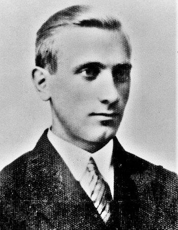

import FBBoxImageWrapper from '../../components/FBBoxImageWrapper.astro'

### Time

[From Time magazine, 12th February, 1945](https://www.facebook.com/permalink.php?story_fbid=pfbid037RpSbNQypxbEZfQTueKMt2F5k2eNnyYE3ExbJVBhgGttSTHqDqFFFpg7ZFjcP2aul&id=100064738144697)

### 1 Front Białoruski

1 Front Białoruski: Drawno i Kalisz Pomorski.

### 1 Front Ukraiński

1 Front Ukraiński: Czechowice (obecnie Czechowice-Dziedzice) w powiecie bielskim.

7 Gwardyjski Korpus Pancerny z 3 Gwardyjskiej Armii Pancernej oraz 52 Armia zdobyły Bolesławiec.

9 Korpus Zmechanizowany zdobył Jawor.

Majewski:

>12 lutego pod ciosami 3 Armii Gwardii przełamany został wreszcie północny "zawias" obrony hitlerowskiej między Odrą a dolnym Bobrem. W wyniku głębokiego włamania, które powstało w obronie niemieckiej na zachód od Głogowa, hitlerowski XXIV Korpus Pancerny zagrożony został odcięciem od pozostałych sił Grupy Armii "Środek" i przyparciem do Odry. W tej sytuacji dowódca korpusu generał W. Nehring, pozostawiając silną załogę w Festung Glogau", zaczął pośpiesznie wycofywać podległe jednostki za linię Bobru. Za Bóbr wycofał się również XXXX Korpus Pancerny (dowodzony przez generała wojsk pancernych G. Henrici'ego), który dotychczas bronił linii Odry od Bytomia Odrzańskiego do ujścia Nysy Łużyckiej. 
>Wykorzystując odwrót nieprzyjaciela, jednostki 21 Korpusu 3 Armii Gwardii dotarły do Odry w rejonie Brzegu Głogowskiego i Wróblina Głogowskiego, zamykając tym ostatecznie pierścień okrążenia wokół Głogowa. W tym samym dniu 76 Korpus dotarł od południa i od wschodu na przedpola Nowego Miasteczka, działające zaś na tym odcinku 93 Brygada Pancerna i 22 Brygada Artylerii Pancernej obeszły tę miejscowość od zachodu i przez Borów i Cisów ruszyły na Kożuchów.

Oraz:

>12 lutego jednostki 4 Armii Pancernej, zgodnie z rozkazem marszałka Koniewa, przekazały swoje pozycje na przedpolach Szprotawy i Żagania nadchodzącym od wschodu dywizjom piechoty 13 Armii i przegrupowały się na zdobyty przyczółek na lewym brzegu Bobru na północ od Zagania.

Oraz:

>Nawet jednak po ich nadejściu nie można było uruchomić przeprawy. Wysiłki saperów niweczyło przeciwdziałanie hitlerowców, którzy otwierając śluzy w górnym biegu rzeki, spowodowali powstanie fali powodziowej. W związku z tym dywizje piechoty 48 Korpusu, które 11 lutego na szerokim froncie sforsowały Bóbr środkami podręcznymi i łodziami, pozbawione wsparcia czołgów i artylerii większych kalibrów, posunęły się w tym dniu jedynie 6 km na zachód (pokonując połowę drogi pomiędzy Bobrem a Kwisą). Natomiast 12 lutego wyszły one nad Kwisę, oczyściły jej prawy brzeg pomiędzy Świętoszowem a Ławszową i zdobyły szereg, małych przyczółków na lewym brzegu.

Oraz:

>Wykorzystaniu pomyślnych działań 3 Armii Pancernej Gwardii i 52 Armii i opanowaniu bardzo ważnego pod względem operacyjnym rejonu Zgorzelca (co odcięłoby hitlerowską 4 Armię Pancerną od sił głównych Grupy Armii "Środek" i odsłoniło kierunek drezdeński) przeszkodził rozwój wydarzeń w rejonie Wrocławia oraz na południe i południowy zachód od Legnicy.

### Belgia

Achille Van Acker z Belgijskiej Partii Socjalistycznej został pierwszym powojennym premierem Belgii. Jest to jeden z twórców belgijskiego welfare-state.

### UPA

W nocy nastąpił atak sotni UPA na wieś Puźniki. Mieli ułatwione zadanie, bo samoobrona, która do tej pory broniła wsi przestała istnieć. Najpierw po wejściu wojsk sowieckich ujawnił się jej dowódca, został aresztowany i zesłany do łagrów. Potem większość jej żołnierzy wcielono do WP. Duża licząca 800 mieszkańców prawie wyłącznie polska wieś mająca długą historię walk z UPA została prawie bezbronna.

UPA zaatakowało o 4 w czasie zmiany warty. Większość Polaków zdołała się schronić w przygotowanych do obrony miejscach. Liczbę ofiar ocenia się na 50 do 120 ludzi.

W ciągu kilku następnych dni mieszkańcy wsi ewakuowali się do Koropca i Buczacza. Potem przesiedlono ich na tzw. Ziemie Odzyskane: wsie Niemysłowice (gmina Prudnik) i Ratowice (gmina Czernica k. Wrocławia).

### Dmytro Klaczkiwski

Dla Polaków najważniejszą osobą kojarzoną ze zbrodniami UPA (około 100 tys. zamordowanych Polaków) jest Stepan Andrijowycz Bandera. Tak się jednak składa, że podczas Rzezi Wołyńskiej i wcześniej, bo od 1941 Bandera był uwięziony w obozie koncentracyjnym Sachsenhausen. Zapewniono mu wygody i miał kontakt ze światem zewnętrznym, ale nie ma dowodów, by wydawał rozkazy, lub choć w jakimś stopniu wspierał czystki etniczne prowadzone przez UPA. Większość szefostwa organizacji Bandery, czyli OUN-B została uwięziona przez Niemców.

Osobą bezpośrednio i niewątpliwie odpowiedzialną za plan wymordowania Polaków był dowódca UPA-Północ Dmytro Klaczkiwski. Od dłuższego czasu na jego tropie była grupa operacyjna 20 Brygady Wojsk Wewnętrznych NKWD. Pojmany 17 dni wcześniej jego żołnierz po 12 dniach przesłuchań opowiedział śledczym dość, żeby mogli go złapać. 10 lutego rozbito oddział osłony Klaczkiwskiego.

Dzisiaj żołnierze 233 batalionu 20 Brygady WW NKWD pod dowództwem starszego lejtnanta Chabibulina przeczesując las, wykryli ognisko, a następnie idąc po śladach, natrafili na trzech uciekających mężczyzn, dwóch ochroniarzy Klaczkiwskiego osłaniało dowódcę, po krótkiej walce wszyscy trzej zostali zabici.

Klaczkiwski został zidentyfikowany i pogrzebany w nieujawnionym miejscu.

<FBBoxImageWrapper>

Dmytro Klaczkiwski (1911-45) 
Źródło: Wikipedia By nieznany - [http://www.kivertsi.in.ua/news/120211182958.jpg](http://www.kivertsi.in.ua/news/120211182958.jpg), Domena publiczna, [Link](https://commons.wikimedia.org/w/index.php?curid=18852670)
</FBBoxImageWrapper>

### Ziemia Lubuska

Z leżącego przy Odrze miasteczka Schwedt/Oder (20 km na północ od Cedyni) biegnie droga w kierunku SE na Odrę. Po drugiej stronie 3 km od rzeki znajduje się wieś Grabowo. Dziś tam walczył SS-Fallschirmjäger-Bataillon 600. Znana i rozpoznawalna jednostka, od jesieni 1944 jedyni spadochroniarze SS. Wspierając 210. StuG Abteilung bronili pozycji Odry przed atakiem kilku batalionów piechoty, kilku kompanii czołgów T-34-85 i jednej kompani IS-2.
>Teraz Rosjanie zapełnili drogę czołgami. Opuściłem moją wysuniętą pozycję z dowódcą mojej kompanii. Każdy z nas miał panzerfausta. Pełzliśmy jak Indianie. Nagle usłyszałem głuchy dźwięk – odgłos wystrzelonego Panzerfausta. Dowódca wystrzelił ze swojej broni. Widziałem pocisk przelatujący nad czołgiem. "Aha"" pomyślałem, "on celował na 80 m, a mi się wydaje, że jest to 60 m." Wycelowałem i odpaliłem mojego Panzerfausta. Moje obliczenia okazały się trafne gdy Panzerfaust dosięgnął celu... 
>Rosjanie nadjeżdżali teraz czołgami IS. Chcieliśmy uszkodzić te kolosy i po ich zdobyciu odholować je. Raz po raz starałem się z dowódcą mojej kompanii, Hauptscharführerem, którego imienia już nie przywołam, zbliżyć się do czołgu IS. Tym razem Rosjanie byli uważni i ostrzelali nas z pistoletów maszynowych, zmuszając do odwrotu. Obeszliśmy ich i spróbowaliśmy jeszcze raz z drugiej strony drogi. Zabrałem ze sobą Waltera Birke dla bezpieczeństwa.
>Posuwaliśmy się do przodu lasem, wzdłuż prawej strony drogi, ale nie znaleźliśmy dobrej pozycji do oddania strzału. Rozkazałem odwrót. Tuż przed skrajem lasu, w kierunku na otwarty teren, usłyszałem strzał z karabinu. Odwróciłem się. Moje ubezpieczenie strzeliło z przydrożnego rowu z karabinu snajperskiego w Rosjanina majstrującego przy uszkodzonym T–34. Gdy obejrzałem się, zauważyłem, jak wieża czołgu IS powoli odwracała się w naszym kierunku.
>Następnie zobaczyłem wystrzał z armaty czołgowej, usłyszałem eksplozję, zauważyłem ogień bezpośrednio koło mnie i upadłem na plecy. Nagle zdałem sobie sprawę, że zostałem ranny. Chciałem się podnieść i poszukać schronienia, ale nie byłem w stanie tego zrobić. Moje nogi nie utrzymałyby mnie, więc dowlokłem się za małe wzniesienie terenu i sprawdziłem rękoma swoje nogi. Były całe we krwi, pomyślałem, "Cholera, teraz stracę nogi!"

Jednostka ta trzymała pozycję Odry ponad miesiąc, a kiedy wojska niemieckie wycofywały się stamtąd, stanowili straż tylną. [500 SS-Fallschirmjägerbataillon –jednostka specjalna SS](https://www.facebook.com/permalink.php?story_fbid=185582836350117&id=110114217230313)

### Dolny Śląsk

- Sowieci przekroczyli Bóbr w Gryżycach (Elektrownia Wodna Grajówka) kilka km na północ od Żagania. [FORSOWANIE BOBRU – ZDOBYCIE HYDROELEKTROWNI GRYŻYCE(GREISITZ)](https://www.facebook.com/bobr1945/posts/3167450643368577)

- Pierwszy atak na Kożuchów (93 Brygada Pancerna z 4 Armii Pancernej). Odparty. Następnego dnia Brygada dostała posiłki i zdobyła miasto. [Sowieckie czołgi w walkach o Kożuchów – 12 lutego 1945 roku](https://www.facebook.com/bobr1945/posts/3041999539247022)

- W Głogowie ginie pułkownik Arthur Schön [DWUKROTNIE POCHOWANY (?!?)](https://www.facebook.com/festungglogau1944.1945/posts/pfbid0YxyVZ2emkUu1CG6PDHyHvmkeENNigzTnfBSewopjjCMcAvS5AyiY1LinBe66YNhol)

### 6 Armia

Majewski:

>Decyzje podjęte przez dowództwo Frontu przyniosły oczekiwane rezultaty. Już 12 lutego 3 Brygada Zmechanizowana Gwardii (4 Korpusu Pancernego Gwardii), wzmocniona przez 298 pułk dział pancernych, zdobyła Krajków i Milejowice i po odparciu kontrataków hitlerowskich utrzymała je do nadejścia sił głównych 32 Korpusu Gwardii. W dniu następnym w rejonie Żurawiny jednostki 32 Korpusu i 4 Korpusu Pancernego Gwardii połączyły się z wysuniętymi oddziałami 7 Korpusu Zmechanizowanego Gwardii. W nocy z 13 na 14 lutego, po zdobyciu przez 4 Korpus Pancerny Gwardii Galowic i nawiązaniu kontaktu z siłami głównymi 7 Korpusu Zmechanizowanego w rejonie Domasława oraz po dotarciu jednostek 31 Korpusu Pancernego do Wilczkowa, po raz pierwszy zamknął się pierścień wokół Wrocławia. 14 lutego jednostki 6 Armii zepchnęły hitlerowców w kierunku południowych i zachodnich przedmieść Wrocławia, 74 Korpus osiągnął linię: Prężyce (nad Odrą), Brzezina, Leśnica, 22 Korpus spychał przeciwnika w kierunku Oporowa i Kleciny, a głównie siły 5 Armii Gwardii (korpusy 34 i 32) osiągnęły linię: Siechnica, Rzeplin, Domasław, Magnice, Wilczków. 
W tym samym dniu sytuacja jednak ponownie się skomplikowała. Przyczynił się do tego mimo woli dowódca 3 Armii Pancernej Gwardii, generał P. Rybałko, który dążąc do szybkiego wznowienia natarcia z rejonu Bolesławca na zachód, nalegał na bezzwłoczny powrót pod jego rozkazy obu działających pod Wrocławiem korpusów. W związku z tym jednostki pancerne i zmechanizowane opuściły zajmowane pozycje jeszcze przed nadejściem luzujących je dywizji 5 Armii Gwardii (dotyczyło to zwłaszcza 7 Korpusu Pancernego w rejonie między Kątami Wrocławskimi a Gniewoszowem). Zbiegło się to w czasie z kolejnym uderzeniem niemieckim, zmontowanym przez dowództwo Grupy Armii "Srodek" siłami 19, 8 i 20 Dywizji Pancernej po obu stronach masywu Ślęży. W rezultacie 19 Dywizji Pancernej udało się wbić głębokim klinem wzdłuż drogi Mirosławice, Gniechowice, Małuszów, Tyniec Mały i przejściowo nawiązać kontakt z załogą "Festung Breslau". Po kilkunastu jednak godzinach "korytarz" ten został ponownie przecięty przez zebrane znów w "kułak uderzeniowy" oddziały 7 Korpusu Pancernego Gwardii.

Opracowane na podstawie: Primke, Szczerepa "Kierunek Festung Breslau":

W rejonie operacji Armii pomiędzy Legnicą a granicami Wrocławia panuje ta sama osobliwa sytuacja co wczoraj. Na całym obszarze Niemcy są siłą ustępującą, ale lokalnie podejmują groźne kontrataki i wciąż silnym punktem oporu jest Środa Śląska. Ponadto pojawia się 19 Dywizja Pancerna.

Dywizje Armii przesuwają się na wschód. Front Armii już jest nadmiernie rozciągnięty, ale będzie rozciągnięty jeszcze bardziej, jest to bowiem krytyczny moment operacji okrążenia Wrocławia. Niemcy rzucili wszystkie siły do obrony istniejącego jeszcze korytarza i atakują pozycje sowieckie na linii autostrady. Dla obu stron jest w tym momencie jasne, że najbliższe dwa - trzy dni rozstrzygną los Wrocławia. Dowództwo sowieckiego Frontu uznało rzucone na Wrocław siły za wystarczające do zamknięcia go w oblężeniu i zdobycia w ciągu kilku dni. Z akceptowalnym opóźnieniem: tydzień, może dwa tygodnie. Natomiast dla Niemców jest to walka o odparcie sowieckiego natarcia teraz, a może w jakiejś perspektywie po zniszczeniu 6 Armii i 7 Korpusu utrzymania linii Odry.

Czas pokaże i jest to niestety czas liczony w miesiącach, że obie strony dokonały tragicznej w skutkach pomyłki. Przewaga sowiecka owszem wystarczy do zablokowania pozycji wrocławskiej, ale nie wystarczy do zdobycia Wrocławia. Wrocław będzie się bronił w oblężeniu do końca wojny, prawie trzy miesiące. I tu druga strona tej pomyłki - z powodu ogólnej słabości sił niemieckich na niezajętych przez Armię Czerwoną obszarach Dolnego Śląska obrona Wrocławia, nie odegra żadnej roli w dalszych losach wojny. Będziemy mieli do czynienia z sytuacją tragicznego pata, którego skutkiem będzie tragedia i śmierć dziesiątków tysięcy ludzi i zagłada miasta.

Na prawej flance 6 Armii czyli na odcinku Legnica - Kąty Wrocławskie były oddziały 22 Korpusu Strzeleckiego wzmacniane na autostradzie dwoma Brygadami 7 Korpusu. 22 Korpus zajął rubież Jarostów - Pichorowice - Kostomłoty - Kąty Wrocławskie - Bogdaszowice i dziś rano w godzinach od 0700 do 1000 zluzował dwie Brygady 7 Korpusu wysłane w celu wzmocnienia ataku na korytarz. Od tej pory 22 Korpus Strzelecki broni pozycji na autostradzie samodzielnie. 957 Pułk Strzelecki wyróżnił się w ataku na Kostomłoty, które zostały zdobyte. Dzięki wsparciu artyleryjskiemu odparł silny kontratak z udziałem czołgów 8 Dywizji Pancernej. Jak zeznał wzięty następnego dnia jeniec w nocy 8 Dywizja Pancerna została odesłana do Wrocławia.

218 Dywizja Strzelecka opuściła rubież Bartoszów - Rogoźnik pozostawiając tam 372 Pułk Strzelecki i zajęła w obronie okrężnej pozycję Ciechów - Cesarzowice - Kulin. W rejonie Taczalin - Biernatki - Janowice pozostawała 273 Dywizja Strzelecka 74 Korpusu Strzeleckiego.

181 Dywizja Strzelecka wciąż prowadziła walki na przedpolu Środy Śląskiej, opór Niemców miał tu wsparcie artyleryjskie i moździerzowe. Zaciekłe walki toczono o obszar na północ od miasta. W Szczepanowie i leśniczówce Grünthal były silne pozycje niemieckie. Dywizja otrzymała wsparcie 77 Polowego Rejonu Umocnionego, który zajął pozycje na południe od Odry. Jak sama nazwa wskazuje, jest to jednostka typowo defensywna, nienadająca się do ataku, ale za to obficie wyposażona w broń maszynową i artylerię. Stale będzie się posuwać wzdłuż południowego brzegu Odry na wschód i 14 lutego zostanie włączona do składu 6 Armii.

Najbliżej Wrocławia była 359 Dywizja Strzelecka, która przekroczyła Bystrzycę. Pułki 1198 i 1196 pomimo kontrataków niemieckich trzymały pozycję Samotwór - Skałka - Gałówek - Jarząbkowice - Zakrzyce. 1194 Pułk Strzelecki był w lesie pomiędzy Gozdawą a Ciechowem.

Do wsparcia walczących została tu skierowana 8 Brygada Artylerii Pancernej wyposażona w działa samobieżne SU-76. Przedtem w składzie 5 Armii Gwardyjskiej w rejonie Brzegu, od 5 lutego w rezerwie Frontu. 10 lutego przerzucona w rejon Oleśnicy, dzień później Ścinawy. Dziś o 0600 w Cesarzowicach została podporządkowana dowództwu 6 Armii i skierowana na Siemidrożyce w celu wzmocnienia pozycji w Kostomłotach.

### 7 Korpus Zmechanizowany Gwardii

Opracowane na podstawie: Primke, Szczerepa "Kierunek Festung Breslau":

Rzucone na korytarz obie Brygady 25 i 57 walczyły cały dzień bez zaplecza i łączności z resztą Korpusu. Zaatakowały z drogi Kobierzyce Domaniów na wschód. O godz. 0900 zdobyły Księginice. W boju o Księginice rozbito kontratak idący z Domasławia, na lotnisku polowym zniszczono 9 samolotów.

Do 1200 zdobyto Galowice i do 1500 uderzeniem z obu stron Wilczków. Zarówno Galowice, jak i Wilczków mają dla Wrocławia w tym momencie znaczenie strategiczne, jest to ostatnia droga łącząca go ze światem. Dlatego, zanim sowieci zdołali się umocnić w Wilczkowie, Niemcy przypuścili bardzo silny atak i pomimo zażartego oporu do godz. 1930 wyparli czerwonoarmistów ze wsi.

Korzystając z zapadających ciemności, Niemcy zaatakowali słabe zaplecze Brygad w Domaniowie i zmusili czerwonoarmistów do wycofania się do Księginic. Te również zostały zaatakowane, po odparciu czterech szturmów sowieci z braku amunicji wycofali się do Galowic. W ten sposób z końcem dnia Galowice stały się centrum sowieckiego oporu. Pozycja sowiecka w Galowicach była odcięta i okrążona ze wszystkich stron.

Wieczorem 12 lutego łącznościowcom z 57 Brygady udało się nawiązać kontakt radiowy z 4 Korpusem Pancernym Gwardii, który wzmacniał uderzenie 5 Armii Gwardyjskiej od wschodu. Ustalono, że jest już w okolicy Żórawiny.

Zajmujące do tej pory pozycje na autostradzie Brygady 24 i 26 otrzymały rozkaz, by do godz. 1700 ześrodkować się w rejonie na wschód od Kątów Wrocławskich Sadków - Rybnica - Sadowice (24 Brygada) i Wojtkowice - Strzeganowice - Sośnica z gotowością do ataku na linii Małuszów - Domasław - Żórawina.

Atak tych oddziałów napotkał silny opór niemiecki. Tyniec Mały został zdobyty dopiero po zmroku. Pod koniec dnia czołgi zgrupowania osiągnęły rejon Domasławia i nawiązały kontakt radiowy z odciętą resztą Korpusu w Galowicach.

### Wrocław

Kontratak wzmocnionych posiłkami oddziałów niemieckich odbija Zakrzów i odzyskuje całe Psie Pole:
>Około godziny 23.00 kapitan Günther wprowadza swoich dowódców kompani na pozycje wyjściowe. Jest jasna księżycowa noc. Tu i ówdzie pada w ciemnościach pojedynczy strzał. Nagle o 5.55 rozpoczyna się uzgodniony ostrzał artyleryjski. Początkowo wszystko przebiega zgodnie z planem. Wyrwani ze snu Rosjanie tylko w pojedynczych przypadkach stawiają bardziej zorganizowany opór [...] Po krótkim starciu batalion dociera do północnego skraju Zakrzowa. Do dowódcy pułku idzie meldunek - cel zdobyty! Wtedy na horyzoncie pojawiają się sowieckie czołgi. Grzechoczące gąsienicami i strzelające na oślep kolosy nie stwarzają jeszcze zagrożenia, ale kapitan Günther wie, że jego zmęczeni żołnierze potrzebują chwili wytchnienia i mogą nie powstrzymać nacierających. Sytuację komplikuje fakt, że także od strony Pawłowic rozbrzmiewa bitewny alarm i zbliżają się Rosjanie.

Poniedziałek zwykle kojarzy się z czymś nowym, z jakimś początkiem. Ten jest inny. Od dłuższego czasu Wrocław stoi wobec perspektywy oblężenia i jest ona trochę jak front wschodni. Bardzo długo odległa i groźna, później nagle realna, jakby niespodziewanie wbrew wszelkim zapewnieniom i nadziejom. Nagle w ciągu kilku dni, które minęły niemal niezauważone, staje się nieunikniona i dyktuje warunki. O tym dniu komendant twierdzy Hans von Ahlfen pisze:
>tymczasem do 12 lutego sytuacja na Śląsku nad Odrą i na południe od Wrocławia przybrała tak niekorzystny obrót, że trzeba było się liczyć z rychłym zamknięciem pierścienia wokół Wrocławia.

Naprawdę? Rychłym? Tego dnia Wrocław był już de facto okrążony. Wróg miał kompletną kontrolę nad północą i wschodem, blokował autostradę i umacniał się na kierunku zachodnim. Jedyna droga wyjścia wiodła na południe, ale ludność cywilna już nie dysponowała własnymi samochodami, nawet gdyby ktoś tamtędy jechał, cały czas by się patrzył w lewo, wypatrując sowieckich czołgów. Ruch kolejowy wstrzymywano i uruchamiano w zależności od sytuacji w Kątach Wrocławskich, bo właśnie toczyły się o nie walki - jak pisze von Ahlfen:
>w nocy z 10 na 11 lutego nie udało się zatrzymać wielkiej sfory rosyjskich czołgów na autostradzie w kierunku Kąty Wrocławskie - Wrocław.

Była to jedyna droga ucieczki, na którą być może można było liczyć, a już wkrótce zamknie się ostatecznie. Droga powietrzna była własnością Luftwaffe i była bardzo ryzykowna, bo panowanie w powietrzu mieli sowieci. Tylko temu, że najwidoczniej 2 Armia Lotnicza nie używała radarów, Luftwaffe zawdzięcza istnienie mostu powietrznego.

W nocy z 11 na 12 lutego ostatecznie oddano rejon Oławy, broniły się tam będąca w trakcie formowania 609. Dywizja i sąsiadująca z nią od prawej 269. Dywizja zagrożona na swoim zachodnim skrzydle.

Ponieważ nie padł rozkaz, by bronić się w okrążeniu (tym razem ktoś zapomniał o utworzeniu Twierdzy) większość sił udało się wyprowadzić z okrążenia przez istniejącą jeszcze lukę w kierunku na Jordanów (niem. Jordansmühl), pozostała część musiała się wycofać do Wrocławia, wzmacniając załogę Twierdzy.

Hugo Hartung wciąż jest na lotnisku w Strachowicach, ale odległy o kilkaset metrów Krzeptów jest już oblężony z trzech stron, pisze:
>zostajemy odwołani z powrotem do bazy. Udaje się nam ujść z kleszczy wroga w ostatniej chwili. W Strachowicach nie ma już wody ani prądu. Za to jedzenia picia i papierosów mamy aż nadto. Wieczorem siedzimy przy świecach w kwaterze. Prawie nikt się nie odzywa. Czujemy, że kataklizm przybliża się z każdą godziną.

Tego dnia ksiądz Peikert odnotowuje dwie najistotniejsze rzeczy, choć zmniejszyła się znacznie ilość wiernych, aktywność religijna tych, którzy pozostali wzrosła, natomiast władze miasta zaprzestały wymuszać terrorem opuszczenie miasta, oczywisty znak desperacji i klęski:
>Msza święta wczesnym rankiem o godz. 7, jak w ogóle msza św. w ostatnich tygodniach, ma bardzo dużą frekwencję. Codziennie udziela się 270-300 komunii. Odkąd pociągi nie kursują, ustaje terroryzowanie i nakłanianie ludności do opuszczania Wrocławia. Nowe przymusowe ewakuacje dużych obszarów Śląska. Wielokilometrowe kolumny uchodźców, nędzy i ubóstwa ciągną na chłód i poniewierkę. [...] Zgorzelec i Łużyce pod groźbą ewakuacji.
