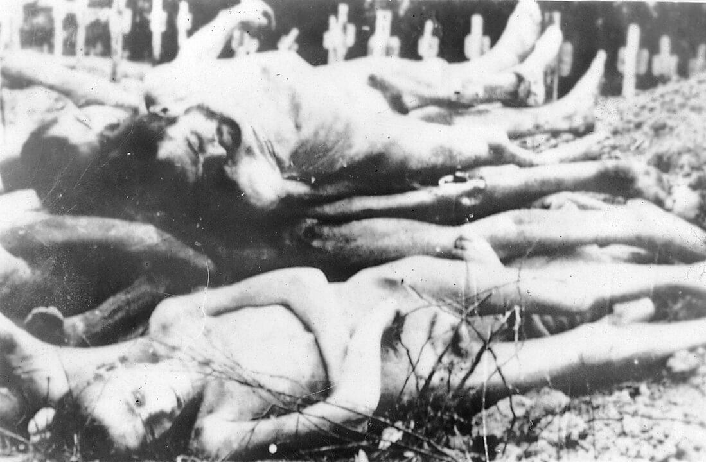

import FBBoxImageWrapper from '../../components/FBBoxImageWrapper.astro'
import SeeAlso from '../../components/FBSeeAlso.astro'

### Samobójstwa hitlerowców

Kolejnych dwóch hitlerowców popełnia samobójstwo.

Alfred Meyer, oficer Wielkiej Wojny, do NSDAP przystał w 1928 i szybko zaczął robić tam karierę. W 1931 zostaje gauleiterem północnej Westfalii. Po ataku na Sowiety w 1941 jest zastępcą Alfreda Rosenberga, szefa Ministerstwa Rzeszy do spraw Okupowanych Terytoriów Wschodnich (niem. Reichministerium für die Besetzten Ostgebiete or Ostministerium), którego zadaniem był zarząd okupowanych terytoriów rosyjskich a w szczególności przeprowadzanie ludobójstwa, deportacje i grabież. Brał udział w konferencji w Wannsee jako przedstawiciel Rosenberga.

Dziś został znaleziony martwy u podnóża Hohenstein nad Wezerą.

Heinrich Burchard generał Luftwaffe, dowódca dywizji obrony przeciwlotniczej skorzystał z oferty honorowego wyjścia po tym, jak doniesiono stosownym władzom o jego słowach:

>... Hitler Schluss machen solle, der Krieg sei ja doch verloren.

Hermann Göring kazał go przewieźć do bazy lotniczej Güstrow w Meklemburgii. Powiadomiono go o degradacji i wyroku śmierci, w pokoju znajdował się pistolet.

### Gustav Frenssen

Pisarz, zwolennik regionalizmu, swobody seksualnej, antyintelektualizmu i antysemita. W powieści "Peter Moor's Fahrt nach Süd-West" z 1906 uzasadniał ludobójstwo narodów Afryki.

W latach wojny zaangażowany w propagandę narodowo-socjalistyczną. Pracował głównie dla radia i biura prasowego NSDAP. Umieszczony na Gottbegnadeten-Liste.

Zmarł w Barlt (Schleswig-Holstein). Nie jest mi znana przyczyna śmierci, ale miał wtedy 82 lata.

### KL Buchenwald

4 kwietnia US Army po raz pierwszy zetknęła się z hitlerowskimi obozami koncentracyjnymi, zajęli KL Ohrdruf (Turyngia), gdzie znajdował się podobóz Buchenwaldu.

Polski inżynier radiowiec Gwidon Damazyn w 1940 został schwytany jako partyzant i uwięziony na Pawiaku. W marcu 1941 został wysłany do KL Buchenwald (k Weimaru, Turyngia) gdzie ze względu na wykształcenie został umieszczony w komandzie elektryków. Tam również działał w ruchu oporu, w Internationale Militärorganisation Buchenwald. Już w 1943 zbudował konspiracyjny odbiornik radiowy, który zapewniał informacje o sytuacji na świecie. W 1945 zbudował także nadajnik radiowy Morse'a.

6 kwietnia zaczęła się ewakuacja samego Buchenwaldu i w tej sytuacji więźniowie zdecydowali się, nawiązać łączność z aliantami prosząc o natychmiastową pomoc. 8 kwietnia w samo południe wysłali meldunek:

>To the Allies. To the army of General Patton. This is the Buchenwald concentration camp. SOS. We request help. They want to evacuate us. The SS wants to destroy us.

Kilka minut potem otrzymali odpowiedź ze sztabu Trzeciej Armii:

>KZ Bu. Hold out. Rushing to your aid. Staff of Third Army.

Minęły dwa straszne dni. Ruch oporu dezorganizował ewakuację. Dopiero 11 kwietnia słysząc zbliżający się front, przy użyciu ukrytej przez obozowy ruch oporu broni (91 karabinów i jeden rkm) przed południem przystąpili do akcji. Kiedy oddziały 3 Armii amerykańskiej znalazły się w pobliżu obozu głównego Rozpoczęła się nierówna walka, niedoświadczeni, osłabieni i słabo uzbrojeni ludzie zaatakowali obozowe straże i odbili obóz z rąk SS. 

O godz. 1600 żołnierze amerykańscy wkroczyli do wyzwolonego już obozu, w którym wciąż było 20 tys. więźniów.

Był to pierwszy duży obóz koncentracyjny wyzwolony przez aliantów zachodnich, sowieci zajęli obozy KL Auschwitz 27 stycznia.

Zarówno KL Ohrdruf jak i Mittlebau-Dora to były podobozy Buchenwaldu.

### KL Mittlebau-Dora

11 kwietnia wyzwolono również obóz koncentracyjny KL Mittlebau-Dora (k Nordhausen, Turyngia). Była to podziemna fabryka rakiet V2 i bomb latających V1. Od maja 1944 wytwarzano tam ok. 500 rakiet V2 miesięcznie i było to jedyne miejsce ich produkcji. Tempo produkcji udało się utrzymać do stycznia 1945. Ukryta w wykutych w górze Kohnstein sztolniach fabryka Mittlewerk pracowała do samego końca. Od stycznia do kwietnia 1945 powstało tam przynajmniej 1700 rakiet V2 i ponad 6 tys. bomb latających V1. Z powodu morderczych warunków pracy, niedożywienia i brutalnego traktowania zginęło tam 20 tys. ludzi.

Ten niewolniczy obóz pracy dwukrotnie był wizytowany przez von Brauna: 25 stycznia i potem 6 maja 1944.

Kiedy w marcu 2019 Rammstein opublikował klip [Rammstein Official "Rammstein - Deutschland (Official Video)" [9:22]](https://www.youtube.com/watch?v=NeQM1c-XCDc) pojawiły się głosy, że scena egzekucji miała miejsce w Mittlebau-Dora, bo tam produkowano te rakiety. No cóż, licentia poetica, ale jeżeli mowa o scenie, w której V2 startuje to nie, żadna rakieta tam nie wystartowała. Jedynym miejscem, które było jednocześnie obozem pracy i poligonem rakietowym był Peenemünde-Ost na wyspie Uznam (niem. Heeresversuchsanstalt Peenemünde).

<SeeAlso txt="Wunderwaffe" url="/festung-breslau/article/wunderwaffe" />

<FBBoxImageWrapper>

Ciała ofiar KL Buchenwald, 16 kwietnia 1945. 
The bodies of prisoners in the liberated Buchenwald, 16 April 1945 
[CC BY-SA 3.0](http://creativecommons.org/licenses/by-sa/3.0/), [Link](https://commons.wikimedia.org/w/index.php?curid=316201)
</FBBoxImageWrapper>

### Stadt des KdF-Wagens

Żartuje się czasem o zaginionych początkach Volkswagena. Istotnie koncernowi VW nie za bardzo wypada eksponować powstania i pierwszych lat firmy. Była to bowiem hitlerowska koncepcja stworzenia taniego, dostępnego dla robotnika auta w cenie nie przekraczającej 1000 marek, osiągającego prędkość maksymalną 100 km/h i mogącego zabrać 2 osoby dorosłe i troje dzieci. Taki Ford T dla niemieckiej rodziny. Było kilka projektów, które szły w tę stronę, ale żaden z nich nie mógł tak zejść z kosztami. Już w 1934 tym projektem w tak wczesnej fazie nazywanym "samochodem ludowym" zainteresował się Hitler. Ten przymiotnik "ludowy" jest charakterystyczny dla nomenklatury państwa hitlerowskiego, np. tani odbiornik radiowy przeznaczony do rozpowszechniania goebbelsowskiej propagandy nazywał sie Volksempfänger - "odbiornik ludowy".

Wzięto najbardziej obiecujący projekt autorstwa Ferdynanda Porsche i zapewniono państwowe finansowanie inwestycji. Formalnie instytucją zajmującą się inwestycją był Niemiecki Front Pracy (niem. Deutsche Arbeitsfront) zastępujący związki zawodowe, które zostały zdelegalizowane po przejęciu władzy przez hitlerowców. Miała łączyć harmonijnie wszystkie kategorie pracowników i pracodawców. Jej najbardziej widoczną częścią była Siła Przez Radość (niem. Kraft durch Freude) odpowiedzialna za sprawy socjalne, turystykę i sport. To właśnie KdF prowadziła abonamentową sprzedaż auta w programie oszczędnościowym reklamowanym:

>Fünf Mark die Woche musst du sparen, willst du im eigenen Wagen fahren

"Musisz zaoszczędzić pięć marek tygodniowo, jeśli chcesz jeździć własnym samochodem" - tyle bowiem wynosiła tygodniowa składka. Przy tej cenie (tyle kosztował motocykl) i takiej wysokości składki to się w ogóle nie spinało finansowo. Konieczne było ciągle dotowanie inwestycji stąd kolejne opóźnienia. Zapisało się na ten system ponad 300 tys. ludzi. Samochód nazwano KdF-Wagen, nazwa Volkswagen w różnych formach istniała w nazwie przedsiębiorstwa od 1937.

W maju 1938 zaczęto budowę zupełnie nowej, ogromnej fabryki Volkswagena w Wolfsburgu (Dolna Saksonia), któremu z tej okazji zmieniono nazwę na Stadt des KdF Wagens - Wolfsburg. Pierwotnie było to małe miasteczko ze średniowieczną historią, które zostało rozbudowane w duży ośrodek przemysłu motoryzacyjnego.

Kiedy już w końcu miała ruszyć produkcja, no cóż, wybuchła wojna. Żaden z abonentów auta nie otrzymał, choć z pewnością wielu z nich jeździło już wkrótce Volkswagenami całkiem za darmo, bo cała produkcja poszła na potrzeby wojska. Co interesujące w końcu VW przedstawił model cywilny na 55 urodziny Hitlera w 1944, był to Type 1 Cabriolet.

Dzisiaj Amerykanie wkroczyli do niebronionego Stadt des KdF Wagens, było tam 7700 przymusowych robotników, z powojennych ustaleń wynika, że przez fabrykę przewinęło się ich ponad 15 tys. 2 maja zostało przemianowane na Wolfsburg. W czerwcu w wyniku podziału na strefy okupacyjne znalazło się na obszarze brytyjskim. I tu zaczyna się mało znana historia przedsiębiorstwa. Na tamtym etapie była to po prostu jedna duża fabryka, poważnie zniszczona, głównie przez bombardowanie w kwietniu 1945.

Odpowiedzialność za fabrykę przejął REME (ang. Royal Electrical and Mechanical Engineers), którym na terenie Wolfsburga kierował major Ivan Hirst. Początkowo wyglądało na to, że to koniec całego projektu Volkswagena. Fabryka była używana jako baza remontowa armii brytyjskiej, a całe jej wyposażenie było przeznaczone na reparację, czyli planowe rozgrabienie. Hirst jednak na to nie pozwolił, widział ogromny potencjał w fabryce i w końcu stała się główna bazą remontową i miejscem przebudowy Volkswagenów przejętych przez armię brytyjską. Zatrudniała coraz większą liczbę pracowników cywilnych, okolicznych Niemców. W 1948 Hirst sprowadził do zakładu Heinricha Nordhoffa dyrektora produkcji Opla. W końcu w 1949 było to właściwie przedsiębiorstwo cywilne pod zarządem wojskowym brytyjskim i w takim stanie zostało przekazane władzom niemieckim. To Nordhoff w ciągu kolejnych 20 lat zarządzania przedsiębiorstwem przekształcił go w wielonarodowy koncern znany dzisiaj.

- [Ivan Hirst](https://en.wikipedia.org/wiki/Ivan_Hirst)

### Duane Francis

Pilot porucznik Duane Francis i obserwator porucznik Bill Martin podczas misji zwiadowczej na swoim L-4 Grasshopper (była o nim mowa przy okazji mostu w Remagen) zgłosił zauważony samolot nieprzyjaciela i wezwał pomoc, mówiąc, że odbędzie walkę powietrzną:

>We're about to give combat.

Było to o tyle dziwne, że ani L-4 ani zauważony samolot nie były uzbrojone. Niemieckim samolotem był Fieseler Fi 156 Storch - dokładnie odpowiednik amerykańskiego Pasikonika.

Jednostka Francisa i Martina - 71st Armored Field Artillery Battalion - znajdowała się wówczas 80 km od Berlina. Francis wykonywał misję zwiadowczą w odległości 100 km od Berlina, w rejonie 5 Dywizji Zmechanizowanej.

Pasikonik nie był uzbrojony, ale jego załoga posiadała broń - pistolety osobiste Colt 1911 o kalibrze .45. Amerykanie z sobie znanych powodów ciągle stosują jednostki imperialne i te cholerne cale. Kalibry określają w setnych cala. M1911 jest zasilany .45 ACP opracowanym w 1904 przez Johna Mosesa Browninga, była podstawowa amunicja pistoletowa US Army aż do 1985, kiedy to wprowadzono Berettę 9 mm. Polacy znają 1911 najbardziej z jego udoskonalenia, jakim był polski Vis wz. 35, ale M1911, i tak jest światową legendą tak samo, jak np. Luger.

Pocisk .45 ACP ma średnicę 11,5 mm. Kawał gnata.

Francis i Martin po zbliżeniu się do hitlerowskiego Bociana ostrzelali go z pistoletów. Dokładnie widzieli twarze przerażonych Niemców. Niemiecki pilot widząc, że nie ucieknie, skierował się ku ziemi i roztrzaskał samolot przy lądowaniu. Amerykanie wylądowali i wzięli go do niewoli. Jego obserwator uciekł w pole, ale został wypłoszony ogniem pistoletowym.

Francis zaciągnął się do wojska przed ukończeniem studiów medycznych, był więc tylko sanitariuszem, udzielił pierwszej pomocy rannemu w nogę Niemcowi i wtedy przyjechały amerykańskie czołgi. Na pamiątkę zabrał hitlerowską flagę wojenną i oznaczenia lotnicze niemieckiego pilota. Miał bardzo interesujący przebieg służby, m.in. wziął udział w bitwie o Las Hürtgen, gdzie wiele Pasikoników zostało zestrzelonych. Tam jego samolot dostał przydomek "Miss me!". Potem również jako pilot obserwator wziął udział w wojnie w Korei.

- Mark Felton Productions ["Grasshopper vs. Fieseler Storch - WW2's Weirdest Dogfight" [YT 4:24]](https://www.youtube.com/watch?v=eAf0maieLjs)
- ["Last (and Most Unique) Dogfight of WWII"](https://www.armedforcesmuseum.com/last-and-most-unique-dogfight-of-wwii/)

### Masakry w Bachowie, Brzusce i Sufczynie

W trzech wioskach położonych na przebiegającej południkowo drodze, 15 km na zachód od Przemyśla: Bachów, Brzuska, Sufczyna oddziały poakowskie (prawdopodobnie ze Zgrupowania Warta) i BCh przy współudziale miejscowej ludności polskiej dokonały masakry Ukraińców.

W Bachowie zamordowano około 100 ludzi, część pochowano w dole w środkowej części wsi, przy budowie studni w 1971 wydobyto tam szkielety.

W Sufczynie zamordowano 26 osób, najwięcej ofiar było w Brzusce około 180 osób, z czego połowa to były kobiety i dzieci. Księdza Ołeksija Biłyka wraz z rodziną zarąbano siekierami.

Przypuszczalnie była to zemsta za dokonane w styczniu morderstwo polskiej rodziny nauczycielskiej Sugierów, których ciała odnaleziono w piwnicy. Wg IPN-u sprawcami byli żołnierze UPA. Ocaleli z masakry zostali wywiezieni na Ukrainę. Nikt nie był sądzony za zbrodnię. Mogiła na cmentarzu w Bachowie została odnowiona w 1999.

### Kościół grekokatolicki

NKWD dokonuje serii aresztowań biskupów greckokatolickich. Aresztowany jest m.in. arcybiskup metropolita lwowski kardynał Josyf Slipyj.

28 kwietnia 1943 jako biskup i koadiutor metropolii lwowskiej odprawił w Archikatedrze św. Jura nabożeństwo z okazji powołania 14 Dywizji Grenadierów SS (potocznie: SS-Galizien), w obecności przedstawicieli władz okupacyjnych m.in. Otto von Wächtera, gubernatora dystryktu galicyjskiego Generalnego Gubernatorstwa.

1 listopada 1944 został następcą Szeptyckiego.

Aresztowany został wraz z szeregiem biskupów greckokatolickich przez NKWD. W łagrach spędził 18 lat. Po interwencji Jana XXIII i prezydenta Johna F Kennedy'ego został zwolniony w 1962 i zmuszony do wyjazdu do Rzymu gdzie spędził resztę życia. Zmarł w 1984. W 1992 szczątki biskupa zostały pochowane w katedrze lwowskiej.

### Wrocław

Majewski:

>W dniach 11 i 12 kwietnia 294 Dywizja Piechoty wsparta przez 80 pułk czołgów ciężkich zdobyła Park Dębowy i odrzuciła hitlerowców za nasyp kolejowy na odcinku od wysadzonego mostu na Odrze do dworca Wrocław-Mikołajów. Na tej rubieży pododdziały hitlerowskiego pułku "Mohr" oraz działa pancerne porucznika Rettera zdołały przejściowo powstrzymać natarcie radzieckie¹37. 15 kwietnia, po wprowadzeniu do walki nowo przybyłej do Wrocławia 135 Dywizji Piechoty, 74 Korpus wznowił natarcie na odcinku pomiędzy Odrą a ulicą Robotniczą. Do 25 kwietnia jednostki korpusu wyszły na wysokość portu miejskiego na Odrze, ruin między ulicami Młodych Techników i Inowrocławską, kościoła Św. Mikołaja, ulicy Szczepińskiej, Dobrej i Braniborskiej.

Laßmann:

>Ustawiczny lęk przed śmiercią coraz bardziej obciąża naszą psychikę. Nerwy mamy napięte do ostateczności. Z drugiej jednak strony takie godziny rodziły w nas poczucie głębokiej więzi, ofiarności i troskliwego współczucia. Wspólne życie w ograniczonej przestrzeni jednej piwnicy nabierało przez to więcej ciepła, dawało poczucie bezpieczeństwa i sprawiało, że byliśmy zdolni do każdego bezinteresownego uczynku i odwagi wszędzie tam, gdzie tylko one były potrzebne. Psychicznie cierpieliśmy wszyscy i mieliśmy tylko jedno życzenie: jeżeli już pisana nam była śmierć, to chcieliśmy umrzeć wszyscy razem. Moja prośba do Stwórcy brzmiała zawsze, aby tylko śmierć nie przyszła do mnie w postaci bomby, która przygniecie mnie gruzami, pod którymi będę bezradnie tkwił, aż wyzionę ducha.
